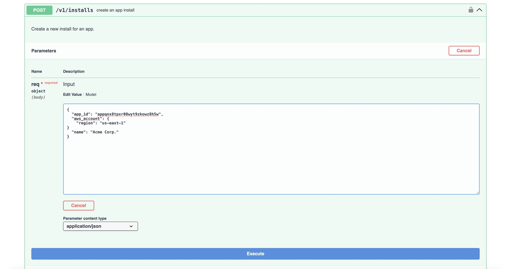

Access our [API](https://api.nuon.co/docs/index.html), or from within a selected org, run `nuon docs api` to open the API docs in your browser with automatic authorization.

```bash
nuon docs api
```

If you access the link directly, click "Authorize" in the top-right corner to authorize your org.

Navigate to the Install section and expand the `POST` request titled "Create an app install."



From there, you'll be able to fill in and/or add any necessary inputs. Once filled in, click execute.
