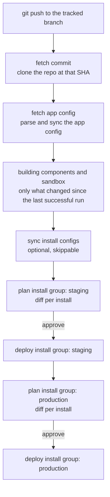
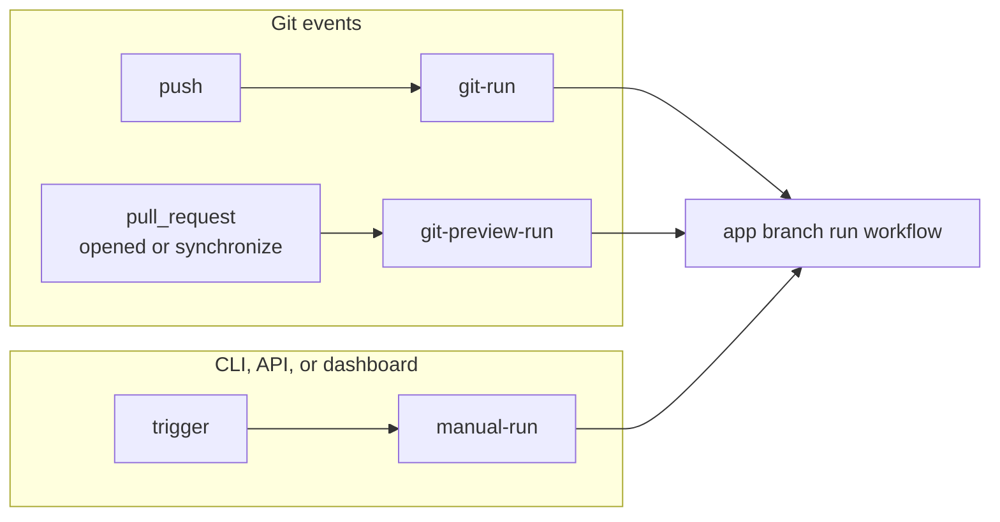

## What is an App Branch?

An app branch connects one git branch to your [app](/concepts/apps). When you push to that branch, Nuon fetches the
config at that commit, builds whatever changed, and then rolls the new version out across your customer
[installs](/guides/app-install-life-cycle), in an order you define, with a plan and an approval gate in front of
every step.

Before app branches, updating a fleet meant running `nuon apps sync` from a laptop or wiring up a GitHub Action with
an API token, then driving each install yourself. An app branch makes the git push the trigger, and makes the rollout
a single reviewable workflow instead of a sequence of manual steps.

<Note>
  If you are new to Nuon, read [apps](/concepts/apps) and the [app and install life
  cycle](/guides/app-install-life-cycle) first. An app branch orchestrates the same install workflows those pages
  describe. It does not replace them.
</Note>

## The end-to-end flow



Each box is a step in a single workflow, visible in the dashboard and in the CLI workflow TUI. The step names above
are the real ones you will see. Two of them behave specially:

- **`plan install group: <name>`** is an approval step. It computes the config diff for every install in the group and
  then waits. Nothing is applied to those installs until a human approves it in the dashboard, or an API caller
  advances it.
- **`deploy install group: <name>`** and **`sync install configs`** are skippable, so you can let a rollout move past
  a group without deploying to it.

Groups run in the order you declare, and the approval in front of each group is what makes the rollout staged: group
two does not start until you approve it.

{/* SCREENSHOT NEEDED — see ~/app-branches-launch/SCREENSHOTS-NEEDED.md
<Frame caption="A branch run's deployment plan: the staging group plans, waits for approval, then deploys before production begins.">
  
</Frame>
*/}

## Run types

Every run of an app branch is an *app branch run*. There are three kinds, and they differ in what they are allowed to
touch.

| Run type | Triggered by | What it does |
| --- | --- | --- |
| `git-run` | A push to the tracked branch | Builds, then plans and deploys each deployment group in order. |
| `git-preview-run` | Opening or updating a pull request against the tracked branch | Plan only. Builds and reports the config diff, then stops. Never touches an install. |
| `manual-run` | `nuon apps branches trigger`, the API, the dashboard, or your CI | Same steps as a `git-run`. Add `--preview` and it still plans every group and waits at each approval gate. It just applies nothing. |



A merge is not a special case: closing a pull request is ignored, and the push to the tracked branch that follows the
merge is what starts the `git-run`.

A `git-preview-run` stops after `sync install configs`. The per-group plan and deploy steps are not created at all,
so a pull request cannot reach an install even in principle.

A manual plan-only run works differently, and the difference matters in practice. `--preview` suppresses the *apply*,
not the workflow: the run creates every group's `plan install group` and `deploy install group` step and pauses at the
first approval gate, so you see the same per-install diffs you would in a real rollout. Approving them applies
nothing. Expect a manual plan-only run to sit waiting for you rather than finishing on its own.

## Deployment groups

A deployment group is a named subset of your installs that receives an update as a unit. Groups are the unit of
ordering and the unit of approval.

<Note>
  The dashboard calls these **deployment groups**. The TOML key is `install_groups`, and the API routes use
  `install-groups`. They are the same thing.
</Note>

You declare groups on the branch config, and each group picks its installs one of two ways:

- **By labels** — a `label_selector` of key/value pairs. Any install carrying all of those labels is in the group, and
  membership updates itself as you label and unlabel installs. This is the option to reach for.
- **Explicitly** — a static list of `install_ids`, or of `install_names` that Nuon resolves to IDs when you sync.

A group uses one or the other; a label selector cannot be combined with an explicit list in the same group.

```toml branch.toml
name = "main"

[connected_repo]
repo      = "acmeco/my-app-config"
directory = "."
branch    = "main"

[[install_groups]]
name  = "staging"
order = 1
[install_groups.label_selector]
env = "staging"

[[install_groups]]
name  = "production"
order = 2
[install_groups.label_selector]
env = "prod"
```

`order` controls which group deploys first: lower runs first. Declare your groups in the order you want them to run;
an unset `order` falls back to the position in the file.

### Rolling out gradually

There is no separate canary feature to configure. A canary is just a first group with a narrow selector: label one or
two installs `wave = "early"`, give that group the lowest `order`, and it plans and waits for approval ahead of
everyone else. Approve it, watch it, and then approve the next group when you are satisfied.

Because the gate is an approval rather than a timer, the pace is yours: approve the next group in the dashboard, or
have an external system approve it through the API once your own checks have passed.

## Pull request previews

When you open a pull request against a tracked branch, or push another commit to one, Nuon runs a plan-only preview
and reports it on the pull request itself:

- a comment titled `## Nuon Preview — <AppName>`, containing a table of config changes broken down by section
  (Section / Added / Changed / Removed) with the individual entries expandable underneath. The same comment is edited
  in place on every later push, so the pull request never accumulates a pile of stale bot comments.
- a commit status with the context `nuon/preview`, which moves from pending to success or failure.

If the pull request does not change the app config at all, the run stops early and says so
(`No changes to nuon.toml detected in this PR. Preview skipped.`) rather than doing pointless work.

Posting to the pull request needs an **org-level GitHub connection**, not a particular kind of branch config: your org
must have the Nuon GitHub App connected for the repository's owner. That is satisfied by a `[connected_repo]` branch,
and equally by a `[public_repo]` branch whose owner your org has connected. A public `acmeco/*` repo gets
previews as long as the org has connected `acmeco`. See [connecting a repository](/guides/vcs).

<Warning>
  If no such connection exists, the preview run still executes and appears in the dashboard, but the comment and the
  commit status are skipped **without an error**. When previews go missing, check the GitHub App connection for the
  repository's owner rather than the branch config.
</Warning>

## Plans, diffs, and who approves

The value of a branch run is that nothing reaches an install unseen. Each `plan install group` step computes a diff
per install in that group, showing exactly what would change, and holds the rollout there.

That gate belongs to whoever operates the install. A customer running your software in their own cloud account sees
the pending update, reads the diff, and approves or refuses it, the same review they already get for
[workflows](/concepts/workflows) and [approvals](/concepts/workflows#workflow-approvals) on a single install, now
driven from your git history.

<Note>
  Branch rollouts always require an approval on each group's plan step. There is no configuration that
  auto-approves a deployment group.
</Note>

## Install version history

Every config change to an install is recorded as an *app config version*: a snapshot of what that install was
expected to be running at a point in time. The history is available per install in the dashboard and over the API,
along with the diff between any two versions.

Because any past version can be applied again, the history doubles as a recovery path: if a change turns out badly,
you re-apply an earlier version rather than hunting for what the old values were. The
[guide](/guides/app-branches#re-apply-a-previous-config-version) walks through the exact calls.

## Install configs in git

An app branch can also track your install config files, not just your app config, keeping the installs in your control
plane in step with what is in git.

Enabling it takes two things: a repository block for the install configs, and the directory they live in. There is no
implicit default for the repository. A branch tracks install configs only once you set **one of**
`installs_connected_repo` or `installs_public_repo` (they are mutually exclusive). Pointing that block at the same
repository as the app config is perfectly normal; you just have to declare it.

```toml branch.toml
name               = "main"
installs_directory = "installs"

[connected_repo]
repo      = "acmeco/my-app-config"
directory = "."
branch    = "main"

[installs_connected_repo]
repo      = "acmeco/my-app-config"
directory = "."
branch    = "main"
```

<Warning>
  `installs_directory` on its own does nothing. With neither installs repository block set, the sync is skipped
  silently: no error, no synced installs. Keep the installs repository block's `directory` at the repository root
  (`"."`) and give `installs_directory` a path from there; that is the layout Nuon resolves consistently.
</Warning>

Each file describes one install (its labels, its cloud account, its inputs, its stack overrides, its component
toggles) using the same format `nuon installs sync` already accepts:

```toml installs/customer-acme.toml
name            = "customer-acme"
approval_option = "approve-all"

[labels]
env    = "prod"
tier   = "enterprise"
region = "us-east-1"

[aws_account]
region = "us-east-1"

[component_toggles]
monitoring = true
```

A sync can start three ways: a push that touches those files, the skippable `sync install configs` step inside a
branch run, or a manual trigger. Whichever way it starts, Nuon clones the repo at that commit, parses each file,
creates installs it has not seen before, and diffs the ones it has. Each sync produces a record with per-install
version entries (file path, whether the install was created or updated, and the stored diff), plus counts of how
many installs synced and how many failed.

Because the install configs get their own repository block, they do not have to live with the app config at all. A
separate repository (one your support team owns, say, with different reviewers) works the same way.

<Note>
  Nuon reads the installs repository block when it parses `branch.toml` **from git**, during a branch run's `fetch app
  config` step. So the way to enable install config sync is to commit these fields and let a run pick them up. See
  [managing install configs in git](/guides/app-branches#manage-install-configs-in-git) for the exact sequence.
</Note>

<Tip>
  Labels set in an install config file are what deployment group label selectors match on. Managing install configs in
  git therefore means group membership is version-controlled too.
</Tip>

## Notifications and automation

Branch runs emit the same signals as the rest of the platform, so you can watch them without polling:

- **[Slack](/guides/slack)** — branch run notifications follow your org's existing Slack preferences.
- **[Webhooks](/guides/webhooks)** — branch runs emit workflow and workflow step lifecycle events
  (`com.nuon.workflow.lifecycle.v1`) with `data.workflow.owner_type` of `app_branches`, plus an event when an app
  config is synced. External systems can react to a plan being ready, or to a group finishing, and can drive the next
  approval through the API.

## Rules and limits

A few constraints are worth knowing before you design your branch layout:

- All branches of one app must point at the **same repository**. The branch and directory within it may differ.
- An install can belong to **one app branch** at a time.
- Two branches of the same app cannot use an **identical label selector**.
- Every push to the tracked branch starts a run. There are no path filters. Scope what a branch watches with the
  `directory` field on the repo block.
- `install_names` are resolved to install IDs when you sync, and an unknown name fails the sync. Renaming an install
  detaches it from its group until the next sync, which is the main reason to prefer `label_selector`.

## Next steps

<CardGroup cols={2}>
  <Card title="Configure app branches" icon="screwdriver-wrench" href="/guides/app-branches">
    Write a branch config, label your installs, trigger runs, and set up pull request previews.
  </Card>
  <Card title="Walkthrough" icon="rocket" href="/get-started/app-branches-walkthrough">
    Add an app branch to the `eks-simple` example app end to end.
  </Card>
  <Card title="Branch config reference" icon="file" href="/config-ref/branch">
    Every field on `branch.toml`.
  </Card>
  <Card title="Workflows" icon="circle-nodes" href="/concepts/workflows">
    How plans, approvals, and diffs work for an individual install.
  </Card>
</CardGroup>
