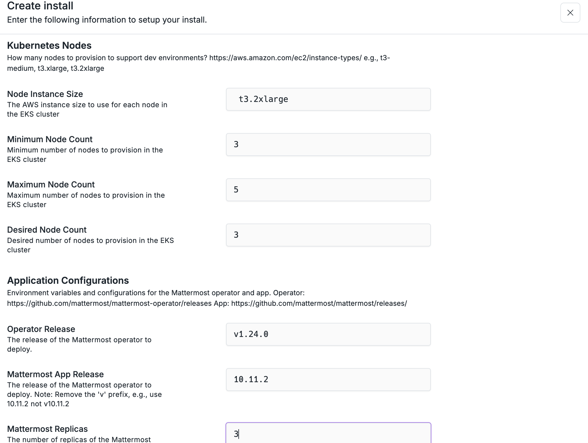

Inputs are used to collect customer provider values for configuring your app.

## Defining Inputs

Inputs are configured in a `inputs.toml` file inside the root of your app
directory.

Add inputs to your App using the following configuration block

```toml inputs.toml
#:schema https://api.nuon.co/v1/general/config-schema?type=inputs

[[group]]
name = "network"
description = "Configure the install's network settings."
display_name = "Network"

name         = "vpc_id"
display_name = "VPC ID"
group        = "network"
description  = "ID of the VPC to install the app into."
default      = ""
required     = true
sensitive    = false
```

## Configuration Using Inputs

Inputs can be used to configure both sandboxes and components. All inputs are
made available via [variable](/guides/using-variables) configuration.

Inputs are defined in a `inputs.toml` file inside the root of your app
directory.

All inputs are accessed using `{{.nuon.install.inputs.<input-name>}}`.

### Configuring Sandboxes

You can configure Sandboxes by using inputs as `var`s.

For example, to use the `root_domain` input, as a variable to configure the
sandbox:

```toml sandbox.toml

#:schema https://api.nuon.co/v1/general/config-schema?type=sandbox
terraform_version = "1.11.3"

[public_repo]
directory = "."
repo      = "nuonco/aws-eks-karpenter-sandbox"
branch    = "main"

[vars]
public_root_domain   = "{{ .nuon.inputs.inputs.root_domain }}"
```

### Configuring Components

Depending upon the component type, you can use install inputs to configure
components using Helm values, Terraform variables or environment variables.

To use Inputs in a Terraform module.

```toml components.database.toml
#:schema https://api.nuon.co/v1/general/config-schema?type=terraform
type              = "terraform_module"
name              = "database"
terraform_version = "1.11.3"

[public_repo]
directory = "terraform"
repo      = "your-org/your-repo"
branch    = "main"

[vars]
DATABASE_PASSWORD = "{{.nuon.install.inputs.database_password}}"
DATABASE_HOST     = "{{.nuon.install.inputs.database_host}}"
```

To use inputs in a Helm chart Component.

```toml components/helm-database.toml
#:schema https://api.nuon.co/v1/general/config-schema?type=helm
type   = "helm_chart"
name   = "helm-database"
chart_name = "database"

[public_repo]
directory = "helm"
repo      = "your-org/your-repo"
branch    = "main"

[values]
DATABASE_PASSWORD = "{{.nuon.install.inputs.database_password}}"
DATABASE_HOST     = "{{.nuon.install.inputs.database_host}}"
```

To use inputs in a Docker image.

```toml components/docker-build.toml
#:schema https://api.nuon.co/v1/general/config-schema?type=docker-build
type   = "docker_build"
name   = "docker-build"

[public_repo]
directory = "."
repo      = "your-org/your-repo"
branch    = "main"

# use an input to pass in a docker registry password, when building an image
[vars]
docker_build_registry_password = "{{.nuon.install.inputs.docker_build_registry_password}}"
```

## App Input Groups

You can organize inputs into groups, which are useful for structuring how they
are visualized in the install. By default, all inputs are created in the
`default` group.

To create a group, and add an input to it, simply declare the group in your
config or terraform and set the `group` field on any input belonging to it.

```toml inputs.toml
#:schema http://localhost:8081/v1/general/config-schema?type=inputs
[[group]]
name         = "db"
description  = "Configuration for the database "
display_name = "Database configuration"

[[input]]
name         = "db_password"
description  = "Password to use for the database."
default      = ""
sensitive    = true
display_name = "Password"
group        = "db"
```

## Inputs For Customer Resources

Inputs are commonly used to allow a customer to provide access to existing
resources. For example, an input can be used for:

- accepting a database url, or database ID to connect to
- accepting a VPC ID to install an app into
- accepting an existing S3 bucket name to use for storage
- accepting an existing Kubernetes cluster ID to connect to
- accepting a token to access a third party cloud provider or account

You can even use inputs to manage resources from
[third party cloud providers](/concepts/platforms#supporting-custom-platforms).

## Inputs when Installing an App

When installing an app, the customer is presented with a modal form to fill out the inputs
defined in the app's `inputs.toml` file.



## Updating Inputs

If you add a required input _after_ an install is created, the inputs must be
added to the install before it can process any new sandbox updates or component
provision/deprovision jobs.


<Note>
	We recommend avoiding adding backwards incompatible input changes in the same
	app.
</Note>
