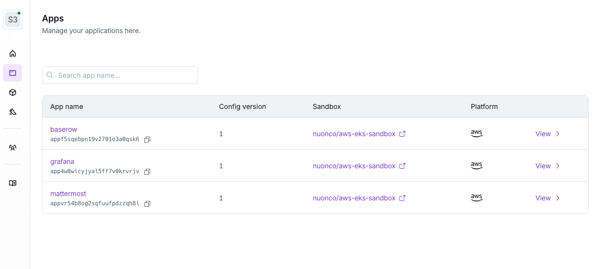
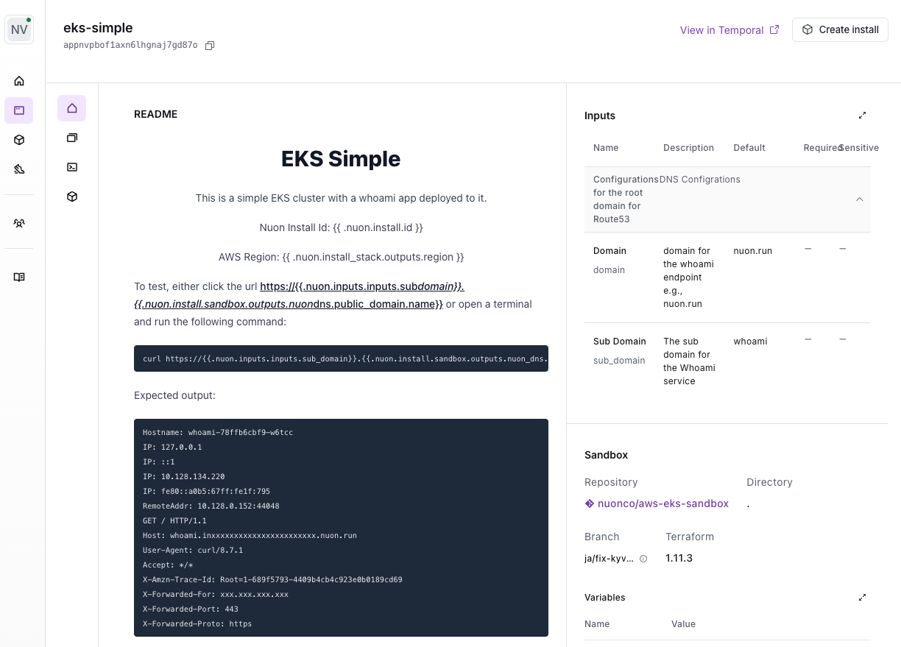

Apps are versions of your application code and infrastructure that can be
deployed into a customer cloud account.

Nuon is designed so you can lift and shift your _existing_ application and
infrastructure into new deployment options. Most Nuon users will create multiple
apps to offer different "flavors" of BYOC to their customers. e.g., AWS, Azure
versions, dev, prod environment versions, create a VPC, re-use a VPC versions,
etc.

## What Is An App?

When you first set up Nuon, you will map your existing product into one or more
apps. An App is a fully configured version of your product that can be installed
into your customer's cloud account.

## How do you configure an App?

Each app is represented as multiple configuration `.toml` files.

Each app consists of the following parts:

- `Sandbox` - The base infrastructure layer e.g., AWS EKS, Azure AKS
- `Runner` - The Nuon service that manages the install
- `Inputs` - Customer-provided input values specific to each install e.g., app
  release, domain name
- `Components` - Your application e.g., Helm, manifests, load balancers,
  certificates, Terraform

## Sandbox

The sandbox is the base layer of each App and is responsible for setting up any
shared infrastructure to configure an install. In most cases, sandboxes consist
of the following resources:

- Basic cloud account access and controls (such as IAM on AWS)
- Basic network infrastructure (such as an AWS VPC)
- Compute infrastructure (such as a Kubernetes or ECS cluster)

Read more about sandbox configuration [here](/concepts/sandboxes).

## Inputs

Inputs allow you to define different inputs that customers can provide to a app.
This enables you to create "configuration" knobs that your customers can manage
to control your application.

Inputs are commonly used to:

- Allow users to select regions and provide access to an account
- Customize app & infrastructure versions, such as pinning a Kubernetes cluster
  version
- Re-use existing infrastructure, such as providing a `vpc_id` that has been
  granted access

Read more about inputs [here](/concepts/app-inputs).

## Components

Components are used to connect your existing application and infrastructure code
to your app.

Components allow you to:

- Import existing images, or build Dockerfiles and sync these artifacts into
  customer accounts
- Deploy Helm charts
- Deploy Kubernetes manifests
- Deploy Terraform code

Common components include certificates, load balancers, Kubernetes operators or
Helm to deploy an app or database, etc.

Apps allow you to create dependencies between components and expose a rich
configuration language to share outputs between components for configuration.
You can use [variables](/guides/using-variables) to configure components with
the outputs of other components.

Read more about components [here](/concepts/components).

## READMEs

When running an app in an [Install](/concepts/installs), you often need to
document important info. e.g., the app's access URL, the install state, links to
documentation.

It can also be nice to have some level of programmability, such being able to
render a button that will trigger an [action](/concepts/actions). Additionally,
this documentation must be rendered per-Install because certain values -- such
as URLs -- will be different for each Install.

App READMEs were introduced to support this. Each app has a `README.md` text field
where you can define a Markdown document which will be rendered in the Dashboard
for each Install of that App. You can use all valid Markdown, including HTML.
You can also use variables, so that the document will be custom-rendered for
each Install.

See the [Using READMEs](guides/using-readmes) guide for more details.

## App Management

The [CLI](/cli) exposes many operational commands to manage apps. The Dashboard UI can also provide limited app management functionality.

To see all available commands, run: `nuon apps --help`.

Commands for creating, deleting, and viewing apps.

**Create a local app directory** - Create a directory and name it after your
app. This directory will contain your App's configuration files.

```sh
nuon mkdir your-app
cd your-app
```

**Create an app** - `.toml` config files are used to represent a configuration for a single
app. For consistency, the app name must be the same name as the directory you
created above.

```sh
nuon apps create --name=your-app
```

**List all apps** - List all apps using the CLI or Dashboard UI.

```sh
nuon apps list
```



**Pinning an app** - pin your app

You can pin an app, which will set its ID as a default argument to all app
commands. This is helpful to avoid having to pass `-a` to each command.

```sh
nuon apps select
```

<Note>Each example below assumes you have run `nuon apps select` first.</Note>

To show the currently pinned app:

```sh
nuon apps current
```

**Get an app** - Get basic info about app

```sh
nuon apps get
```

**Rename** - Rename an app

```sh
nuon apps rename --name=new-name
```

### Configuration

You can view various configs for an app and sync configuration files using the
[CLI](/cli).

**Sync** - Sync config files to the Nuon control and data plane

Sync is a critical step as you iterate and update you app configuration. Syncing performs syntax
validation, uploads your configuration to the Nuon control plane, and triggers builds for any components. e.g., Terraform module, Helm chart, Kubernetes manifest, container image.

If any component `.toml` files have changed, or any related files such as Helm `values.yaml` files, a new build will be triggered during sync.

If component source files have changed, you must push those changes to your git repo, then manually build the component using the Dashboard UI or CLI.

Sync all config files in the current directory:

```sh
nuon apps sync
```


**Configs** - List all config versions for an app

```sh
nuon apps configs
```

**Runner-config** - Print the current runner config

```sh
nuon apps runner-config
```

<Note>
	The output of the following 2 sub-commands are JSON so to improve readability,
	use `jq` or `python`
</Note>


```sh
nuon apps <sub-command> | jq
nuon apps <sub-command> | python -m json.tool
```

**Sandbox-config** - Print the current sandbox config

```sh
nuon apps sandbox-config
```

**Input-config** - Print the current input config

```sh
nuon apps input-config
```

## App Metadata

You can add the following metadata to your app, which is used in
installers:

- `display_name`
- `description`

This metadata can be added via a `metadata.toml` config file in the app root directory:

```toml
display_name = "Your app"
description  = "your app"
readme       = "./README.md"
```

The `readme` field points to a `README.md` file that will be rendered in the
Dashboard UI for each app and its installs.


