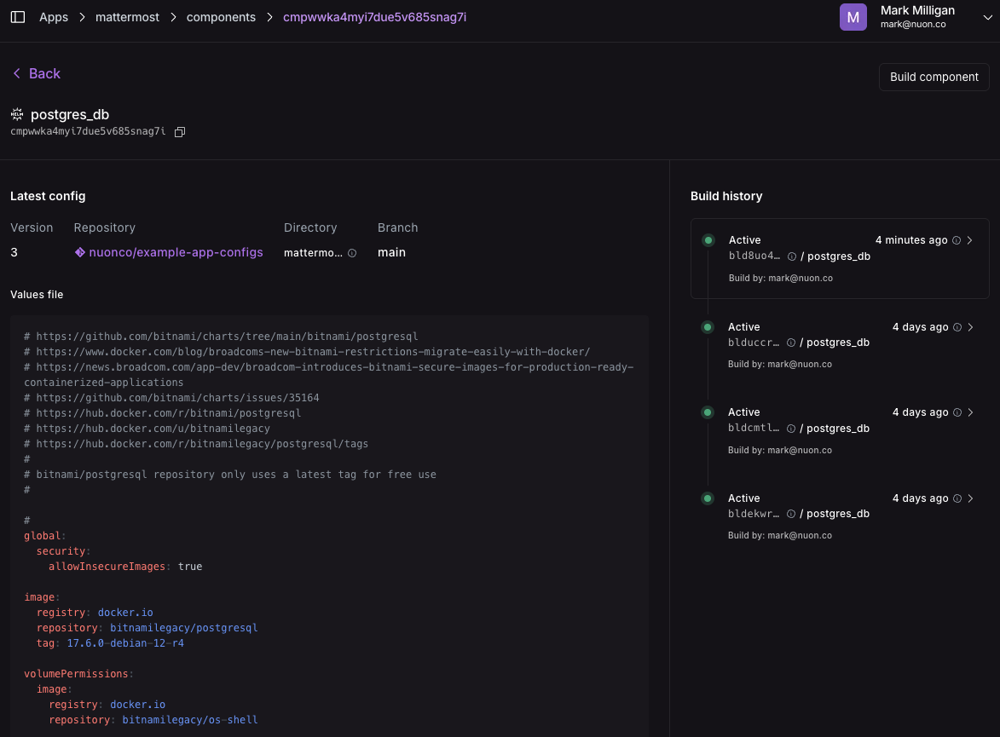
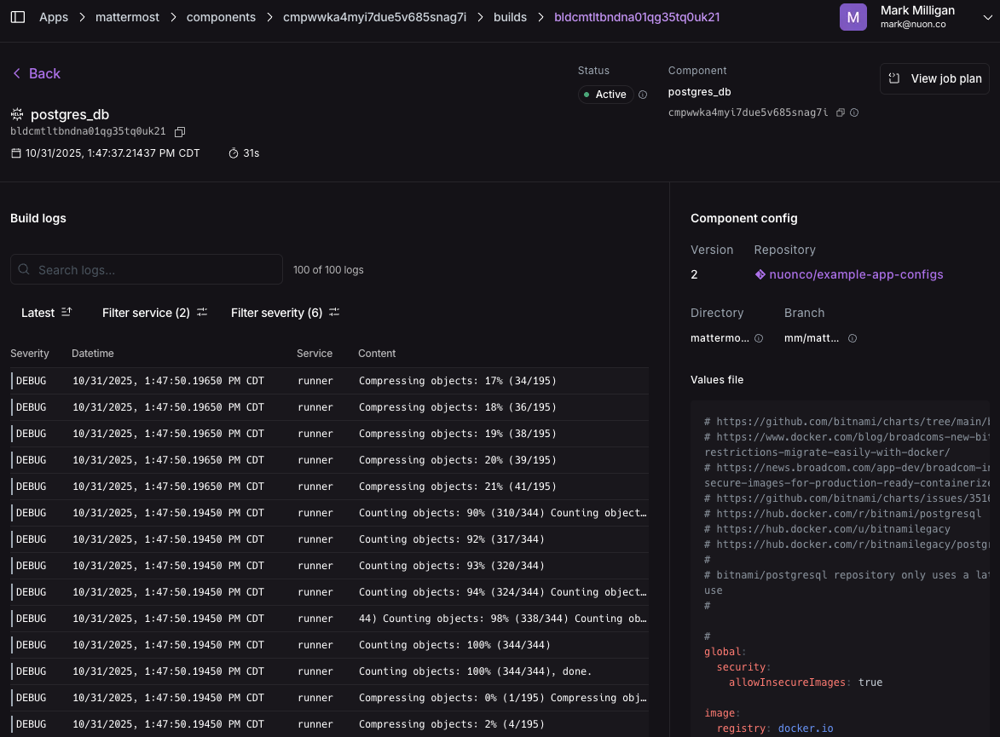

Nuon supports several different component types that allow you to connect your
existing container images, Helm charts, Kubernetes manifests and Terraform code
to your app.

## What is a Component?

A component represents a part of your App. Nuon supports the following component
types:

- [Helm Charts](/guides/helm-chart-components) - Any Helm chart located in a
  repository
- [Terraform](/guides/terraform-components) - Any Terraform module
- [Kubernetes Manifest](/guides/kubernetes-manifest-components) - Any raw
  kubernetes manifest
- [Docker](/guides/docker-build-components) - Any Dockerfile that can be built
- [Container Images](/guides/container-image-components) - Any prebuilt OCI
  image

## How do you configure a component?

A component is configured in an individual `<component name>.toml` file inside a
directory called `components` in the root of your app directory. e.g., a Helm
chart component named `grafana` would be defined in a file named `grafana.toml`
inside a directory named `components`.

Additional component configuration files can be added to the `components`
directory or another directory in the app directory, and referenced in the
Component's config file. e.g., you can have a `values.yaml` file for a Helm
chart component to deploy observability platform from Grafana Labs located in
`components/values/grafana`

You can configure components to use either a public repo (using a `public_repo`
block) or a private GitHub repo (using a `connected_repo` block). Read more
about VCS configuration [here](/guides/vcs).

```toml components/grafana.toml
#:schema https://api.nuon.co/v1/general/config-schema?type=helm
name           	= "grafana"
type           	= "helm_chart"
chart_name     	= "grafana"
namespace      	= "grafana"
storage_driver 	= "configmap"
dependencies   	= ["prometheus"]

[public_repo]
repo 			= "grafana/helm-charts"
directory 		= "charts/grafana"
branch 			= "main"

[[values_file]]
contents 		= "./values/grafana/values.yaml"

```

By default, every component must have a `git` repository to store its source files, but you can include them in the app directory and reference the same app repo in the component `.toml` file. This example shows a component that uses the same repo as the app to store its AWS Terraform module to create the certificate in AWS:

```toml components/certificate.toml

[public_repo]
repo      = "nuonco/example-app-configs"
directory = "grafana/src/components/certificate"
branch    = "main"
```

<Note>
If you are iterating and making changes to the source files of a component, running `nuon apps sync` will not trigger a new build. You need to first push your changes to your repo then create a new build manually using Dashboard UI or CLI after syncing the app. During development, it is recommended to create a branch and use that branch in the component config file.
</Note>


## Component Management

The [CLI](/cli) exposes many operational commands to manage components.

To see all available commands, run: `nuon components --help`.

<Note>
	Make sure to select an App using `nuon apps select` before using the `nuon
	components` commands, or pass the `-a` flag to each `nuon component` command.
</Note>

### Component Management

<Note>
	There no longer is a `nuon components select` command to pin a component.
	Instead, pass the `-c` flag to each command to specify the component by its id
	or name.
</Note>

Commands for working with components:

**List Components** - List components for an app.

```sh
nuon components list
 ```

**Get a component**

```sh
nuon components get -c <component_id or component_name>
```

**Delete a component** - delete a domponent.

<Note>
	It is not recommended to delete components using the CLI. Instead, manage them
	by removing a component `.toml` file from the app directory and then running `nuon apps sync`.
</Note>

```sh
nuon components delete -c component_id
```

**Print a component config** - Print the latest configuration for a component.

```sh
nuon components latest-config -c <component_id or component_name>
```

### Component Builds

All components must be built before creating an install or updating an install. `nuon apps sync` for the first time or if a component `.toml` or related Helm `values.yaml` has changed will also trigger a build. The release commands support an `-auto-build` flag which will trigger a build.

Any of the following CLI commands can use component_id or component_name with the `-c` flag to specify which component to build.

**Create or re-create a Build** - Create a build using the latest component configuration in the Dashboard UI or with the CLI.


```sh
nuon builds create -c component_name
```

**List Builds** - List builds for a component with the CLI or Dashboard UI.

```sh
nuon builds list -c component_name
```

<Note>
	If you do not pass the `-c` flag, all Builds for all components in the
	currently selected spp will be listed.
</Note>



**Get a Build** - Print out build details.

```sh 
nuon builds get -b <build-id> -c component_name
```

**Logs** - Show logs for a build by opening the Dashboard UI.

```sh 
nuon builds logs -b <build-id> -c component_name
```


