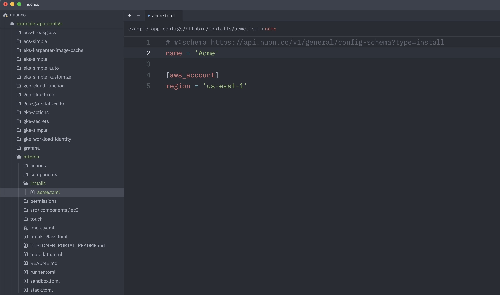
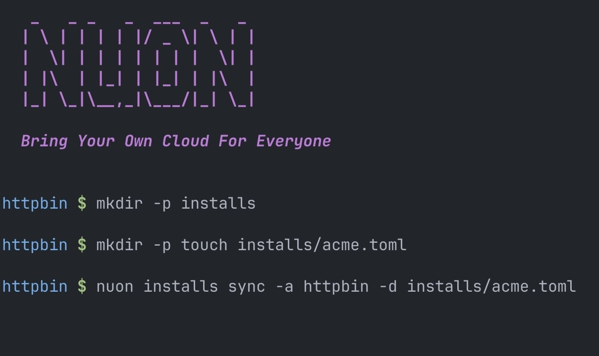
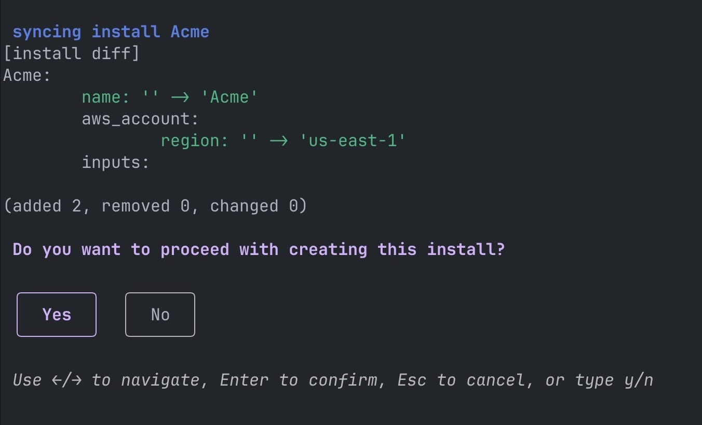
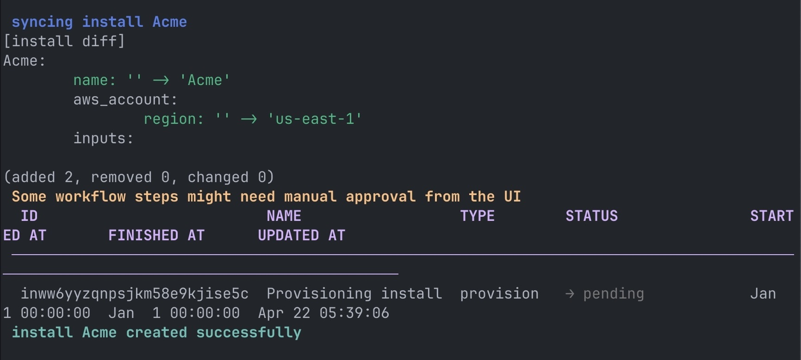

First, create an install config file by running

```bash
mkdir -p installs
```

```bash
touch installs/<install-name>.toml
```

If you have any questions about which specific inputs go into a config file, reference our [configuration files docs](/configuration-files#install-config).



Once a config file exists, generate new installs using our CLI command

```bash
nuon installs sync -a Acme -d installs/acme.toml
```



You'll then be presented with a selection prompt asking whether you would like to create the install.



Once you select "yes," you'll be directed to your install in the browser, and a completion message will appear in your terminal.

