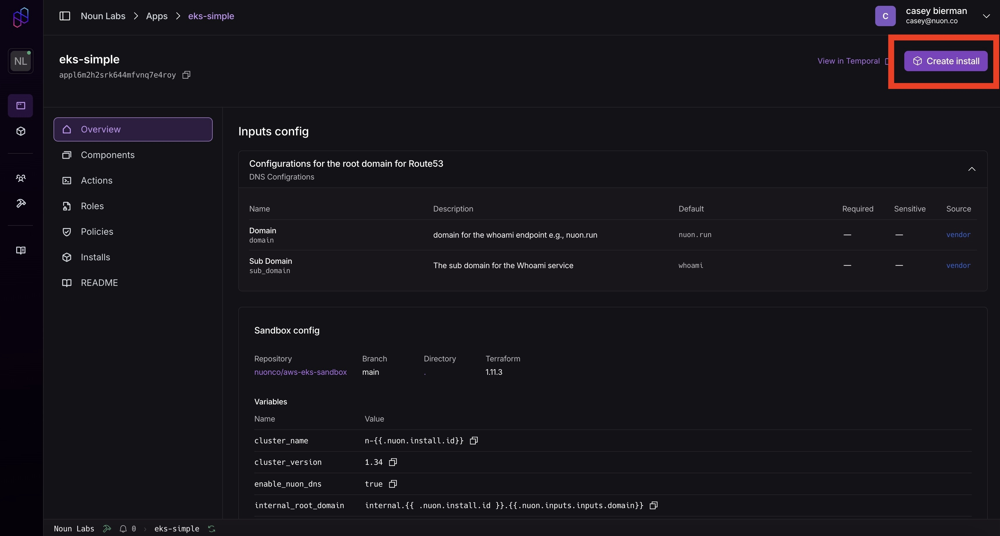
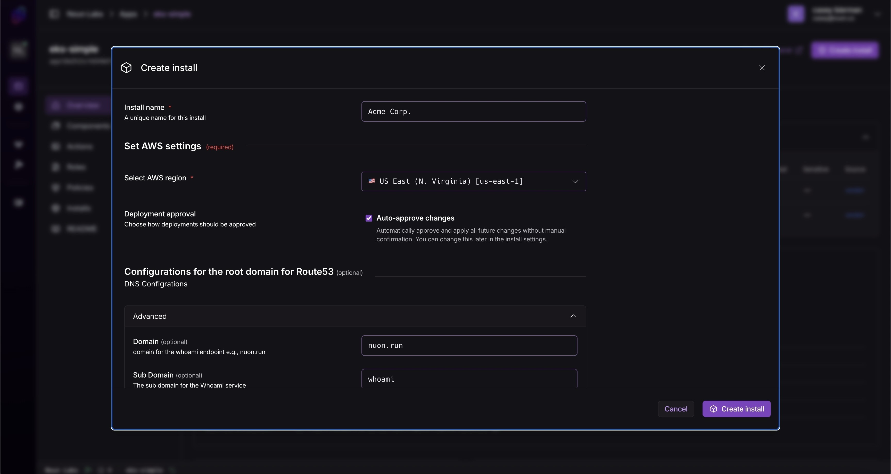
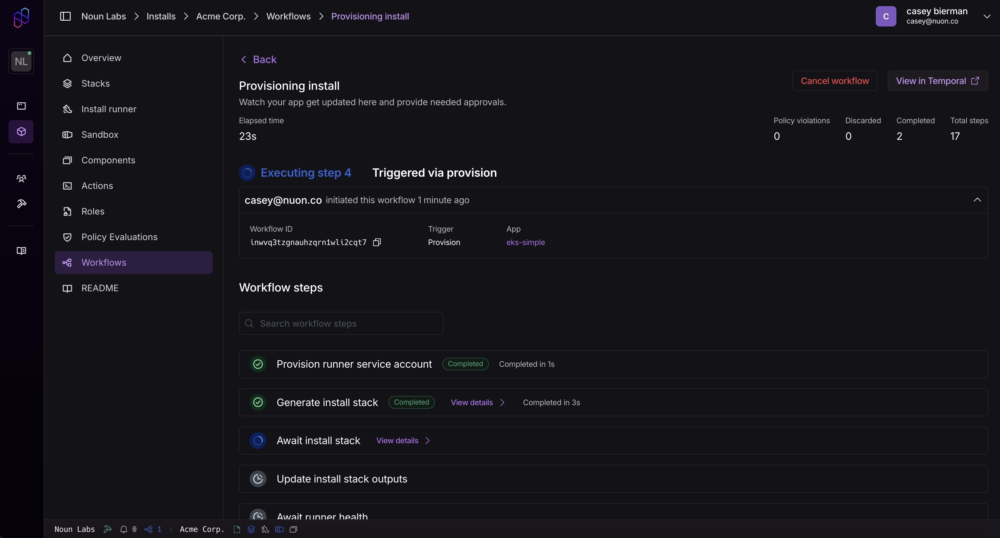

Inside your org, navigate to any application.

In the upper-right corner, you'll see a button labeled "create install."

A form will pop-up where you can enter inputs.

Once filled out, click "create install," and your install will start deploying.

