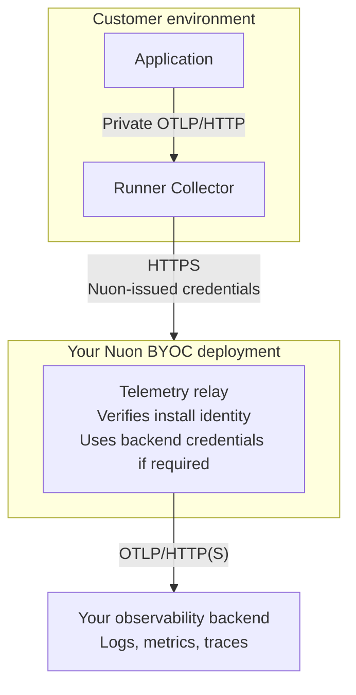

Install telemetry lets software vendors collect application logs, metrics, and traces from customer environments
in their own observability backend. A private endpoint in each install receives the data, and a relay in the
vendor's **Nuon BYOC deployment** forwards it to the backend.

For setup instructions, see [Set Up Install Telemetry](/guides/byoc/telemetry). To change which installs send data,
see [Manage Install Telemetry](/guides/manage-install-telemetry).

## What gets collected

The install endpoint accepts OpenTelemetry logs, metrics, and traces sent by your application, an agent, or your
own Collector. Enabling forwarding does not instrument the application, discover workloads, or automatically
scrape metrics. You choose what to emit; your backend handles storage, queries, dashboards, and alerts.

This is separate from two other kinds of telemetry:

- **[Runner audit logs](/guides/export-runner-audit-logs)** record Nuon runner operations. Customers configure that
  export independently through a `telemetry-export-config` secret in their cloud account, using their own backend
  destination and credentials. The install telemetry toggle does not control audit export.
- **Control-plane telemetry** describes Nuon's own services, not the applications running in customer installs.

## How data reaches your backend

1. The application sends data to the install's private OTLP/HTTP endpoint.
2. A Collector managed by the install runner queues the data and forwards it to the relay over HTTPS. The runner
   obtains and automatically renews short-lived credentials for that connection.
3. The relay authenticates the runner and attaches verified org, app, install, and runner IDs.
4. The relay forwards the data to the configured OTLP/HTTP backend using credentials stored in the BYOC deployment.

All enabled installs using a relay share its backend destination. Applications do not need backend credentials,
runner tokens, or the central relay URL.

## Private endpoints and network access

The install stack exposes the endpoint as `telemetry_endpoint`. Current supported stacks enable private ingress
by default, but a customer can disable it. Older stacks may need an update before the output is available.

The private endpoint uses **OTLP/HTTP on port 4318**. It is not a public internet endpoint. Workloads must have
network access through the install's cloud networking and firewall rules. The GCP stack requires clients in the
same region; its default internal firewall source range is `10.128.0.0/16`.

Use `http/protobuf` for application SDKs. The endpoint is a base URL: standard exporters append `/v1/logs`,
`/v1/metrics`, or `/v1/traces`. A signal-specific endpoint setting must include the corresponding full path.
The HTTP receiver also accepts OTLP/JSON.

The private receiver does not require application credentials or provide TLS. Network access controls restrict
who can send to it. The Collector-to-relay connection uses HTTPS and Nuon-issued credentials; the relay-to-backend
connection uses HTTP(S) and the vendor's backend credentials, if required by the backend.

## What the telemetry setting controls

The org default is disabled initially. An install follows the current org default unless it has an explicit
enabled or disabled override. The control plane resolves these settings and sends the result to the runner.

The runner refreshes settings every 15 seconds and starts or stops its telemetry Collector as needed. An offline
runner cannot apply changes until it returns. If a settings refresh fails, the runner retains its active
configuration until it can fetch settings again.

Three things must be ready for data to flow: the central relay, the install's private ingress, and enabled
forwarding on the install. Changing the forwarding setting does not provision ingress, deploy an application
Collector component, or enable the relay. Likewise, a stack endpoint or an enabled setting is not proof of backend
delivery.

## Identity in your backend

The relay attaches these **verified resource attributes** using the authenticated runner identity:

| Attribute | Identifies |
| --- | --- |
| `nuon.org.id` | Nuon organization |
| `nuon.app.id` | Application |
| `nuon.install.id` | Customer install |
| `nuon.runner.id` | Sending runner |

Caller-supplied copies of these IDs are removed throughout the payload before the relay stamps the resource.
Matching is case-insensitive and includes underscored aliases such as `nuon_install_id`. A producer cannot use
these fields to claim another install's identity, but this does not attest to the integrity of the emitting
workload or its data.

The runner also adds `nuon.org.name`, `nuon.app.name`, `nuon.install.name`, and `nuon.install.labels.<key>` from its
settings. These help with display and filtering, but the relay does not verify them against the IDs. The relay
sets `nuon.telemetry.source` to `install` for this path.

Use resource-aware queries to filter by the verified IDs. Some backends flatten or rename resource attributes
into metric labels; check that mapping and any naming collisions before using those labels in dashboards or
alerts. Names and custom install labels are not authoritative identity.

## Delivery behavior

The runner Collector forwards asynchronously using a bounded disk-backed queue and retries transient export
failures. The relay itself has no persistent queue or retry loop. A successful response from the install endpoint
means local acceptance, not confirmation that the backend stored the data.

Delivery is best effort, not exactly once. Retries can produce duplicates, while queue exhaustion, storage
failures, permanent rejections, and some authentication or downstream failure responses can lose data. Do not
rely on indefinite outage retention or automatic historical backfill. Monitor missing data in your backend.

Runner audit export uses a separate Collector process and queue, but shares the runner host's resources.

## Next steps

<CardGroup cols={2}>
  <Card title="Set up telemetry" icon="rocket" href="/guides/byoc/telemetry">
    Connect your BYOC relay to a backend and send data from your first install.
  </Card>
  <Card title="Manage install telemetry" icon="sliders" href="/guides/manage-install-telemetry">
    Change the org default, enable or disable installs, and troubleshoot collection.
  </Card>
</CardGroup>
