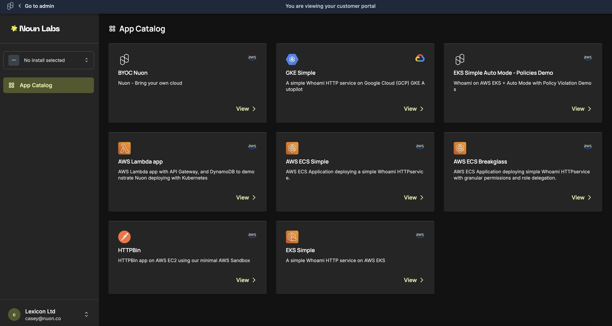
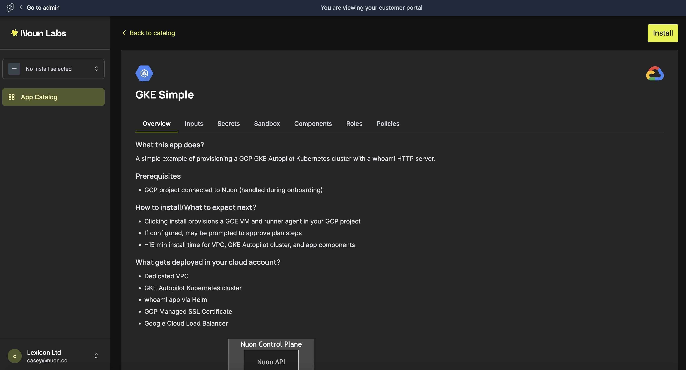
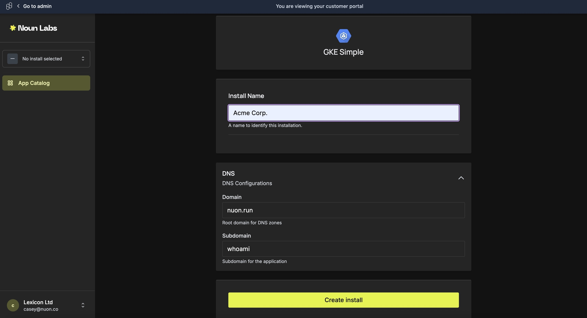
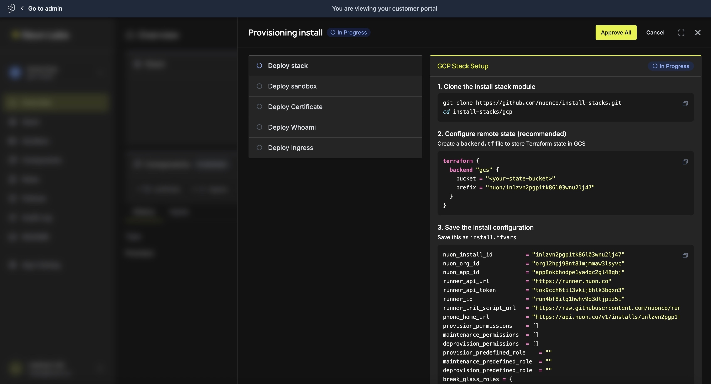

First, your customer will select a provided app by clicking "view."

Once inside the app, in the top right corner, they'll click "install."

A form will pop-up where your customer can enter any inputs.

Once filled out, they'll click "create install," and their install will start deploying.

