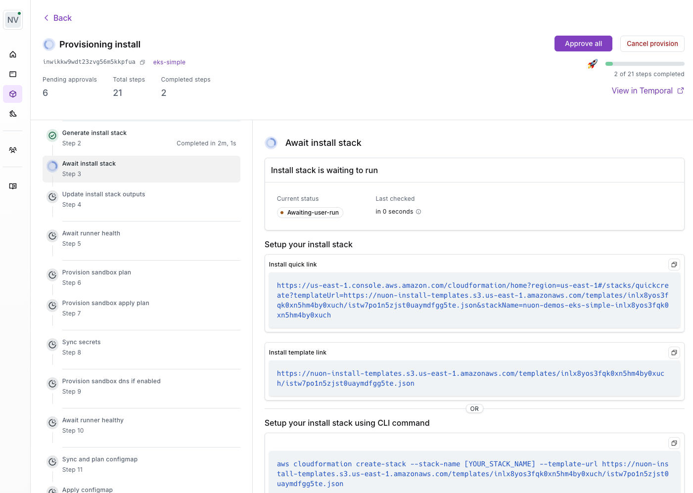
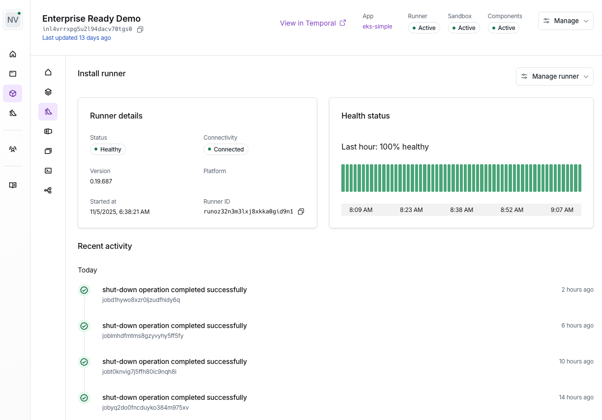

Runners are deployed into each install, and are responsible for updating, monitoring and managing your running app. 

## How do you configure a Runner?

The Runner is a VM created in the customer's cloud account, and is defined in the cloud provider's Infrastructure as code (IaC) language. e.g., as an AWS CloudFormation stack.

When you create an install in the Dashboard UI, Nuon outputs a link to a AWS CloudFormation stack that you share with your customer to create the Runner in the AWS Console or CLI using your cloud credentials. This template is generated by Nuon based on the app's configuration, and includes the runner configuration.

## Runner Responsibilities

The runner performs the following jobs, inside of an install:

* provisioning or deprovisioning components
* syncing container images into the local artifact store
* monitoring running components by way of actions e.g., health checks
* running actions, which can be used to perform Day 2 operational tasks
* executing Terraform 
* returning telemetry and log data upon request

## Runner Permissions

Each runner works by listening for jobs from the Nuon managed data plane server it belongs too. This server dispatches jobs, which the runner will pick up and then run tasks to perform.

The runner will use different IAM roles for different component jobs, to minimize the permissions available on each job. These IAM roles are defined in each sandbox, and outputs are used to allow the runner to use them.

Since the runner is deployed _into_ the customer install, no long-lived permissions are required after the initial install. This creates a more secure operating environment, as the _only_ thing that can dispatch work to the runner is the customer's data plane server it belongs to.

