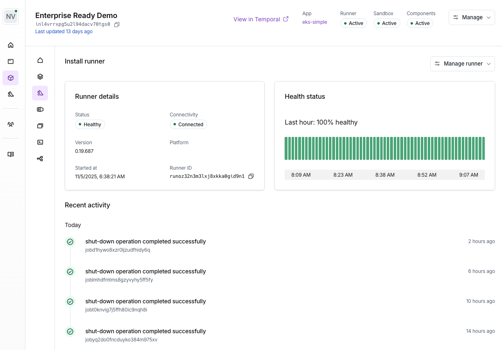

The Runner is a VM deployed into each install as part of the [Stack](/concepts/stacks). It is the bridge between the customer's cloud and the Nuon Control Plane, responsible for executing all infrastructure operations locally inside the customer's environment. For details on how Runners communicate with the Control Plane, see [Platform Architecture](/architecture/platform).

## Responsibilities

- **Infrastructure operations** - provisioning and deprovisioning sandboxes and components using Terraform, Helm, and Kustomize
- **Artifact management** - syncing container images and secrets into the customer's environment
- **Maintenance tasks** - executing actions like database migrations, configuration updates, and operational scripts
- **Monitoring** - running health checks and streaming job logs back to the Control Plane

## Configuration

The runner type is configured in a `runner.toml` file in the root of your app directory:

```toml runner.toml
runner_type = "aws"
helm_driver = "configmap"
```

```toml runner.toml
runner_type = "azure"
helm_driver = "configmap"
```

## Runner Permissions

Each runner works by listening for jobs from the Nuon managed data plane server it belongs too. This server dispatches jobs, which the runner will pick up and then run tasks to perform.

The runner will use different IAM roles for different component jobs, to minimize the permissions available on each job. These IAM roles are defined in each sandbox, and outputs are used to allow the runner to use them.

Since the runner is deployed _into_ the customer install, no long-lived permissions are required after the initial install. This creates a more secure operating environment, as the _only_ thing that can dispatch work to the runner is the customer's data plane server it belongs to.

