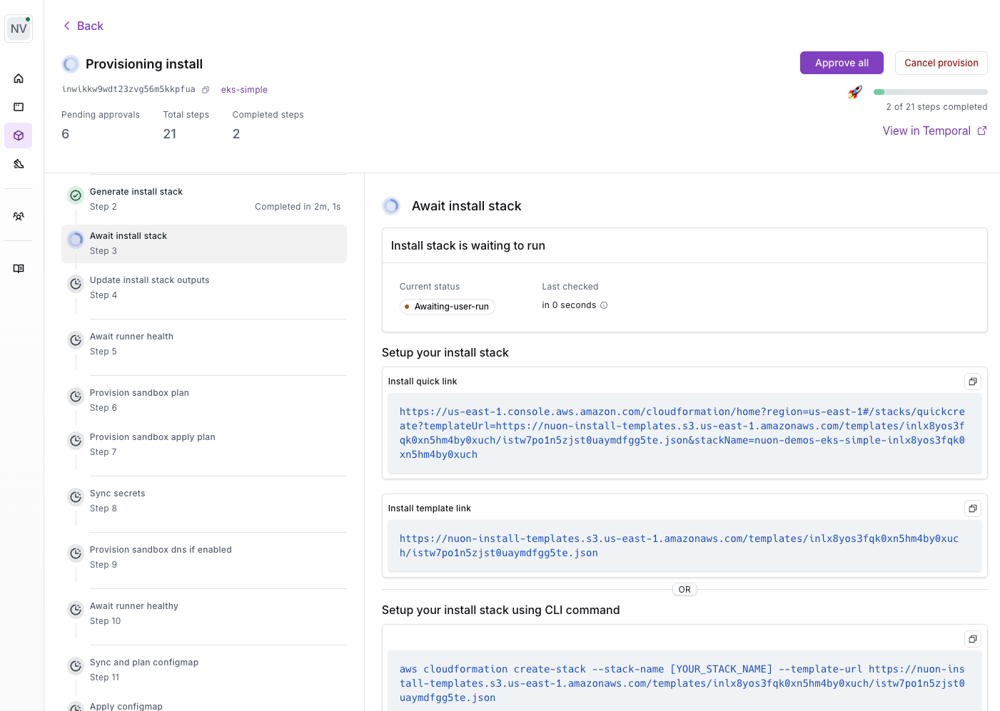

A Stack is the first thing deployed in a customer's cloud account when an install is created. It provisions the foundational resources needed to deploy and operate the app.

For each install, Nuon generates the Stack in Terraform and, where the cloud has one, in its native infrastructure-as-code (IaC) format. Every format creates the same resources, so your customer can use whichever fits their tooling.

- On **AWS**, the native format is a CloudFormation template.
- On **Azure**, the native format is an Azure Resource Manager (ARM) template, compiled from Bicep.
- On **Google Cloud**, only Terraform is generated.

## What does a Stack create?

Every Stack provisions the same three things:

- The network the app runs in
- The [permissions the Runner needs](/concepts/operation-roles#what-are-operation-roles) to deploy and operate your app
- The Nuon-powered [Runner](/concepts/runners) itself

The network can either be **created** by the Stack or **selected** from resources the customer already has. See [Stand-Alone VPC](/concepts/stacks/stand-alone-vpc), [Customer VPC](/concepts/stacks/customer-vpc), and [Customer Cluster](/concepts/stacks/customer-cluster) for each pattern.

## How is a Stack deployed?

1. You create the install. The provision workflow pauses at the **await install stack** step.
2. You send your customer what that step shows: a console link, CLI commands, Terraform, or a Spacelift blueprint.
3. Your customer deploys the Stack in their own account with their own credentials.
4. The Runner phones home. The await step completes and the install proceeds.

No cross-account access is required. The customer owns everything the Stack creates.

## What your customer does on each cloud

| | AWS | Azure | Google Cloud |
| --- | --- | --- | --- |
| **One-click console link** | Always. CloudFormation quick-create link. | Only at [subscription scope](#azure-at-subscription-scope). **Deploy to Azure** button. | Never. |
| **Cloud CLI command** | `aws cloudformation create-stack` | `az stack group create`, or `az stack sub create` at subscription scope | None. Terraform only. |
| **Terraform** | Published module, or generated tfvars | Published module | Published module, or generated tfvars |
| **Spacelift** | Not yet | Not yet | Blueprint or `spacelift.tf` (feature flag) |
| **Customer creates first** | Nothing | Resource group, Key Vault, and secrets at [resource group scope](#azure-at-resource-group-scope-default). Nothing at subscription scope. | Nothing. A state bucket is recommended. |
| **Start here** | [CloudFormation guide](/guides/provision-stacks-with-cloudformation) | [Azure installation](/platform-support/azure#installation) | [Terraform module guide](/guides/provision-stacks-with-terraform-module) |

Published Terraform modules and Spacelift are behind org feature flags. [Reach out to Nuon](https://nuon.co/demo-request) to enable them.

### AWS

The customer opens the quick-create link while signed in to the target account, fills in inputs and secrets, and clicks **Create stack**. The same step offers an AWS CLI command and Terraform.

[Provision Stacks with CloudFormation](/guides/provision-stacks-with-cloudformation) · [Terraform Module](/guides/provision-stacks-with-terraform-module) · [Terraform tfvars](/guides/provision-stacks-with-terraform)

### Azure

`deployment_scope` in `stack.toml` decides what the customer sees. The default is `resource_group`.

#### Azure at resource group scope (default)

No console button. The portal cannot create the resource group the Stack deploys into. The customer creates the resource group and Key Vault, sets any secrets, then runs `az stack group create`. The dashboard renders each command with the install's values filled in.

[Azure installation](/platform-support/azure#install-the-stack-at-resource-group-scope-default)

#### Azure at subscription scope

Set `deployment_scope = "subscription"`. A **Deploy to Azure** button appears and opens the portal's deployment form with the template loaded. The Stack creates its own resource group and Key Vault, and secrets are entered on the form. CLI equivalent: `az stack sub create`.

[Azure installation](/platform-support/azure#install-the-stack-at-subscription-scope)

### Google Cloud

No console link. Nuon generates Terraform only. The customer applies it with the published module, the generated tfvars and open-source `install-stacks/gcp` module, Spacelift, or any other Terraform runner such as Infrastructure Manager.

[Terraform Module](/guides/provision-stacks-with-terraform-module) · [Terraform tfvars](/guides/provision-stacks-with-terraform) · [Spacelift](/guides/provision-stacks-with-spacelift) · [Google Cloud installation](/platform-support/gcp#installation)

## Customer Control

The Stack gives the customer full control over the Runner's access to their cloud account. Through the Stack parameters, the customer can:

- **Enable or disable the Runner** to stop it from executing jobs
- **Configure IAM roles and policies** to control what the Runner can do
- **Grant break glass roles** for temporary elevated access during emergencies, which the customer can revoke at any time
- **Trigger automated actions** when roles are enabled or disabled — use the `role-enabled` and `role-disabled` [action triggers](/concepts/actions#role-change-triggers) to run auditing, validation, or setup tasks in response to role changes

This means the customer always has a killswitch. See [Customer-Controlled Runner Shutdown](/guides/runner-kill-switch).

## Stack Inputs

Stacks accept customer-provided values at deploy time. They come in three forms:

- **[Secrets](/concepts/app-secrets)** — entered by the customer as CloudFormation or ARM template parameters, or as Terraform variables, then stored in AWS Secrets Manager, Azure Key Vault, or Google Cloud Secret Manager.
- **[Customer-facing inputs](/concepts/app-inputs#customer-facing-inputs)** marked `user_configurable` — passed through the Stack at deploy time.
- **VPC and cluster IDs** — required when the app uses the [Customer VPC](/concepts/stacks/customer-vpc) or [Customer Cluster](/concepts/stacks/customer-cluster) pattern. The customer enters them in the Stack's parameter form alongside any other inputs.
