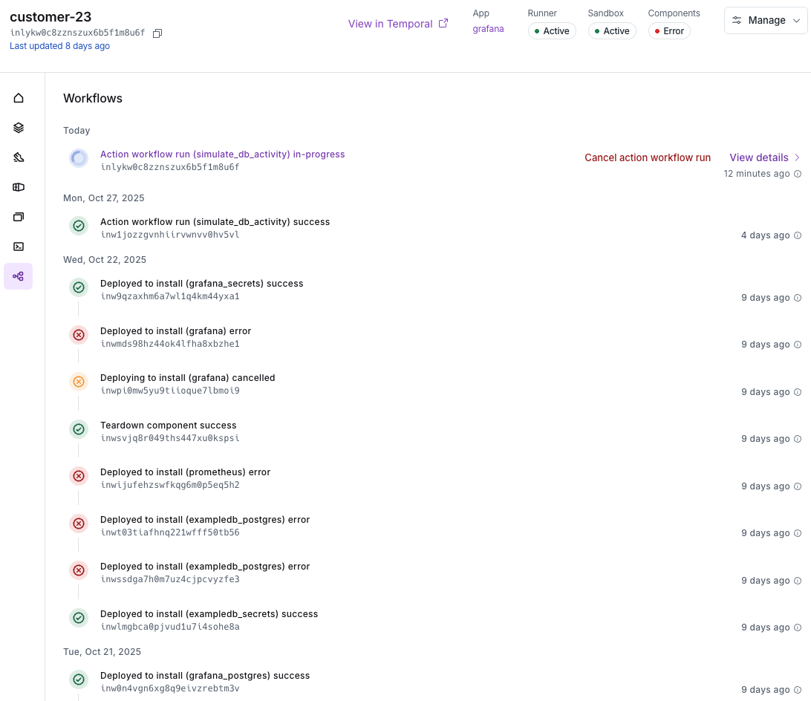
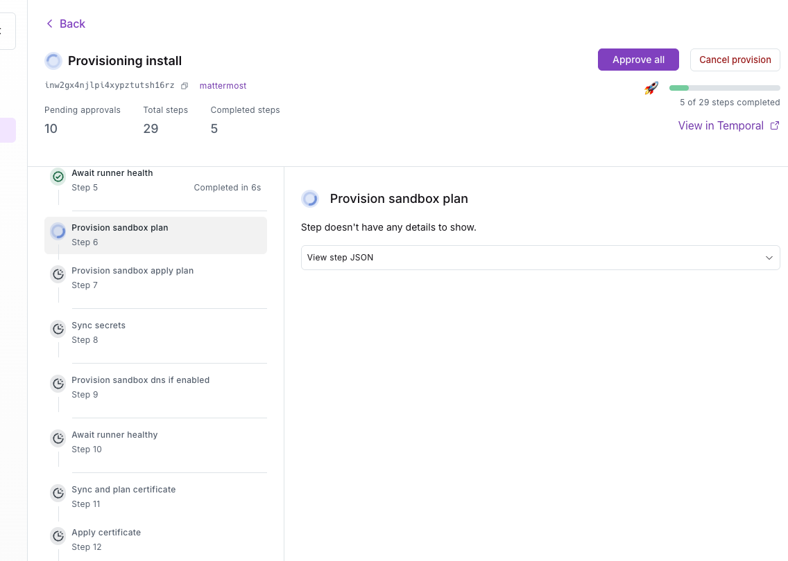
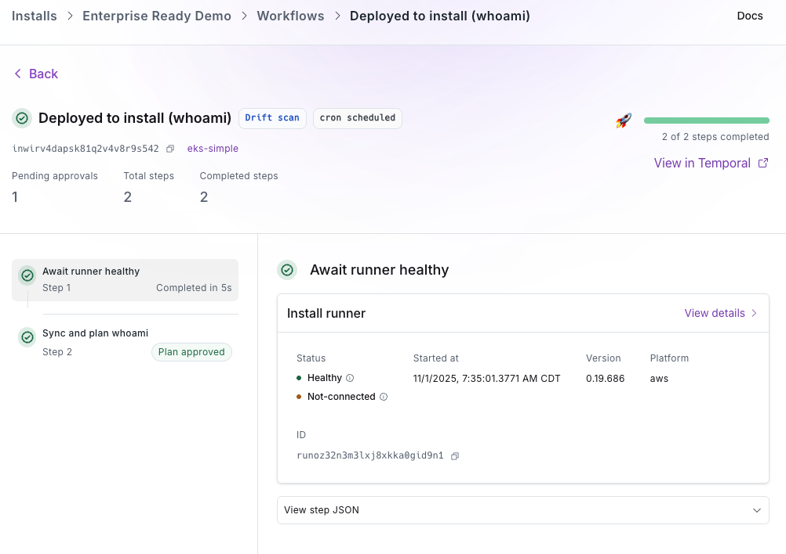
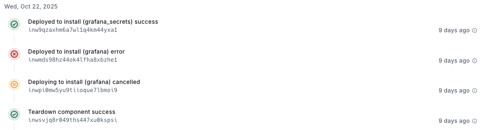
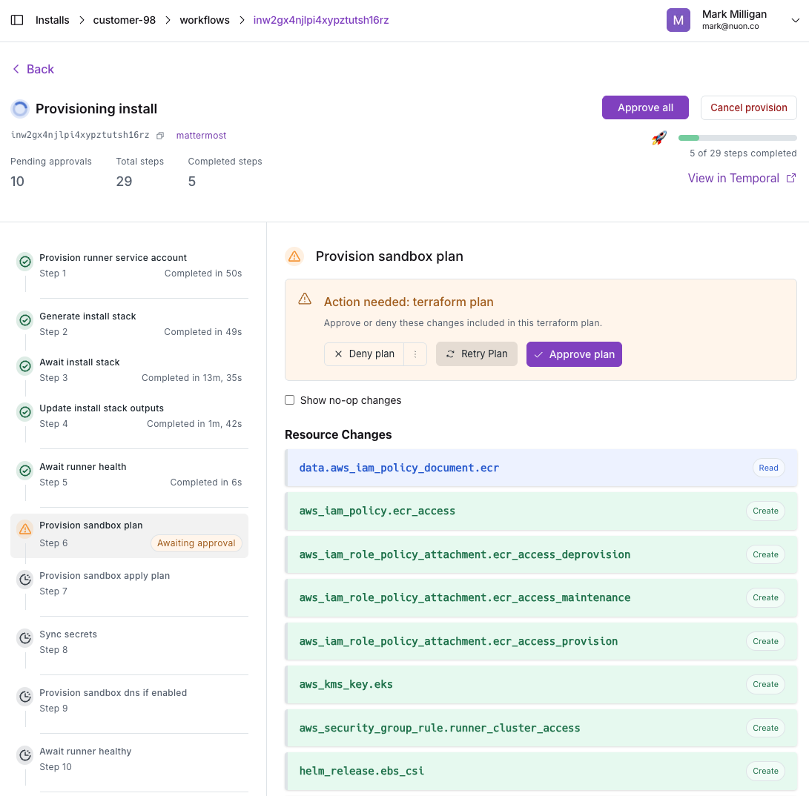
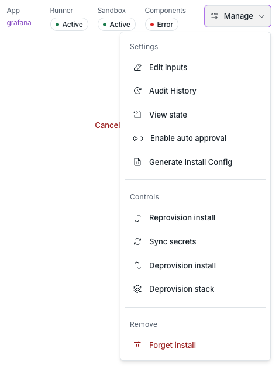
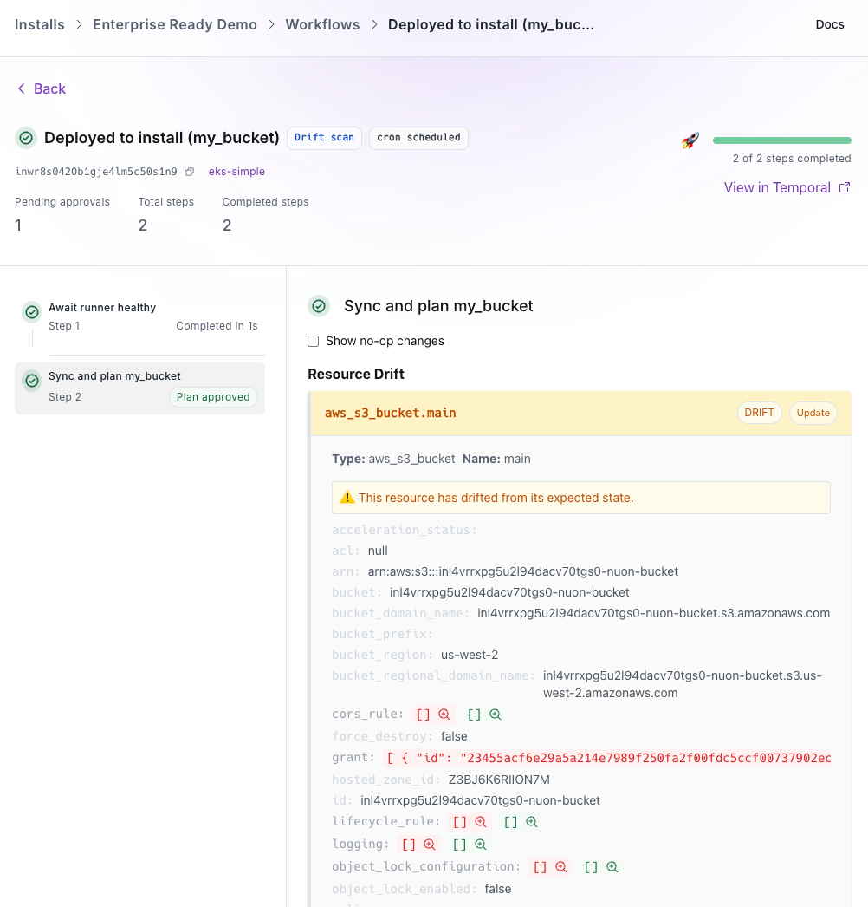

## What is a Workflow?

A Workflow represents the complete lifecycle of deploying, updating or tearing down an app and its components. Workflows also manage the execution of actions.

<Note>
If new to Nuon, familiarize yourself with the [app and install life cycle](../guides/app-install-life-cycle) first.
</Note>

## Workflow Types

### Install

An install workflow covers all of the steps required to install an app from scratch. This includes creating the install stack, creating the virtual machine and starting the Nuon runner, provisioning the sandbox, syncing secrets, deploying the components of the app with Terraform, Helm or Kubernetes manifests e.g., databases, applications, certificates, application load balancers, and executing actions which are bash scripts to perform additional configurations like initializing a database or performing a health check.

### Component

A component workflow deploys a component. If there are dependent components, the user can instruct Nuon to deploy those components as well.

### Action

An action workflow executes the script associated with an action. e.g., initialize a database, run a health check on a component, make a one-off configuration change.

## Workflow States

**Success (green checkmark)**: A step or install component completed successfully

**Error (red X)**: One or more steps failed

**Cancelled (yellow X)**: An install or step was cancelled by the user

**In-progress (brown circle pulsing or clockwise spinning blue circle)**: A component or action is underway

## Workflow Approvals

Components using Terraform, Helm and Kubernetes manifests run a plan step which requires the user to approve or reject the step before proceeding to the apply or deploying of the sandbox and components.

At the install-level and at the individual workflow-level, the user can opt to Approve All plan steps.

## Workflow Diffs

If a component using Terraform, Helm or a Kubernetes manifest has been changed by the user, re-synced to an app and therefore re-built, the plan step will visually show the diff, aka the before and after proposed change, and require the user to approve or reject/deny the change. Learn more about [Understanding diffs](../updates/012-approval-diffs-plan-only).

## Drift Detection

[Drift Detection](../updates/023-drift-workflow-improvements) allows you to automatically identify discrepancies between your defined infrastructure in Nuon and what’s actually running. You can schedule periodic drift checks or manual drift scans from the Dashboard UI. Drilling into the relevant Workflow will show the drift.

