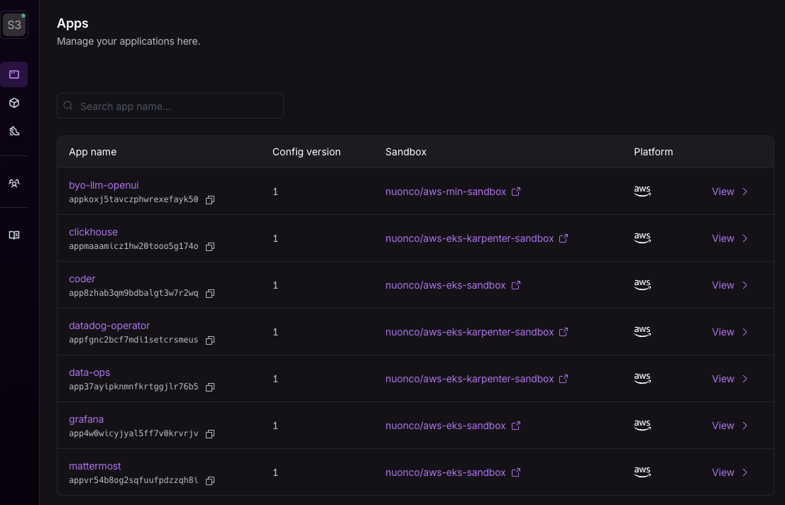
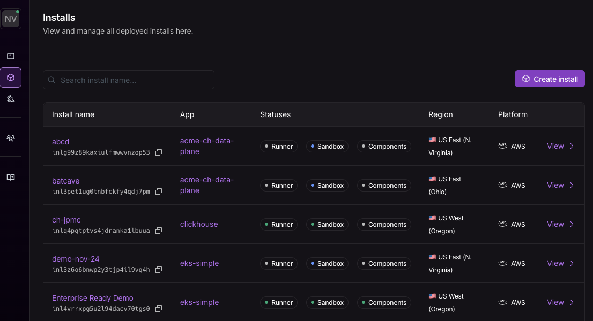
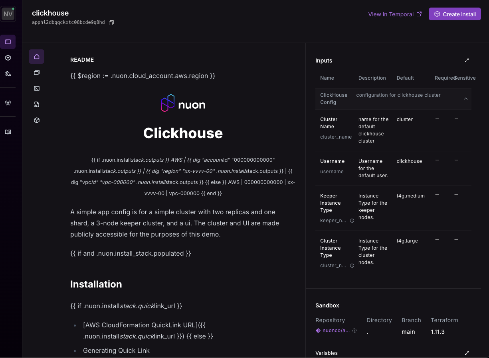
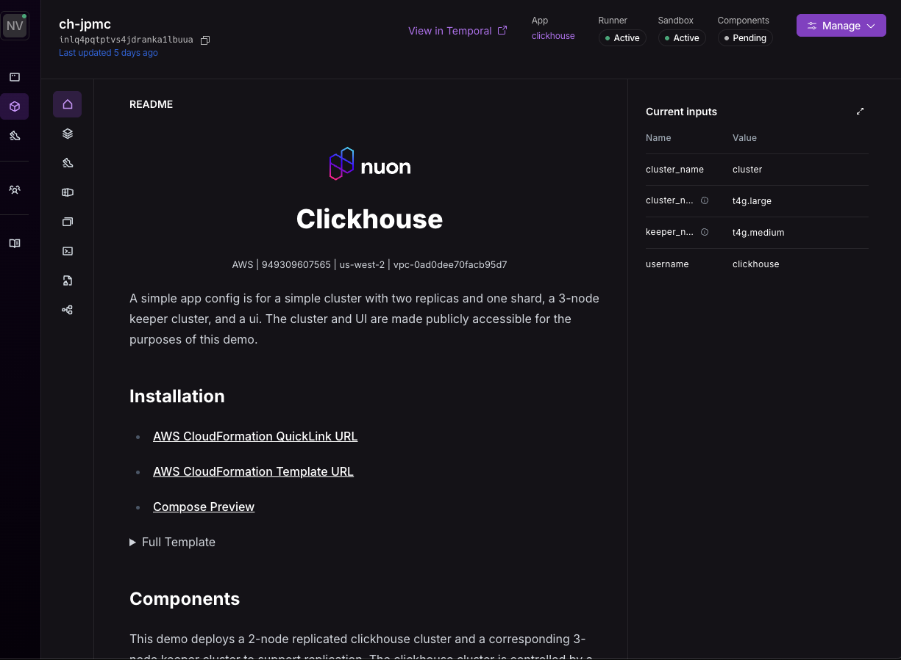
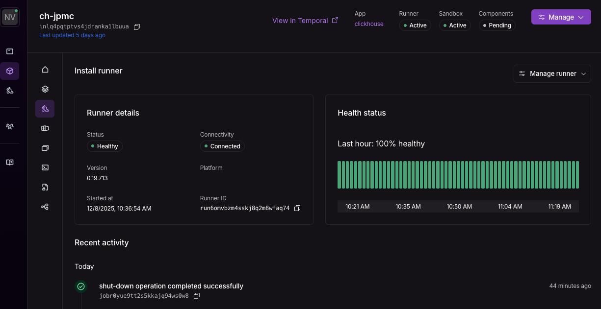
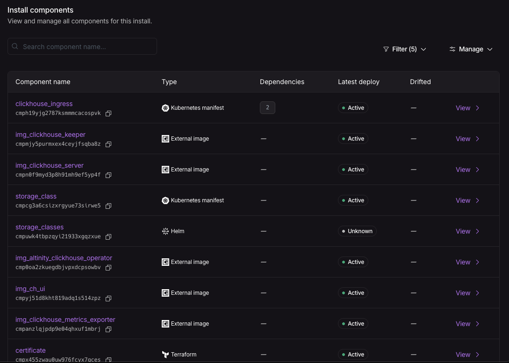
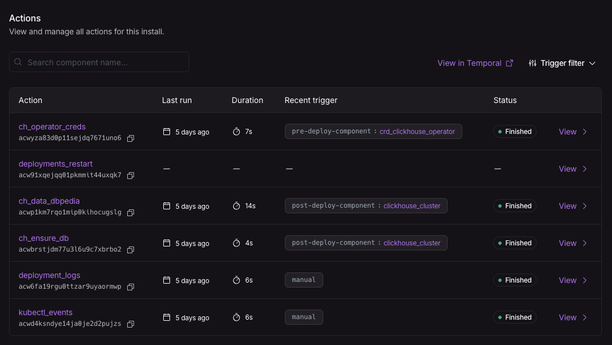
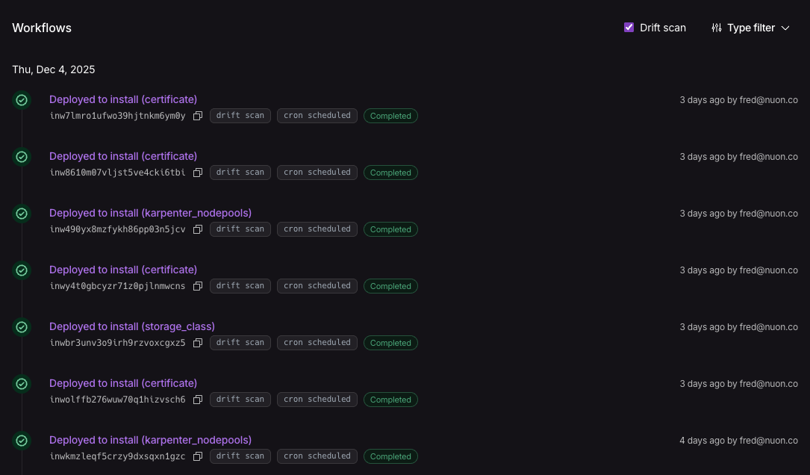
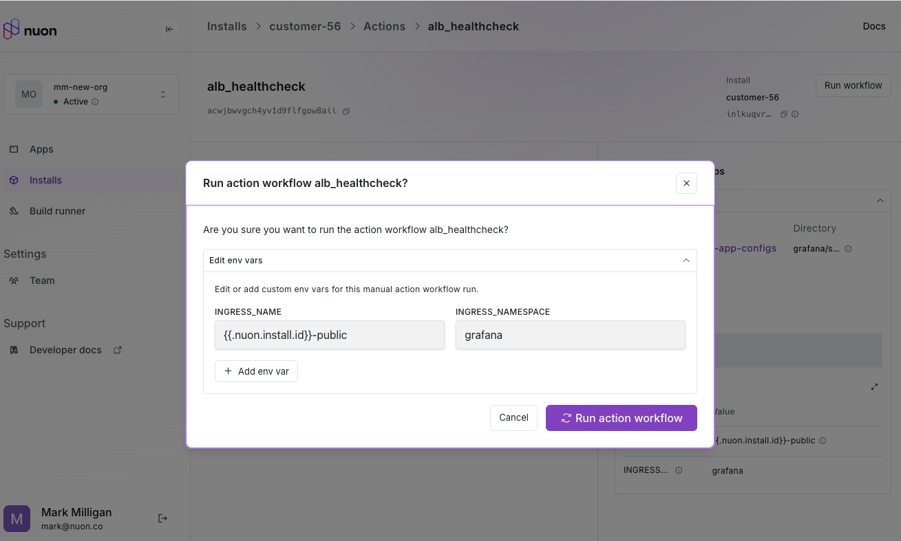
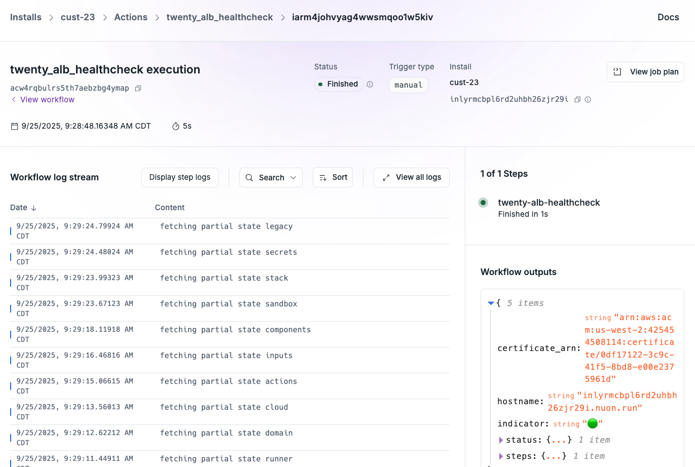

## Apps

With Nuon, Apps are created and synced to the Nuon control plane with the Nuon
[CLI](./cli). Once those steps are completed, Apps, their Components, and
Installs, can be administered in the web-based Dashboard UI.

Access the Dashboard UI at [https://app.nuon.co](https://app.nuon.co)

The default page is a list of Apps created in your Org.

## Installs

Installs of Apps are accessible from both the left navigation bar or within an
App's detail page.

After clicking into an App, there is a `README.md` describing the App and tabs
for the Components, Installs and Actions.

After clicking into an Install, there is the same app README.md with
interpolated values for the Install, inputs, state and tabs for the Runner,
Stack, Sandbox, Components, Actions and Workflows.

The runner tab shows the real-time status and health of the Nuon runner which
communicates from the install’s cloud account to the Nuon control plane for
install and maintenance jobs.

The Components tab lists the building blocks of the App such as Helm charts,
Kubernetes manifests, Terraform modules, and container images. The tab also
shows which build of an app’s component is used and has menu items to re-build
and re-deploy components.

Actions are bash scripts that perform install operations e.g., initialize a
database and day-2 operations like debug, perform health checks, and conduct
additional operations like break glass emergency repairs.

Workflows are orchestrated steps to perform an app or individual component
installation aka provisioning, de-provisioning an install or a component,
tear-down, or run actions, the bash scripts discussed earlier.

Here is a manual action workflow prompting the Nuon operator for inputs before
executing the action script.

Here is an already executed manual action to perform a health check on an
application load balancer. Note the green success indicators.

