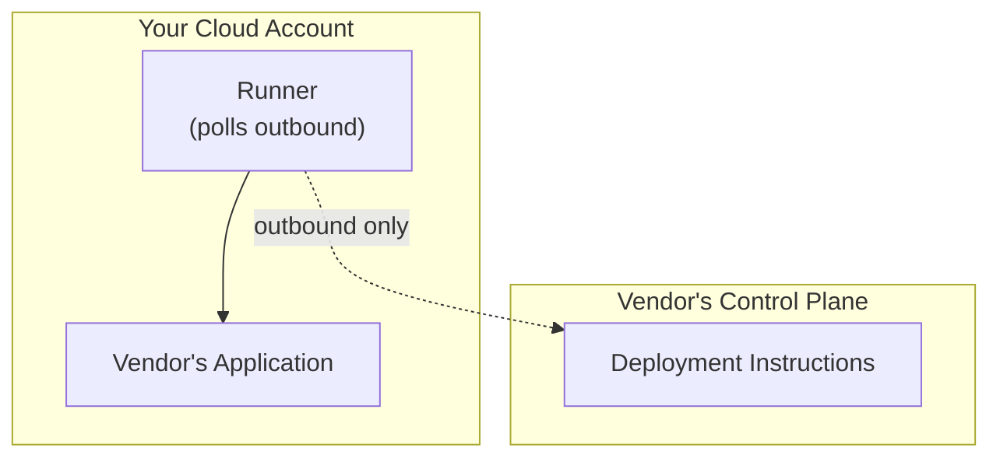

Your software vendor uses Nuon to deploy and manage their application in your cloud account. This guide explains what that means for you.

## What is Nuon?

Nuon is a deployment platform that lets software vendors deliver their applications to your cloud account without requiring direct access to your infrastructure.

**Key benefits for you:**
- Your data stays in your cloud account
- You control when updates are applied
- You can audit all changes made to your environment
- You can revoke vendor access at any time

## How it works

<Frame>

</Frame>

1. You run a CloudFormation stack (AWS), Bicep template (Azure), or Terraform (GCP)
2. This creates a "runner"—a small VM that connects outbound to the vendor
3. The vendor sends deployment instructions to the runner
4. The runner executes those instructions using permissions you approved

**Important:** The runner only makes outbound connections. Your vendor cannot initiate connections into your cloud.

## Guides for customers

<CardGroup cols={2}>
  <Card title="Installing in Your Cloud" icon="cloud-arrow-down" href="/for-customers/installing">
    Step-by-step guide to running the installation stack.
  </Card>

  <Card title="Understanding Permissions" icon="lock" href="/for-customers/permissions">
    What access you're granting and why.
  </Card>

  <Card title="Managing Updates" icon="arrows-rotate" href="/for-customers/updates">
    How to approve, defer, or reject updates.
  </Card>

  <Card title="Audit & Compliance" icon="clipboard-check" href="/for-customers/audit">
    Accessing audit logs and compliance information.
  </Card>
</CardGroup>

## Common questions

<AccordionGroup>
  <Accordion title="Can I see what the vendor is doing?">
    Yes. All operations are logged and auditable. Ask your vendor for audit logs if you need them for compliance.
  </Accordion>

  <Accordion title="Can I stop the vendor from accessing my environment?">
    Yes. You can shut down the runner VM at any time. This immediately stops all vendor access while keeping your application running.
  </Accordion>

  <Accordion title="Does my data leave my cloud account?">
    No. Your data stays in your cloud account. The vendor only sends deployment instructions—they don't extract your data.
  </Accordion>

  <Accordion title="What if something goes wrong?">
    Contact your vendor's support team. If needed, they may request temporary elevated access ("break-glass") which requires your explicit approval via a stack update.
  </Accordion>
</AccordionGroup>
