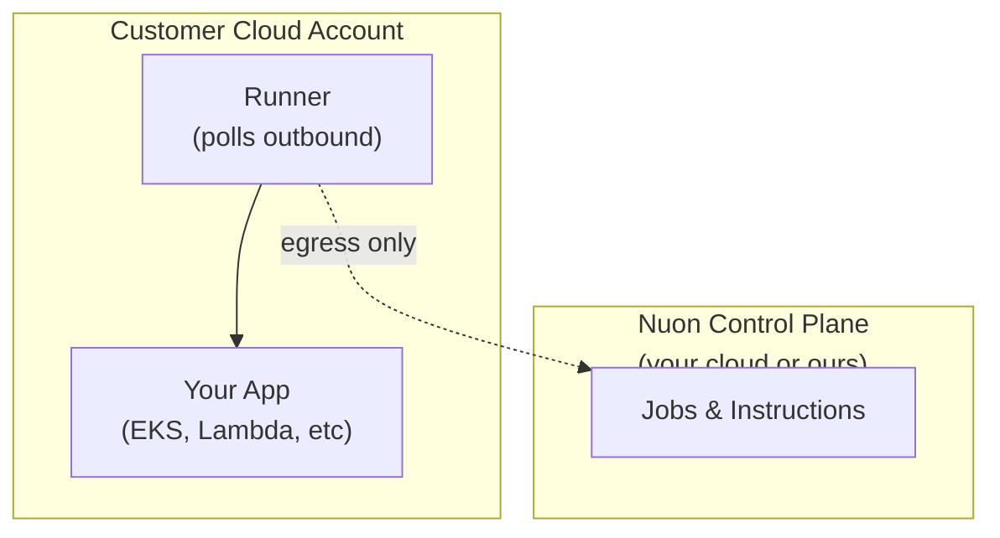

If you're evaluating Nuon for an enterprise deployment, you need to understand how it handles security, multi-customer management, and day-2 operations. This guide addresses the questions that matter when you're planning to deploy to dozens or hundreds of customer environments.

## Security Model

### How Nuon accesses customer clouds

Nuon uses an **egress-only runner architecture**. The runner is a stateless agent deployed in each customer's cloud account that:

1. **Polls outbound** to Nuon's control plane for jobs (no inbound access required)
2. **Uses scoped IAM roles** that your app configuration defines
3. **Has no standing access**—vendors never get direct cloud credentials

<Frame>

</Frame>

<Card title="Deep dive: Runner Architecture" icon="server" href="/runner-architecture">
  Full technical details on how the runner works.
</Card>

### IAM permissions you control

Every app defines three permission sets:

| Role | Purpose | Example permissions |
|------|---------|---------------------|
| **Provision** | Create infrastructure | `eks:CreateCluster`, `ec2:CreateVpc` |
| **Deprovision** | Tear down infrastructure | `eks:DeleteCluster`, `ec2:DeleteVpc` |
| **Maintenance** | Day-2 operations | `eks:DescribeCluster`, `logs:GetLogEvents` |

You define exactly what the runner can do. Customers review these permissions when they run the CloudFormation/Bicep/Terraform stack.

<Card title="Guide: Permissions" icon="lock" href="/guides/install-access-permissions">
  Learn how to scope permissions to the minimum required.
</Card>

### Break-glass access

For emergency situations, Nuon supports a **break-glass role** that:
- Is disabled by default
- Requires customer approval via a stack update
- Expires after a configurable time window
- Is fully audited

<Card title="Guide: Break-glass" icon="key" href="/production-readiness/break-glass">
  Set up emergency access procedures.
</Card>

## Architecture Patterns

### Supported deployment models

| Pattern | Description | Use case |
|---------|-------------|----------|
| **Dedicated VPC** | Each customer gets their own VPC and infrastructure | Maximum isolation, regulated industries |
| **Bring Your Own VPC** | Deploy into customer's existing VPC | Customers with established networking |
| **Bring Your Own Kubernetes** | Deploy to customer's existing EKS/AKS/GKE | Customers who manage their own clusters |
| **Serverless** | Lambda + managed services, minimal infrastructure | Cost-sensitive, low-ops deployments |

<Card title="Guide: Bring Your Own Network" icon="network-wired" href="/guides/bring-your-own-network">
  Deploy into existing customer infrastructure.
</Card>

### Multi-cloud support

| Cloud | Install Stack | Status |
|-------|---------------|--------|
| **AWS** | CloudFormation | Full support (EKS, ECS, Lambda) |
| **Azure** | Bicep/ARM | Production support (AKS) |
| **GCP** | Terraform | Production support (GKE) |

<CardGroup cols={3}>
  <Card title="AWS" icon="aws" href="/platform-support/aws" />
  <Card title="Azure" icon="microsoft" href="/platform-support/azure" />
  <Card title="GCP" icon="google" href="/platform-support/gcp" />
</CardGroup>

## Day-2 Operations

### Continuous updates

When you push changes, Nuon can:

1. **Detect drift** between desired and actual state
2. **Generate diffs** (Terraform plans, Helm diffs) for review
3. **Queue approvals** so customers control when updates apply
4. **Roll out progressively** across customer environments

<Card title="Guide: Workflows" icon="diagram-project" href="/concepts/workflows">
  Understand how deployments and updates flow through the system.
</Card>

### Actions for monitoring and remediation

Actions are bash scripts that run in customer environments for:

- **Health checks**: Verify ALB status, pod health, service availability
- **Diagnostics**: Collect logs, describe resources, check configurations
- **Remediation**: Restart services, clear caches, apply fixes

Actions can be triggered manually, on a schedule, or in response to events.

<Card title="Guide: Actions" icon="play" href="/guides/actions">
  Define operational tasks for your app.
</Card>

### Audit trails

Every operation is logged:
- What changed
- Who initiated it
- When it happened
- What the outcome was

Export audit logs for compliance or to share with customers who need proof of what happened in their environment.

## Control Plane Options

### Nuon Cloud (managed)
- Fastest to start
- No infrastructure to manage
- SOC 2 in progress

### Nuon BYOC (in your cloud)
- Nuon control plane runs in your AWS account
- Your data stays in your cloud
- You control the infrastructure

<Card title="Deployment Options" icon="cloud" href="/deployment-options">
  Compare Nuon Cloud vs BYOC deployment models.
</Card>

## Production Readiness Checklist

Before going to production, review:

<Steps>
  <Step title="Package your app">
    Convert your infrastructure to Nuon TOML configs. [Guide →](/production-readiness/package)
  </Step>
  <Step title="Define permissions">
    Scope IAM roles to minimum required. [Guide →](/guides/install-access-permissions)
  </Step>
  <Step title="Set up monitoring">
    Create health check actions. [Guide →](/production-readiness/monitor)
  </Step>
  <Step title="Plan for incidents">
    Configure break-glass and runbooks. [Guide →](/production-readiness/break-glass)
  </Step>
  <Step title="Document for customers">
    Create customer-facing installation guides. [Guide →](/production-readiness/customer-setup)
  </Step>
</Steps>

<Card title="Full Production Readiness Checklist" icon="clipboard-check" href="/production-readiness/introduction">
  Complete guide to taking your BYOC offering to production.
</Card>

## Common Questions

<AccordionGroup>
  <Accordion title="How do customers trust what's deployed?">
    Customers see exactly what permissions they're granting via the CloudFormation stack. They can review IAM policies before deploying. Audit logs track all operations.
  </Accordion>

  <Accordion title="What if we need console access?">
    Nuon's philosophy is that you shouldn't need console access. Actions provide programmatic access to diagnostics and remediation. For true emergencies, break-glass roles provide time-limited elevated access with customer approval.
  </Accordion>

  <Accordion title="Can customers disconnect the vendor?">
    Yes. Customers can shut down the runner VM at any time, immediately cutting off all vendor access. The deployed application continues running.
  </Accordion>

  <Accordion title="How do you handle different customer versions?">
    Each install can be on a different version. Nuon tracks component versions per install, so you can roll out updates progressively and maintain customers on different release tracks.
  </Accordion>

  <Accordion title="What about SOC 2 / HIPAA / compliance?">
    Because customer data stays in customer clouds, many compliance concerns are simplified. Nuon Cloud is pursuing SOC 2. For maximum compliance, run Nuon BYOC in your own cloud.
  </Accordion>
</AccordionGroup>

## Next Steps

<CardGroup cols={2}>
  <Card title="Try a sample app" icon="play" href="/get-started/ship-byoc-fast">
    Get hands-on in 15 minutes.
  </Card>

  <Card title="Talk to us" icon="comments" href="https://join.slack.com/t/nuoncommunity/shared_invite/zt-1q323vw9z-C8ztRP~HfWjZx6AXi50VRA">
    Discuss your architecture with the Nuon team.
  </Card>
</CardGroup>
