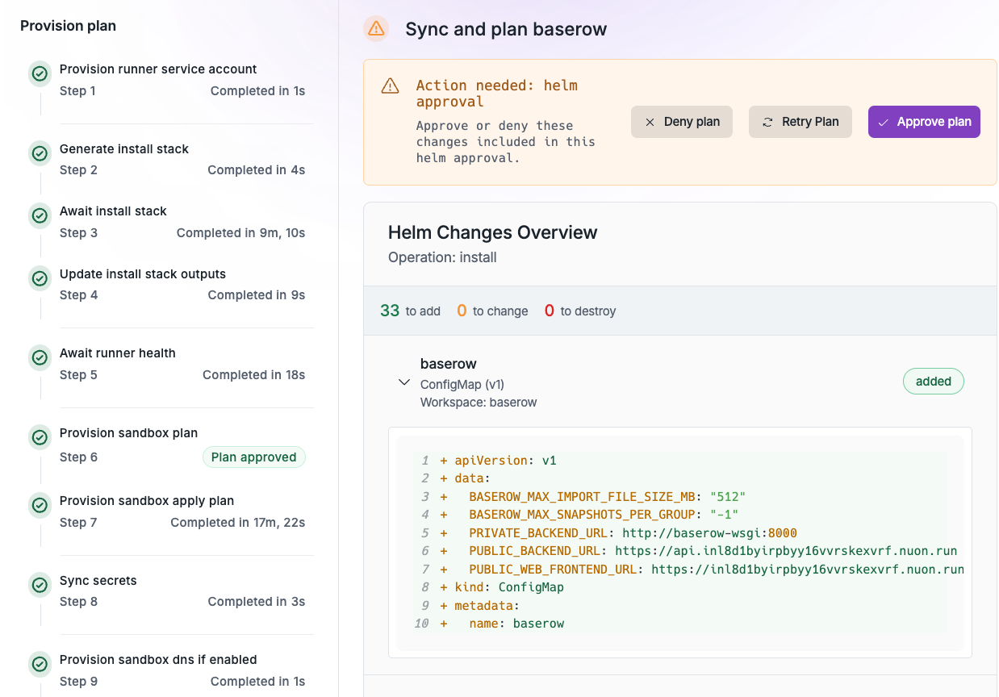
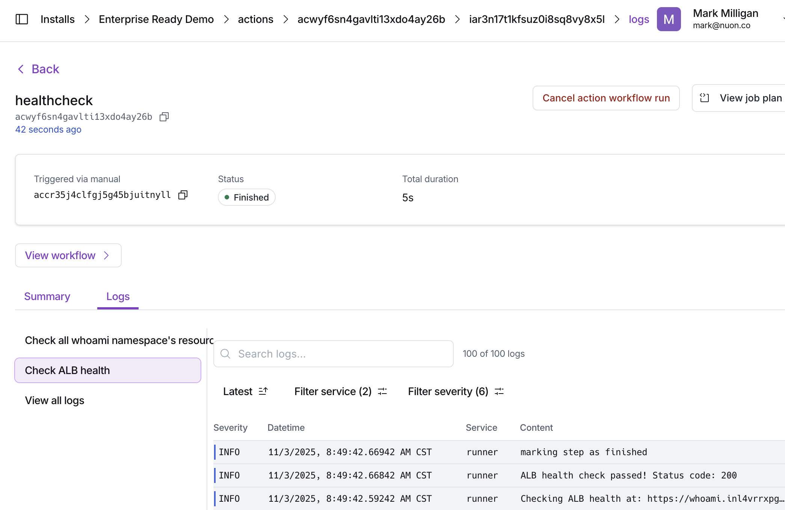
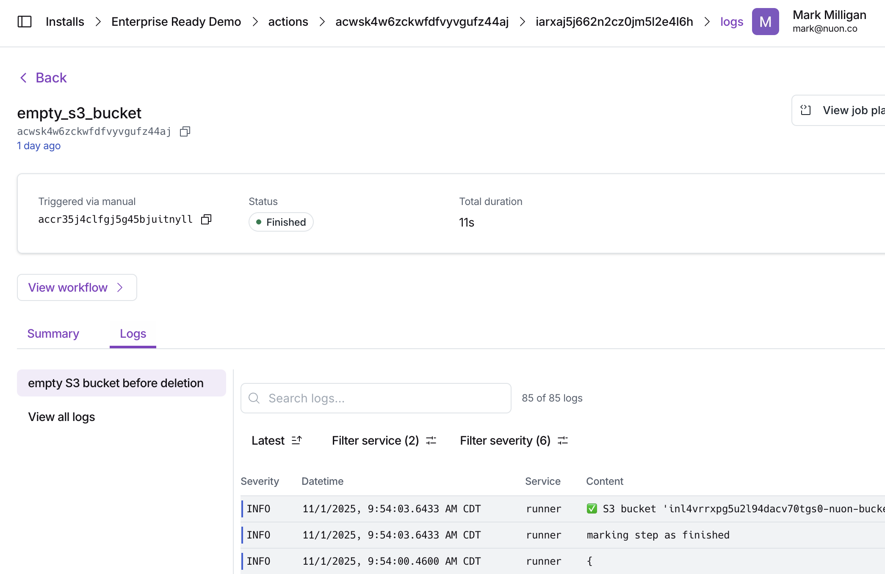

[Apps](../concepts/apps) and [installs](../concepts/installs) in Nuon have a
defined life cycle or [workflow](../concepts/workflows) that starts with
packaging your app, syncing and building OCI artifacts in a container registry.
This is followed by one to many installations of your app defined specifically
for customers. Post installation includes updating the installs with change
controls, and monitoring and remidiating the installs.

Understanding this life cycle is crucial for effectively using Nuon to manage
your apps and installs.

# App Life Cycle

## Package your app

The first step in the app life cycle is to package your app as a set of `.toml`
files in a git-backed repository. These files define the app's sandbox (e.g.,
VPC, networking, and Kubernetes infrastructure), components, inputs, variables,
and other configuration details. These configurations can point to your existing
Terraform modules, Helm charts, Kubernetes manifests, or other
infrastructure-as-code resources.

Packaging your app can be customized to re-use existing VPCs, networking, or
Kubernetes clusters, or by default creates new ones for each install.

## Sync and Build

When an app is initially created and synced to the Nuon control plane with the
[Nuon CLI](../cli), a build occurs for each component in the app.

Builds create an OCI artifact for each component and the Nuon control plane
stores them in the container registry like AWS ECR.

<Note>
	If you change a component after the initial `nuon apps sync`, you must
	re-build the component. Running `nuon apps sync` again will re-build most
	component changes, or manually through the Dashboard UI for git
	repository-based source code changes referenced in the component. Otherwise,
	the changes will not be reflected in the app in Nuon nor any deployed
	installs.
</Note>

If the Nuon CLI detects a change during `nuon apps sync`, e.g., a component
`.toml` file is changed or a referenced file like a Helm values.yaml, it will
automatically rebuild the component, with the build status visible in the CLI
progress output.

If a git repository referenced by the component changes, e.g., a Terraform
module source or a Helm chart, you must manually re-build the component in the
Dashboard UI even after `nuon apps sync` with the Nuon CLI.

# Install Life Cycle

## Installs, defined for your customers

Installs into customer cloud accounts are created from apps and inherit the
infrastructure and components defined in the app. When an install is created, it
uses the latest built version of each component.

An install's life cycle is managed by [workflows](../concepts/workflows) that
define the steps to deploy, update, manage, and tear down the install.

Commencing an install involves adding any inputs defined by the app. e.g., api
key, cloud region, node instance type, app release version, etc. This is how
installs are customized for each customer.

Install workflows consist of multiple steps that execute in sequence to deploy
and manage the install.

## Update, with change controls

Because apps are git-backed, you can update individual or multiple installs to
the latest release of your app or upgrade components or even infrastructure.
e.g., Kubernetes version.

Updates have approval gates by default to ensure changes are reviewed before
being applied to customer installs. e.g., Helm diffs, Terraform plan outputs.
The user can optionally Accept All approvals to streamline the update process.

Kyverno policies can also be applied to installs to enforce security and
compliance during updates. e.g., creating ingress resources or tampering with
container resources requests/limits.

If there are any installs for an app where a component is rebuilt, you must
re-deploy the component in the Dashboard UI otherwise the install will not
receive the component change.

<Note>
	If you have changed an app's components and do not see their changes reflected
	in your installs, ensure you have re-deployed the updated components in the
	Nuon Dashboard. This is a common step that can be overlooked.
</Note>

## Monitor and Remediate

Once deployed, installs can be monitored for health and performance metrics with
actions, bash scripts included in the app. e.g., checking pod status, disk
space, ALB availability, etc.

Actions can also perform remediation tasks automatically or manually through the
Dashboard UI to resolve issues detected during monitoring.

If elevated permissions are required, the user maintaining the install can
request a break glass role with elevated permissions for a limited time to
perform necessary tasks. The end customer approves the request via a
CloudFormation stack which updates the permissions in the install's runner.
