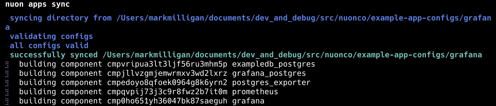
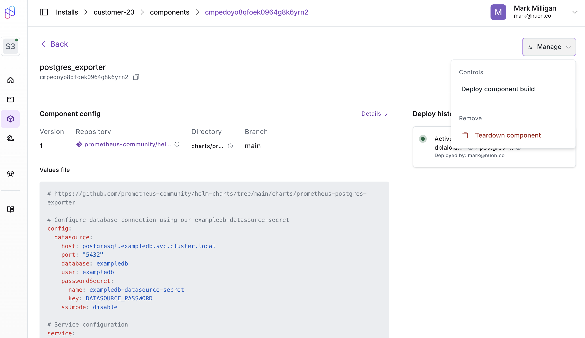

Apps and installs in Nuon have a defined life cycle that includes creation,
configuration, building, deployment, and management. Understanding this life
cycle is crucial for effectively using Nuon to manage your apps and installs.

# App Life Cycle

When an app is initially created and synced to the Nuon control plane with the
[Nuon CLI](../cli), a build occurs for each Component in the App Config.

Builds create an OCI artifact for each component and the Nuon control plane
stores them in the container registry like AWS ECR.

<Note>
	If you change a component after the initial `nuon apps sync`, you need to make
	sure you to re-build the component. Otherwise, the changes will not be
	reflected in the app in Nuon nor any deployed installs.
</Note>{" "}

If the Nuon CLI detects the change during `nuon apps sync`, e.g., a component
`.toml` file is changed or a referenced file like a Helm values.yaml, it will
automatically rebuild the component, with the build status visible in the CLI
progress output.

If a git repository referenced by the component changes, e.g., a Terraform
module source or a Helm chart, you need to be sure to manually re-build the
component in the Dashboard UI even after `nuon apps sync` with the Nuon CLI.

# Install Life Cycle

If there are any installs for an app where a component is rebuild, you must
re-deploy the component in the Dashboard UI otherwise the install will not
receive the component change.

<Note>
	If you have changed an app's components and do not see their changes reflected
	in your installs, ensure you have re-deployed the updated components in the
	Nuon Dashboard. This is a common step that can be overlooked.
</Note>{" "}
