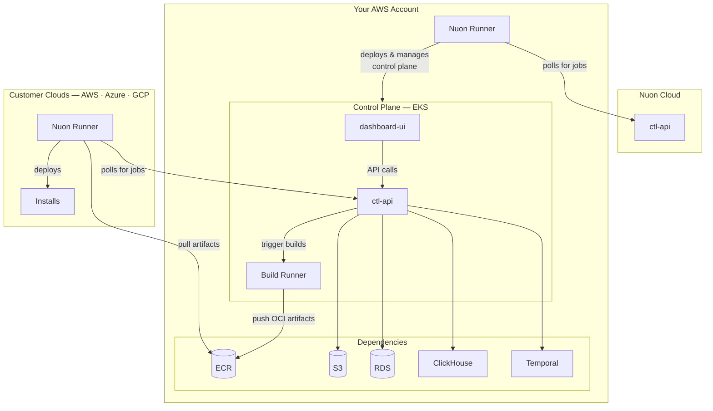
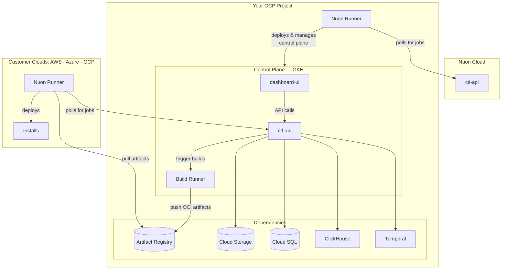

Nuon BYOC gives you a single-tenant Nuon control plane, running in your own cloud, managed as a Nuon install.
You will get all the benefits of Nuon as a managed SaaS service, but in your own cloud.

We use Nuon Cloud to deploy and manage Nuon BYOC as an install — the same process you use to manage apps for your own customers.
We will operate and update Nuon BYOC, while you retain full ownership of your data, networking, and compliance posture.

Nuon BYOC requires a paid license. [Contact sales](https://nuon.co/contact-sales) to get started.

## Architecture

We support running Nuon BYOC on AWS and GCP.
The shape of the architecture is the same across platforms, but using the services native to each cloud.

<Tabs>

<Tab title="AWS">
On AWS, Nuon BYOC runs on an EKS cluster in a dedicated VPC. It uses RDS for the Nuon control-plane and Temporal databases.

Ensure you have admin permissions, and that the account has not reached its quota limits for VPCs, EIPs, and Internet Gateways.

Nuon's resource requirements are not compatible with AWS Free Tier. You will need a paid account.
</Tab>

<Tab title="GCP">

On GCP, Nuon BYOC runs in a GKE cluster in a dedicated VPC Network. Cloud SQL is used for the Nuon control-plane and Temporal databases.

The following APIs must be enabled in your GCP Project.

- Secret Manager API
- Compute Engine API
- IAM Service Account Credentials API
- Cloud Resource Manager API
- Kubernetes Engine API
- Cloud DNS API
- Artifact Registry API
- Certificate Manager API
- Service Networking API
- Cloud SQL Admin API
</Tab>

</Tabs>
