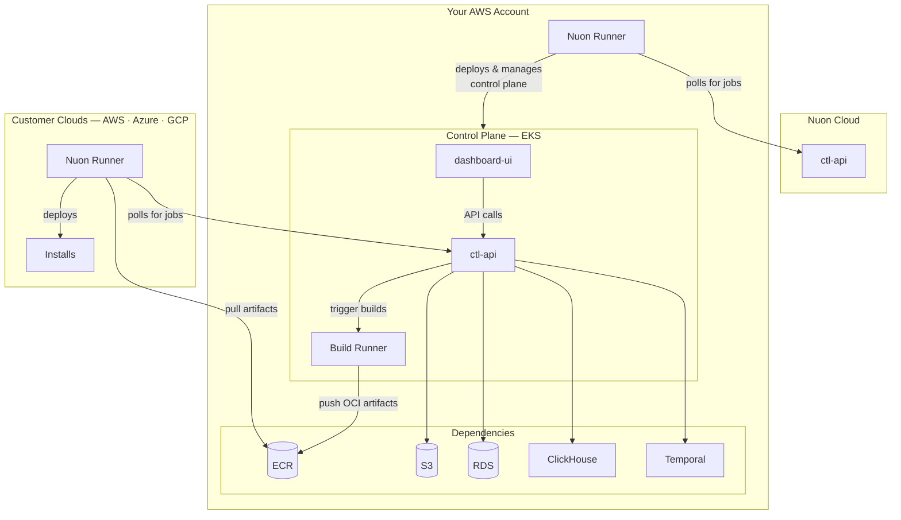

## Architecture

On AWS, Nuon BYOC runs on an EKS cluster in a dedicated VPC.
Ensure you have admin permissions, and that the account has not reached it's quota limits for VPCs, EIPs, and Internet Gateways.



The following regions have been tested and confirmed to support Nuon BYOC.

- us-east-1
- us-east-2
- us-west-2
- eu-west-1

<Note>Nuon's resource requirements are not compatible with AWS Free Tier. You will need a paid account.</Note>

## Select installation method

Nuon supports provisioning the install stacks to AWS using either a Terraform module or a Cloudformation stack.
Both options will provision the same architecture, and accept the same configuration.
When using Terraform, provide them to the stack module using variables.
When using Cloudformation, provide the inputs and secrets below manually through the AWS Cloudformation UI.

<Note>
When using using Terraform, we strongly recommend storing secret values in a secret store and passing them in using env vars or an ephemeral tfvars file.
</Note>

<Tabs>

<Tab title="Terraform">
```hcl main.tf
terraform {
  required_providers {
    aws   = { source = "hashicorp/aws" }
    stack = { source = "nuonco/stack" }
  }
}

provider "aws" {
  region = "us-east-1"
}

provider "stack" {
  api_url = "https://runner.nuon.co"
}

module "aws_stack" {
  source  = "nuonco/stack/aws"
  version = "~> 1.0"

  install_id = "inl28f8vtvldqp6wjj5cobfzm0"

  inputs = {
    github_app_client_id            = ""
    github_app_id                   = ""
    github_app_name                 = ""
    nuon_auth_allow_all_users       = ""
    nuon_auth_allowed_domains       = ""
    nuon_auth_client_id             = ""
    nuon_auth_issuer_url            = ""
    nuon_auth_provider_type         = ""
    read_only_enable_cluster_access = "false"
    read_only_role_arn              = ""
  }

  secrets = {
    nuon_auth_client_secret = { value = var.nuon_auth_client_secret }
    github_app_key          = { value = var.github_app_key }
    slack_client_secret     = { value = var.slack_client_secret }
    slack_signing_secret    = { value = var.slack_signing_secret }
  }
}

variable "nuon_auth_client_secret" {
  type        = string
  sensitive   = true
  description = "OIDC Client Secret from your identity provider."
}

variable "github_app_key" {
  type        = string
  sensitive   = true
  description = "Base64 encoded Github App Key"
}

variable "slack_client_secret" {
  type        = string
  sensitive   = true
  description = "Client Secret from your Slack app's Basic Information page. Managed out-of-band: the central AWS Secrets Manager entry referenced by slack_secrets_arn is the source of truth, and the sync_slack_secrets action writes the value into k8s."
}

variable "slack_signing_secret" {
  type        = string
  sensitive   = true
  description = "Signing Secret from your Slack app's Basic Information page. Used to verify signed Slack webhook requests (events, slash commands, interactions). Managed out-of-band: the central AWS Secrets Manager entry referenced by slack_secrets_arn is the source of truth, and the sync_slack_secrets action writes the value into k8s."
}
```

```sh sh
export TF_VAR_nuon_auth_client_secret='<nuon-auth-client-secret-value>'
export TF_VAR_github_app_key='<github-app-key-value>'
export TF_VAR_slack_client_secret='<slack-client-secret-value>'
export TF_VAR_slack_signing_secret='<slack-signing-secret-value>'
```
</Tab>

<Tab title="Cloudformation">

</Tab>

</Tabs>

## Inputs

### Authentication Configuration

| Input              | Value                                  |
| ------------------ | -------------------------------------- |
| Auth Provider Type | `google` or `oidc`                     |
| Auth Client ID     | `[secret]`                             |
| Auth Client Secret | `[secret]`                             |
| Auth Redirect URL  | `https://auth.<your-root-domain>/auth` |

<Warning>
If using the deprecated Auth0 integration, you will need to provide these inputs instead.

| Input | Value |
|-------|-------|
| Auth0 Issuer URL | Your Auth0 tenant URL |
| Auth0 Audience | Your Auth0 API identifier |
| Auth0 Client ID - CTL API | Your Auth0 native app client ID |
| Auth0 Client ID - Dashboard UI | Your Auth0 SPA client ID |
</Warning>

### GitHub Configuration

| Input                | Value                          |
| -------------------- | ------------------------------ |
| Github App Name      | Name of your GitHub app        |
| Github App ID        | ID of your GitHub app          |
| Github App Client ID | Client ID from your GitHub app |

### DNS Configuration

| Input       | Value                                                                        |
| ----------- | ---------------------------------------------------------------------------- |
| Root Domain | Your custom domain, or `<your-install-id>.nuon.run` for Nuon-provided domain |

### Database Configuration (Optional)

Adjust instance sizes for RDS, Temporal, and ClickHouse clusters if needed.

### Slack Configuration (Optional)

Provide these only if you created a Slack app in the [Slack App](#slack-app-optional) section. Leave blank to disable the Slack integration.

| Input                     | Value                                                     |
| ------------------------- | --------------------------------------------------------- |
| Slack Client ID           | Client ID from your Slack app's Basic Information page    |
| Slack OAuth Redirect URL  | `https://slack.<your-root-domain>/slack/oauth/callback`   |

## Secrets

| Secret               | Value                                  |
| -------------------- | -------------------------------------- |
| `github_app_key`     | Your base64-encoded GitHub App PEM key |
| `auth_client_secret` | The client secret from your Auth0 SPA  |
| `slack_client_secret` | Client Secret from your Slack app (optional — required only if using Slack) |
| `slack_signing_secret` | Signing Secret from your Slack app (optional — required only if using Slack) |
| `slack_state_jwt_secret` | A random high-entropy string (e.g. `openssl rand -hex 32`); signs the OAuth state JWT during Slack installation. Optional — required only if using Slack. |

<Note>
The GitHub App PEM key must be base64 encoded to preserve newlines in text fields.

To encode your PEM key:

```bash
base64 -i your-github-app-key.pem
```

</Note>

### Configure Telemetry Export (Optional)

The `nuon/<install-id>/telemetry-export-config` is automatically generated by the stack, and grants the runner read access.
Update the secret to configure telemetry export to your own OTLP-compatible backend, starting with runner audit logs.
See [Export Runner Audit Logs](/guides/export-runner-audit-logs) for the configuration reference, cloud-specific steps, and verification guidance.

## Verify Installation

After successful provisioning, verify your installation is working by visiting these URLs.

| Service    | URL                                 |
| ---------- | ----------------------------------- |
| Dashboard  | `https://app.<your-root-domain>`    |
| CTL API    | `https://api.<your-root-domain>`    |
| Runner API | `https://runner.<your-root-domain>` |

You can also verify the API is responding by curling it directly.

```bash
curl https://api.<your-root-domain>/health
```
