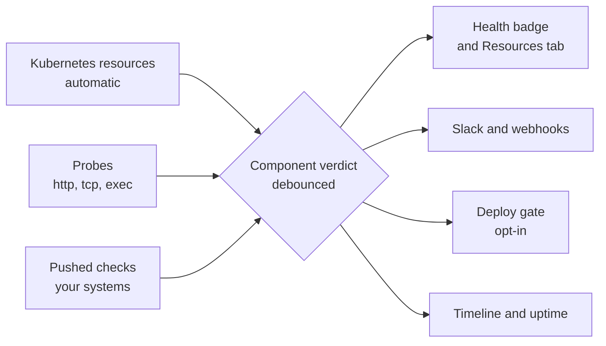
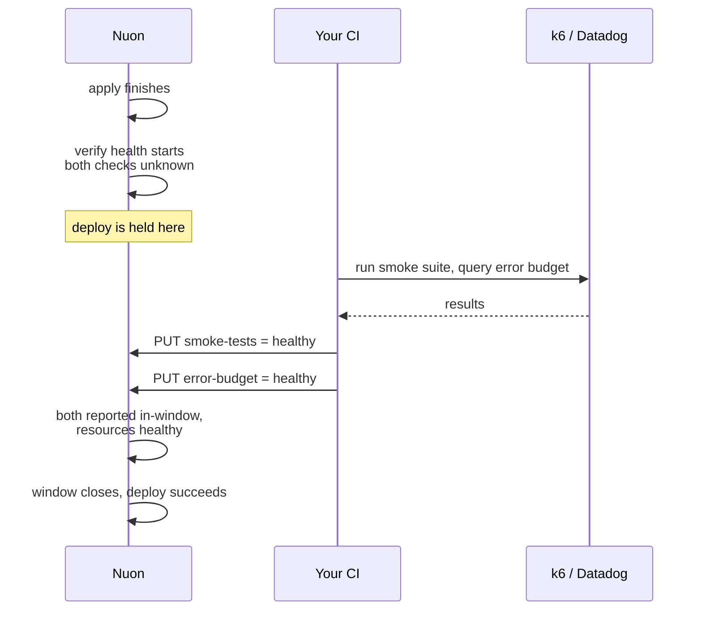

Your deploy succeeded. Is your app actually serving?

Those are different questions, and only one of them is what your customer asks you. Deploy status
tells you the last apply worked — `helm upgrade` can exit 0 while the release sits in
`pending-install` and nothing serves traffic. Terraform and Helm skip when state already matches, so
a component reports Active while its pods are stuck. Something fixed by hand out of band keeps
showing yesterday's error.

Component health answers the live question instead — continuously, per component, on every install.
It's a **separate axis**: Nuon never overwrites deploy status with health or the other way round.

<CardGroup cols={2}>
  <Card title="See what's actually running" icon="eyes">
    Every resource each component manages, with live status, browsable per install.
  </Card>
  <Card title="Get told when it breaks" icon="bell">
    Debounced alerts to Slack and webhooks, with the failing resource and why.
  </Card>
  <Card title="Gate your deploys" icon="shield-check">
    A deploy isn't done when `helm` exits — it's done when the component stays healthy.
  </Card>
  <Card title="Prove it stayed up" icon="chart-line">
    90 days of timeline and uptime per component and install.
  </Card>
</CardGroup>

## Turn it on

<Steps>
  <Step title="Ask Nuon to enable it">
    Component health is behind the `component-health` org feature. Ask us to switch it on for your
    organization — there's nothing to install and no agent runs in your customers' clusters.
  </Step>
  <Step title="Deploy, or refresh cluster access">
    Health reads your customers' clusters using the same access your deploys already use. An install
    that hasn't deployed since the feature was enabled needs one deploy — or click **Refresh cluster
    access** on the install's health card to pick it up immediately.
  </Step>
  <Step title="Open the install's Resources tab">
    Within a minute or two you'll see every resource each component manages, with per-resource
    health, filterable by component, kind, namespace and status.
  </Step>
</Steps>

<Note>
No configuration is required for any of this. Everything below is optional and only extends what
already happens.
</Note>

## What you get with no configuration

Helm chart and Kubernetes manifest components are checked automatically, about once a minute.

**Standard workloads** — Deployments, StatefulSets, DaemonSets, Pods, Services,
PersistentVolumeClaims, Ingresses and Jobs — plus the Helm release's own status.

**Your custom resources too.** Nuon reads the kinds your chart or manifest actually ships, so a
`Certificate`, an `Issuer`, a Karpenter `NodePool` or your own CRD is watched like anything else. A
component that starts shipping a new kind picks it up on its next deploy or drift check.

**Controller-side failures.** Some failures never appear in an object's own status — an Ingress whose
load balancer rejected a certificate looks fine if you only read the Ingress. Nuon reads Kubernetes
warning events too, so those surface as well.

**Terraform components** get their cloud resources listed so you can see what a component owns. Those
rows are inventory, not assessment, so they don't move the verdict on their own — [add a probe or a
check](#choosing-a-check) to give a Terraform component a real verdict.

## How a verdict is reached



The worst thing observed sets the verdict. A component is only as healthy as its unhappiest part.

| Verdict | Meaning |
| --- | --- |
| `healthy` | Everything Nuon observes is fine. |
| `progressing` | A rollout is in flight and can still converge. Not yet a problem. |
| `degraded` | Something is wrong but the component is partly serving. |
| `unhealthy` | The component is not serving. |
| `unknown` | No fresh observations — usually the runner is offline. **Not a failure.** |
| `not-applicable` | Nothing observable here, or the component has never deployed. |

Two rules are worth knowing, because they're why you won't get paged at 3am for nothing:

**Verdicts are debounced.** Three consecutive bad observations flip a component bad; two good ones
bring it back. A single pod restart or a controller backing off doesn't alert.

**Absence of data is never failure.** If observations stop for five minutes the verdict becomes
`unknown` — visually distinct from a failure, and it never alerts. Nuon doesn't guess in either
direction.

<Tip>
A rollout that *can't* converge is reported as `degraded`, not `progressing` — a bad image tag or an
unschedulable pod surfaces straight away rather than waiting out the Kubernetes progress deadline.
And anything stuck `progressing` for 30 minutes is treated as `degraded`, because at that point it
isn't progressing.
</Tip>

## Choosing a check

Three ways to add your own signal. They compose freely — most components need none of them.

| | Use it when | Runs where | Can gate a deploy |
| --- | --- | --- | --- |
| **Probe** | Nuon can reach the thing — an endpoint, a port, a command | Nuon, every cycle | Yes |
| **Pushed check** | Only *your* systems know — CI, a business metric, a nightly audit | Your systems, on your clock | Yes, with `required_checks` |
| **Required check** | A deploy must not finish until an external system says so | — | That's its whole job |

<Note>
**Probes work on every component type, including Terraform.** You don't need a Kubernetes footprint,
and you don't need to write an action. If Nuon can reach it over HTTP, TCP, or a command, a probe is
the simplest thing that works.
</Note>

## Probes

Probes assert your app is actually serving, above the level of infrastructure. A Deployment can be
perfectly ready while the thing inside it returns 500.

<CodeGroup>
```toml Kubernetes component
[[components.api.health.probes]]
type = "http"
url  = "https://{{.nuon.install.sandbox.outputs.public_domain}}/healthz"

[[components.api.health.probes]]
type = "tcp"
url  = "db.internal:5432"

[[components.api.health.probes]]
type = "exec"
name = "migrations-current"
command = ["/usr/local/bin/check-migrations", "--strict"]
```

```toml Terraform component
# An EC2 instance has no Kubernetes status to read, so give it a probe.
# Reference the module's own output.
[[components.ec2.health.probes]]
type = "http"
url  = "http://{{.nuon.components.ec2.outputs.public_ip}}/status/200"
```
</CodeGroup>

- **`http`** passes on 2xx/3xx and never follows redirects.
- **`tcp`** passes if the port accepts a connection.
- **`exec`** passes on exit code 0 and reports the command's output when it fails.

`exec` commands are an argv, never a shell string, and run with a minimal environment (`PATH`,
`HOME`, `TMPDIR`) — they can't see the runner's credentials. Every probe is bounded by a short
timeout and runs once per cycle.

Probe results are ordinary observations: same verdict, same debounce, same alerts, same history.

<Note>
Templated targets are resolved from the install's state, so a probe pointing at a component's own
output can't resolve until that component has applied at least once. Until then the probe reports
`unknown` and says so — it stays visible rather than silently vanishing, and it never fails a deploy.
</Note>

## Pushed checks

For anything Nuon can't reach — a business metric, a queue depth, something your CI already
computed — push it in and it becomes part of the component's health.

```bash
curl -X PUT \
  "https://api.nuon.co/v1/installs/$INSTALL_ID/components/$COMPONENT_ID/health/checks/checkout-latency" \
  -H "Authorization: Bearer $NUON_API_TOKEN" \
  -H "X-Nuon-Org-ID: $NUON_ORG_ID" \
  -d '{"status":"degraded","message":"p99 1.8s over 1.2s budget"}'
```

`status` is one of `healthy`, `degraded`, `unhealthy`, `unknown`. Names are 1–100 characters of
letters, digits, dots, dashes or underscores.

**A pushed check can make a component worse, never better.** Reporting `healthy` will not paper over
crash-looping pods.

**Say how often you'll report.** A check's last value stands for 5 minutes by default. If yours
reports less often, set `stale_after` (up to `60m`):

```bash
  -d '{"status":"healthy","stale_after":"30m","message":"nightly audit clean"}'
```

Past its window a check reads `unknown` rather than keeping its last answer — it stays visible but
stops voting, because a stale answer isn't an answer.

## Required checks

Sometimes a deploy shouldn't be considered finished until something outside Nuon confirms it —
migrations applied, a smoke suite green, a canary analysis passed. List those by name and the deploy
waits for them, the same way a GitHub branch rule waits for a required status check.

```toml
[components.api.health]
block_deploy    = true
required_checks = ["migrations-applied", "smoke-tests"]
```

Each name must be [pushed](#pushed-checks) **after the apply finishes** and be healthy when the
window closes. Nuon can't produce these itself — that's the point — so something in your pipeline has
to push them:

```bash
curl -X PUT ".../health/checks/migrations-applied" \
  -H "Authorization: Bearer $NUON_API_TOKEN" -H "X-Nuon-Org-ID: $NUON_ORG_ID" \
  -d '{"status":"healthy","message":"schema at revision 41"}'
```

<Warning>
If a required check never reports inside the window, the deploy **fails** — it doesn't wait forever.
Give your pipeline room by lengthening `stabilization_window`, rather than expecting the gate to
wait longer on its own.
</Warning>

Every required check starts the window as `unknown` and only counts once it reports, so a value left
over from a previous deploy can't satisfy the gate for this one.

### Example: gate a deploy on a k6 smoke suite

Say you want no deploy to count as finished until k6 has run a smoke suite against the install and
Datadog confirms error rate is within budget. Both are things only your systems know, so both are
pushed checks — and both are listed as required.

```toml
[components.api.health]
block_deploy         = true
stabilization_window = "10m"          # room for the suite to run
required_checks      = ["smoke-tests", "error-budget"]
```



Your pipeline pushes the results whenever they're ready:

```bash
BASE="https://api.nuon.co/v1/installs/$INSTALL_ID/components/$COMPONENT_ID/health/checks"
AUTH=(-H "Authorization: Bearer $NUON_API_TOKEN" -H "X-Nuon-Org-ID: $NUON_ORG_ID")

k6 run smoke.js \
  && curl -X PUT "$BASE/smoke-tests" "${AUTH[@]}" \
       -d '{"status":"healthy","message":"42 checks passed"}' \
  || curl -X PUT "$BASE/smoke-tests" "${AUTH[@]}" \
       -d '{"status":"unhealthy","message":"checkout flow failed"}'
```

Push the failure too, rather than staying silent — a reported failure fails the deploy immediately
with a reason attached, where silence just waits out the window and fails with "never reported".

<Note>
The same pattern works with anything that can make an HTTP call: a Datadog monitor webhook, a Grafana
alert, a GitHub Action, an Argo workflow step, a nightly audit job. Nuon doesn't care what produced
the answer — only that it arrived after the apply and inside the window.
</Note>

## Alerting

Health transitions fan out through webhooks and Slack like any other Nuon event. Subscribe with a
single per-resource flag:

- **`component_health`** on `components` — delivers both directions, so a channel that hears about a
  failure always hears the recovery.
- **`install_degraded`** on `installs` — the install-level rollup crossing. Usually you don't need
  this as well: when a component's failure is what moved the install, the component alert reports
  both in one message.

Two events below: the component degrading, then recovering a couple of minutes later. The failing
resource and the reason travel with the alert, so the first thing you read is already the diagnosis.

Notice that each message covers the component **and** the install. When a component's crossing is what
moved the install rollup, the headline says `install degraded` and an **Install health** field carries
`healthy → degraded` — rather than a second, separate install message arriving alongside it.

<Frame caption="A component degrading and recovering, delivered to Slack.">
  
</Frame>

Three things are deliberately quiet:

- **`unknown` never alerts.** A runner going offline is already reported as runner inactivity, and
  would otherwise page you once per component.
- **Only root causes alert.** When a component fails because something it depends on failed, the
  dependents are labelled `downstream of <component>` and stay silent. One outage, one alert.
- **Recoveries are always paired** with the failure that preceded them.

See [Webhooks](/guides/webhooks) for the full subscription model.

## Verified deploys

By default a deploy finishes when the apply succeeds. Set `block_deploy` and it finishes only once
the component has held `healthy` for `stabilization_window` afterwards.

```toml
[components.api.health]
stabilization_window = "3m"      # default 3m, max 1h
block_deploy         = true      # default false
```

The gate appears as its own **verify health** step, showing what it's watching and what's still
outstanding. Only observations from inside the window count, so a component that was already healthy
still has to prove it survived the change — and a deploy that *fixes* a broken component passes as
soon as its own observations come back healthy.

This is off by default, and it's the only way health can affect whether a deploy passes. A component
Nuon can't observe never blocks a deploy.

<Warning>
**A gate must only assert what the component itself provides.** Put a probe for a public endpoint on
the load balancer component that exposes it, not on the app behind it. If a component's gate depends
on a *downstream* component, a first install deadlocks: the app's gate can't pass until the load
balancer exists, and the load balancer never deploys because the app's gate is holding the workflow.
</Warning>

## Canary and bake periods

The pieces above compose into progressive delivery. The primitive is a fleet health summary scoped by
install label:

<CodeGroup>
```bash CLI
nuon installs health --labels tier:canary --output agent
```

```bash API
curl "https://api.nuon.co/v1/installs/health?labels=tier%3Dcanary" \
  -H "Authorization: Bearer $NUON_API_TOKEN" -H "X-Nuon-Org-ID: $NUON_ORG_ID"
```
</CodeGroup>

```jsonc
{
  "total": 3, "healthy": 3, "degraded": 0, "unhealthy": 0, "unknown": 0, "unset": 0,
  "all_healthy": true,
  "installs": [ { "install_id": "…", "health": "healthy", "unhealthy_components": 0 } ]
}
```

A rollout then reads: deploy to `tier=canary`, hold until `all_healthy` has stayed true for your bake
period, then continue to the rest of the fleet.

```bash
# bake for 10 minutes, requiring health the whole way
for i in $(seq 1 20); do
  ok=$(nuon installs health --labels tier:canary --output agent | jq -r '.data.all_healthy')
  [ "$ok" = "true" ] || { echo "canary unhealthy, halting rollout"; exit 1; }
  sleep 30
done
```

`all_healthy` is never true unless at least one install was actually evaluated, and installs that
have never been evaluated are counted separately in `unset`. A rollout must never read "no data" as a
pass, so the endpoint won't let it.

## Uptime and incidents

Every debounced transition is kept for 90 days, giving each component and install a timeline and an
uptime percentage, drawn as status-page-style daily bars.

The badge and the percentage answer different questions: the badge is the verdict **right now**, the
percentage is the **last 90 days**. A component reading `Healthy` at 97.57% is currently fine and had
a bad spell earlier — and because an install is degraded whenever any of its components is, that one
component is what sets the install's number.

<Frame caption="90-day health for an install, with per-component uptime.">
  
</Frame>

**Time in `unknown` is excluded from uptime** rather than counted as up or down — Nuon won't claim
availability it didn't observe. An install with no observations reports zero observed time instead of
a misleading 100%.

There's also an incident bundle per component, pulling together the failing transition, the captured
diagnosis (Kubernetes events, restart counts, termination reasons like `OOMKilled`) and the deploy it
followed — useful as input to a runbook or an agent.

## Troubleshooting

<AccordionGroup>
  <Accordion title="Everything shows unknown or no resources at all">
    Nuon can't reach the cluster. This is almost always an install that hasn't deployed since
    component health was enabled. Click **Refresh cluster access** on the install's health card, or
    run any deploy. Resources should appear within a minute or two.
  </Accordion>
  <Accordion title="A component shows a dash instead of a verdict">
    That's `not-applicable` — either the component has no observable runtime footprint (a Terraform
    component with no probe, a build-only component), or it has never deployed. Add a
    [probe or a pushed check](#choosing-a-check) to give it a verdict.
  </Accordion>
  <Accordion title="My custom resources aren't listed">
    Kinds are read from what your chart or manifest actually ships, and are picked up on deploy. If
    you've just added a CRD, deploy the component once — or wait for its next drift check, which
    also refreshes them without applying anything.
  </Accordion>
  <Accordion title="A pushed check went unknown on its own">
    Its window expired. Set `stale_after` to match how often you actually report, up to `60m`.
  </Accordion>
  <Accordion title="A verdict took a few minutes to change">
    That's the debounce: three bad observations to flip, two good to recover, at roughly one
    observation a minute. It's what stops a single restart paging anyone.
  </Accordion>
  <Accordion title="My deploy failed on a required check that did run">
    It has to be pushed *after* the apply finishes, and be healthy when the window closes. A value
    pushed before the deploy started doesn't count for that deploy.
  </Accordion>
</AccordionGroup>
