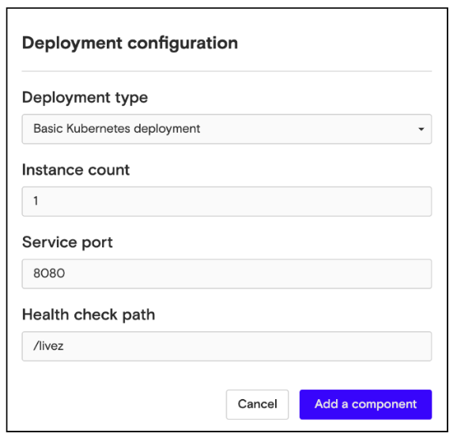
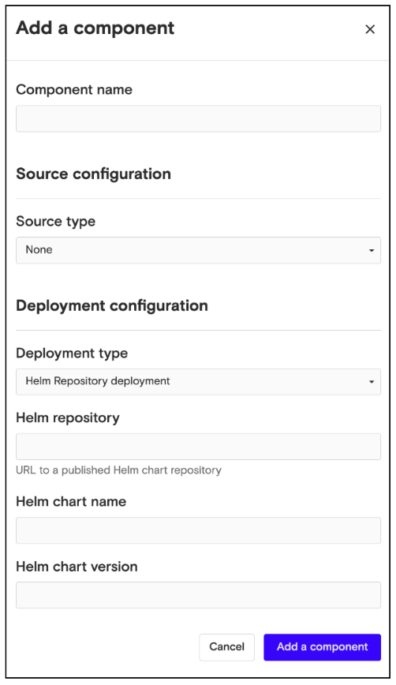
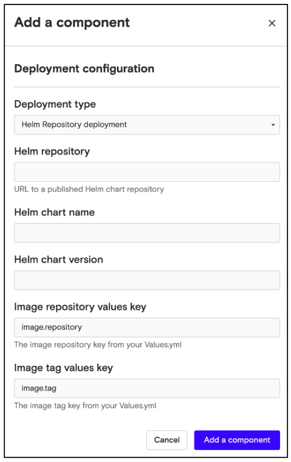

# Configure the Deployment

Once you've configured a component's source, you’ll need to specify how it will be deployed. Nuon supports two types of deployment configurations:

-   **Basic Kubernetes** - set the pod configuration directly
-   **Helm Repository** - use a Helm chart from a public Helm Repository

### Basic Kubernetes

To use a Kubernetes deployment:

1.  From the **Deployment type** menu, choose Basic Kubernetes deployment.
2.  Enter the number of instances you’d like to run.
3.  Enter the service port of your component.
4.  Enter the health check path for Kubernetes to use as a liveness probe.

### Helm Repository

To use a Helm Repository:

1.  The public Helm Repository configuration doesn’t require a source configuration, so you can set the source configuration type to **None**.
2.  From the **Deployment type** menu, choose Helm repository deployment.
3.  Enter a URL to a public Helm Repository.
4.  Enter the name of the Helm Chart you want to use.

If the source of your component is a Docker image, you will also need to specify the value keys for the image repository and image tag.

Once you've configured the source and deployment of your configuration, click **Add a component** at the bottom of the panel to add your component. The component will now be displayed on the Components page, and you can deploy it to any install.
