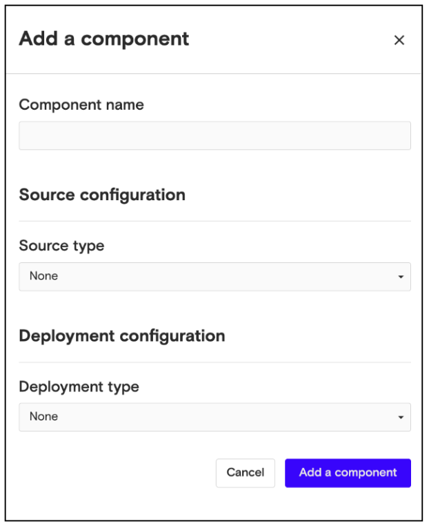
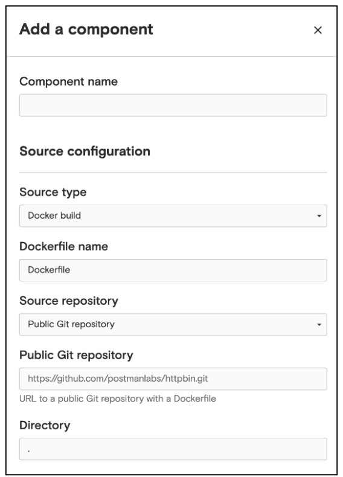
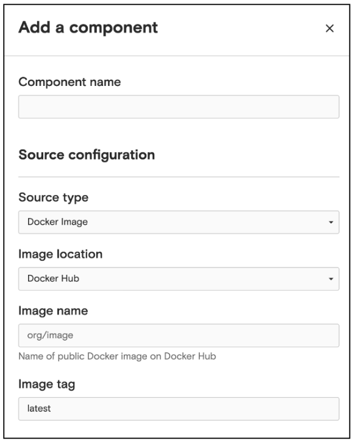
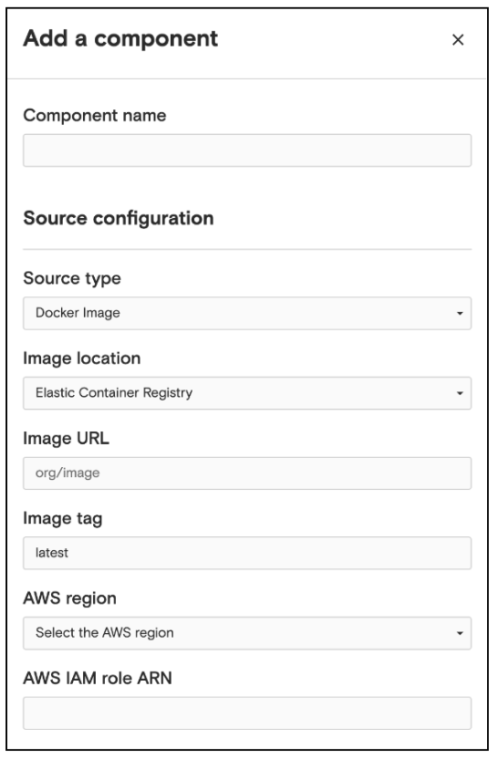

# Configure the Source

When adding a new component, you must configure its source and deployment.

Nuon supports three types of source configurations:

-   **Docker build**: provide a Dockerfile from a public or private GitHub repository
-   **Docker image**: provide a Docker image from a container registry
-   **None**: no source needed because you want to use Helm to deploy

### Using a Docker build

If your component requires building an image from a Dockerfile, you’ll need to provide the name of the Dockerfile and select a source repository. Nuon will need a source repository to pull the Dockerfile from. Currently Nuon supports two types of source repositories, a public Git repository or a private repository from a connected GitHub account.

**To add a component using a Docker build:**

1.  Click **Add a component**, from the Overview page or Components page.
2.  Enter the name of the component, in the dialog that appears.
3.  From the **Source type** menu, select **Docker build.**
4.  Enter the name of the Docker file.
5.  From the Source repository menu, choose one of these options:

-   public Git repository - specify the URL to a public Git repository with a Dockerfile (e.g.[https://github.com/postmanlabs/httpbin.git](https://github.com/postmanlabs/httpbin.git)), and its directory defaults to the root directory. 

-   connected GitHub repository - specify the GitHub repository you connected to previously. If you haven’t connected a GitHub account to Nuon, follow the steps in:[Connect to GitHub](https://counzela.slite.com/app/docs/vK6aYEQVNBXpiL).

6.  Click **Add a component**, at the bottom of the panel.

### Using a Docker image

If your component requires a Docker image from a container registry, you can specify this in two ways:

-   **public Docker image on Docker Hub** - you’ll need to provide the image location (e.g. my-org/my-image) and the image tag you’d like to use.
-   **private Docker image in your AWS ECR account** - provide the image location (i.e. a URL to the image in your AWS account) and the image tag. You’ll also need to select which AWS region the image is located and provide an Amazon Resource Name (ARN) for an IAM role that will give Nuon access to pull the image from your ECR account

**To add a component using a Docker image:**

1.  Click **Add a component**, from the Overview page or Components page.

2.  Enter the name of the component, in the dialog that appears.

3.  From the **Source type** menu, select **Docker image.**

4.  From the **Image location** menu, choose one of these options:

    -   **Docker Hub** - to add a public image
    -   **Elastic Container Registry -** to add an image from your ECR account

5.  If you chose:

-   **Docker Hub** - specify the image name (e.g., my-org/my-image) and image tag

-   **Elastic Container Registry** - specify the image URL, image tag, AWS region, and IAM role ARN. To get the ARN, follow the instructions in[ <u>Create IAM Role for Install.</u>](guides/iam-role-for-installs.md).

6.  Click **Add a component**, at the bottom of the panel.
