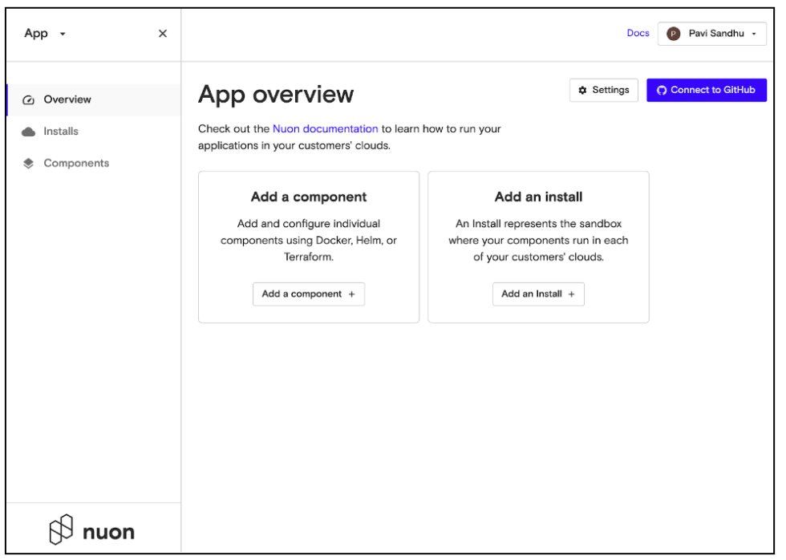
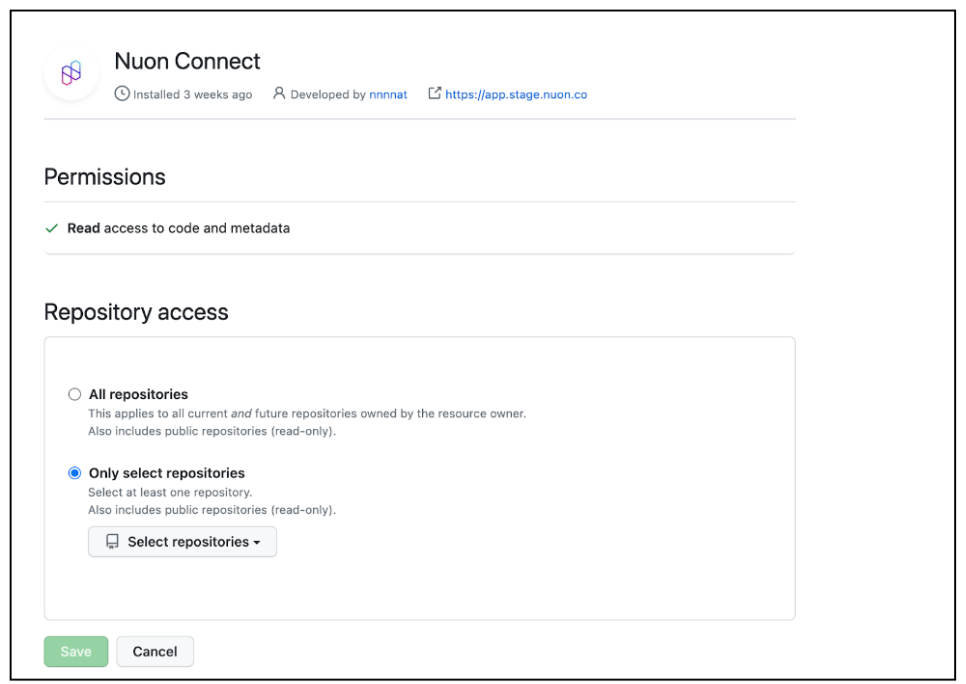

# Connect to GitHub

You can connect an application to your GitHub account, so you can configure components using code from your private repositories. To do this:

1.  In the top right area of the Overview page, click **Connect to GitHub**.

2.  Enter your GitHub credentials, to grant Nuon access to your repositories.

3.  Click **All Repositories** or **Only Select Repositories. **If you click the latter, select one or more repositories from the pulldown menu.
4.  Click **Save**.

Once you've granted Nuon access, we'll direct you to the Nuon dashboard. You can verify the connection has been established by clicking **Settings** and viewing the **Connections** tab.

          