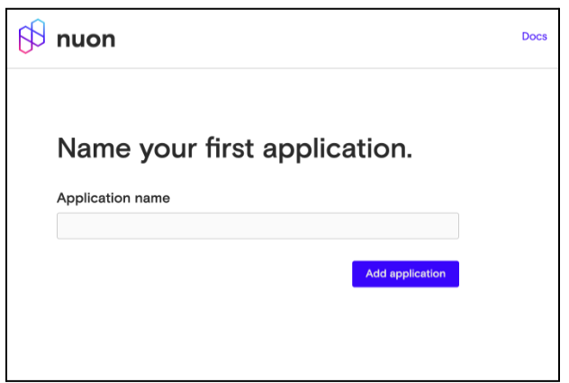
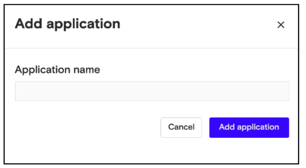

# Create an Application

You can create as many applications as your company requires. To create the first one:

1.  Enter the application name.
2.  Click **Add application**.

To create another application:

1.  Click the application name in the top-left corner of the Overview page.
2.  In the pulldown menu that appears, click **Add application**.
3.  Enter the application name.
4.  Click **Add application**.

