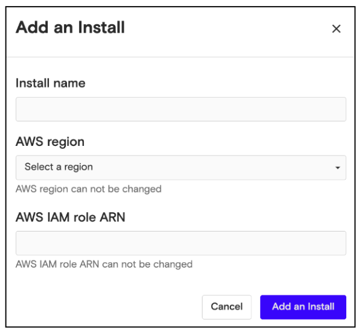
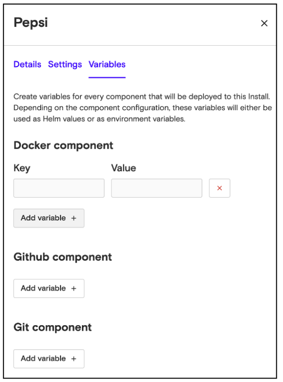

# Create an Install

You must create an install to run your application on your customers' cloud accounts. To do this:

1.  From the Overview or Installs page, click **Add an Install.**

1.  Enter a name for the install. This would typically be your customer’s name.
2.  Select an AWS region, from the pulldown menu.
3.  Enter the IAM role ARN for the AWS account. For details of creating the IAM role, see [Create IAM Role for Install](iam-role-for-installs.md).
4.  Click **Add Install**.

Nuon will start provisioning the install, which can take 15-20 minutes. Once it’s ready, you can deploy a component to this install, following the instructions in: [Deploy a Component](deploy-component.md).

## Add Variables to an Install

Once you've created an install, you can specify variables for every component that will be deployed to this Install. Depending on the component configuration, these variables will either be used as Helm values or as environment variables.

To add a variable to an install:

1.  Go to the Installs page, and click on the install for which you want to specify a variable.
2.  When the panel opens, click **Variables**.
3.  This displays a list of all components added to this install. Click **Add variable** under the component for which you want to specify variables.
4.  Enter the name and value of the variable in the Key and Value fields, respectively.

5.  Click **Save variables** at the bottom of the panel.