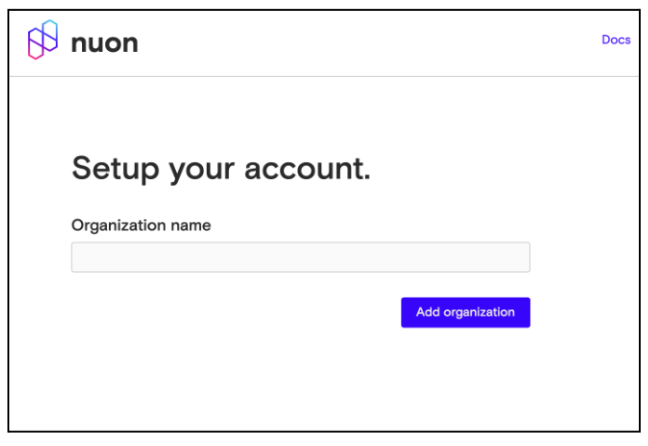

# Create an Organization

To get started with Nuon you’ll need to create an organization.

1.  Go to[ <u>app.nuon.co</u>](http://app.nuon.co/) and sign in. You can use a Google account to sign in.
2.  Once you’re signed in, enter the name of your organization. You can name it whatever you’d like and can change it later if needed.
3.  Click **Add organization**.

