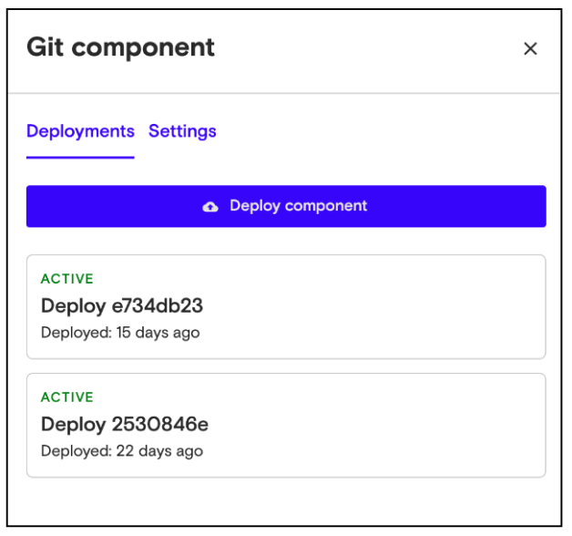
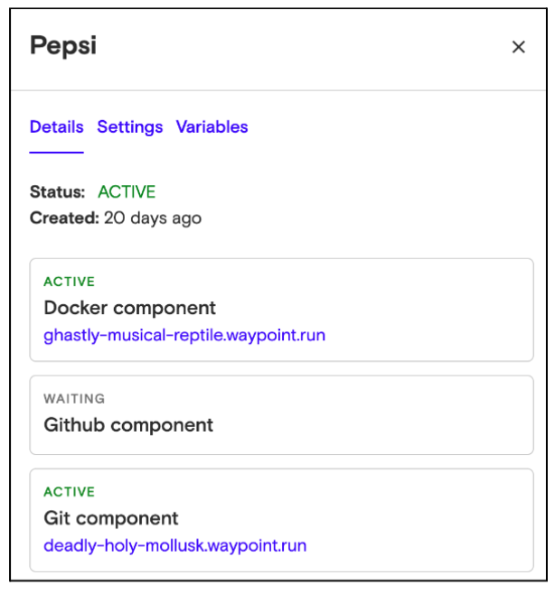

# Deploy a Component

Once you've added a component, you can deploy it to any install you’ve created. To do this:

1.  Go to the Components page, and click on the component you want to deploy.
2.  When the panel opens, click **Deploy component** to start the deployment process. When the deployment is completed, its status will show as **Active**.

## View a Running Instance of a Component

Once you’ve deployed your component, you can view the running instance of the component on any of your installs. To do this:

1.  Go to the Install page, and click one of the provisioned installs.
2.  The Install detail panel opens, showing a list of all component instances. If the instance’s status is active, click the URL to open a new tab with the running component instance in the install.

          