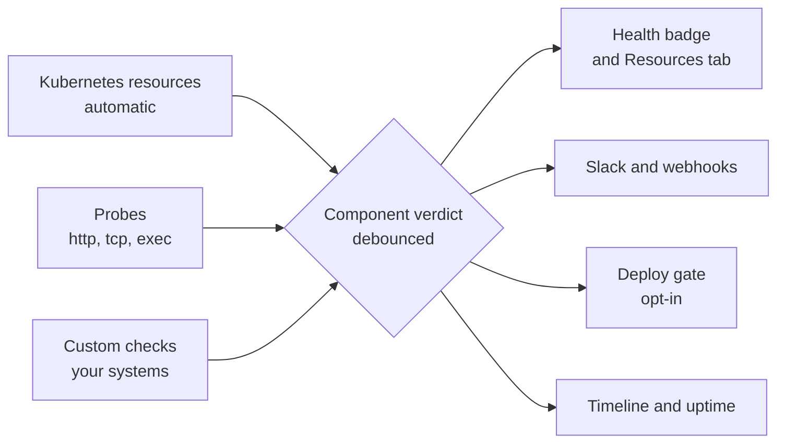
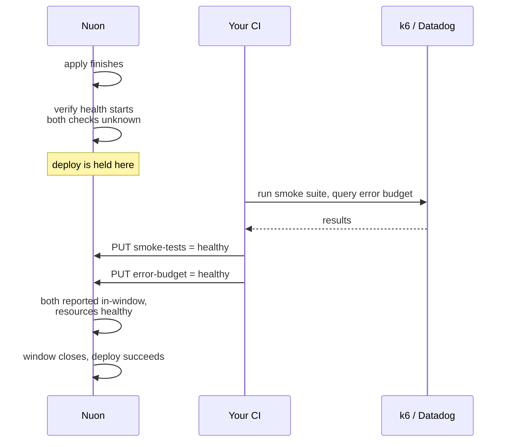

Nuon checks the components running on each install regularly, so you can see their live status.

<CardGroup cols={2}>
  <Card title="See what's running" icon="eyes">
    Every resource each component manages, with live status, browsable per install.
  </Card>
  <Card title="Get alerted on failures" icon="bell">
    Debounced alerts to Slack and webhooks, with the failing resource and the reason.
  </Card>
  <Card title="Gate your deploys" icon="shield-check">
    Hold a deploy open until the component has stayed healthy after the apply.
  </Card>
  <Card title="Track uptime" icon="chart-line">
    90 days of timeline and uptime per component and install.
  </Card>
</CardGroup>

## Turn it on

<Steps>
  <Step title="Deploy, or refresh cluster access">
    Health checks are on for every organization. There's nothing to install, and no agent runs in
    your customers' clusters: Nuon reads them with the same access your deploys use. An install that
    hasn't deployed recently needs one deploy to pick this up, or you can click **Refresh cluster
    access** on the install's health card to pick it up immediately.
  </Step>
  <Step title="Open the install's Resources tab">
    Within a minute or two you'll see every resource each component manages, with per-resource
    health, filterable by component, kind, namespace and status.
  </Step>
</Steps>

<Note>
None of this requires configuration. The rest of this page covers optional settings that add to
the default checks.
</Note>

## What you get with no configuration

Helm chart and Kubernetes manifest components are checked automatically, about once a minute.

Nuon checks standard workloads (Deployments, StatefulSets, DaemonSets, Pods, Services,
PersistentVolumeClaims, Ingresses and Jobs) and the Helm release's own status.

It also checks custom resources. Nuon reads the kinds your chart or manifest ships, so a
`Certificate`, an `Issuer`, a Karpenter `NodePool` or your own CRD is watched like anything else. A
component that starts shipping a new kind picks it up on its next deploy or drift check.

Nuon also reads Kubernetes warning events, which catch failures that never appear in an object's own
status. For example, an Ingress whose load balancer rejected a certificate looks fine if you only read
the Ingress.

Terraform components get their cloud resources listed so you can see what a component owns. Those
rows are an inventory and don't affect the verdict on their own. To give a Terraform component a
verdict, [add a probe or a custom check](#choosing-a-check).

## How a verdict is reached



A component's verdict is the worst status among everything Nuon observes for it.

| Verdict | Meaning |
| --- | --- |
| `healthy` | Everything Nuon observes is fine. |
| `progressing` | A rollout is in flight and can still converge. |
| `degraded` | Something is wrong but the component is partly serving. |
| `unhealthy` | The component is not serving. |
| `unknown` | No fresh observations, usually because the runner is offline. Doesn't count as a failure. |
| `not-applicable` | Nothing observable here, or the component has never deployed. |

Two rules keep brief blips and missing data from sending alerts:

**Verdicts are debounced.** Three consecutive bad observations flip a component bad; two good ones
bring it back. A single pod restart or a controller backing off doesn't alert.

**Missing data is never a failure.** If observations stop for five minutes, the verdict becomes
`unknown`. It's shown differently from a failure and never alerts.

<Tip>
Nuon reports a rollout that can't converge, such as one with a bad image tag or an unschedulable
pod, as `degraded` right away instead of waiting out the Kubernetes progress deadline. A component
that stays `progressing` for 30 minutes is also treated as `degraded`.
</Tip>

## Choosing a check

There are three ways to add your own signals. You can combine them, and most components need none
of them.

| | Use it when | Runs where | Can gate a deploy |
| --- | --- | --- | --- |
| **Probe** | Nuon can reach the target: an endpoint, a port or a command | Nuon, every cycle | Yes |
| **Custom check** | Only your systems know the result: CI, a business metric, a nightly audit | Your systems, on your schedule | Yes, with `required_checks` |
| **Required check** | A deploy must not finish until an external system says so | — | Yes |

<Note>
Probes work on every component type, including Terraform. They don't need a Kubernetes footprint or
an action. If Nuon can reach the target over HTTP or TCP, or check it with a command, a probe is the
simplest option.
</Note>

## Probes

Probes check that your app is serving requests, which infrastructure status can't tell you. A
Deployment can be ready while the app inside it returns 500.

<CodeGroup>
```toml Kubernetes component
[[components.api.health.probes]]
type = "http"
url  = "https://{{.nuon.install.sandbox.outputs.nuon_dns.public_domain.name}}/healthz"

[[components.api.health.probes]]
type = "tcp"
url  = "db.internal:5432"

[[components.api.health.probes]]
type = "exec"
name = "migrations-current"
command = ["/usr/local/bin/check-migrations", "--strict"]
```

```toml Terraform component
# An EC2 instance has no Kubernetes status to read, so give it a probe.
# Reference the module's own output.
[[components.ec2.health.probes]]
type = "http"
url  = "http://{{.nuon.components.ec2.outputs.public_ip}}/status/200"
```
</CodeGroup>

- **`http`** passes on 2xx/3xx and never follows redirects.
- **`tcp`** passes if the port accepts a connection.
- **`exec`** passes on exit code 0 and reports the command's output when it fails.

`exec` commands are an argv, never a shell string, and run with a minimal environment (`PATH`,
`HOME`, `TMPDIR`), so they can't see the runner's credentials. Every probe is bounded by a short
timeout and runs once per cycle.

Probe results feed the same verdict, debounce, alerts and history as every other observation.

<Warning>
**Probes run from the runner.** A probe target has to be resolvable
and reachable from wherever the runner is deployed, so in-cluster addresses never work: Kubernetes
service DNS (`http://api.myapp.svc:3001/healthz`), pod IPs, and `localhost` all fail to resolve or
connect, and the probe records an `unhealthy` observation. That is why the
Kubernetes example above probes the install's public hostname instead of the in-cluster service.

If a component has no target the runner can reach, don't give it a probe. Set
[`block_deploy`](#verified-deploys) and let Nuon's automatic Kubernetes health checks decide the
verdict.
</Warning>

<Note>
Templated targets are resolved from the install's state, so a probe pointing at a component's own
output can't resolve until that component has applied at least once. Until then the probe reports
`unknown` and says why. It stays listed and never fails a deploy.
</Note>

## Custom checks

For anything Nuon can't reach, such as a business metric, a queue depth or a result your CI already
computed, push a custom check and it becomes part of the component's health.

```bash
curl -X PUT \
  "https://api.nuon.co/v1/installs/$INSTALL_ID/components/$COMPONENT_ID/health/checks/checkout-latency" \
  -H "Authorization: Bearer $NUON_API_TOKEN" \
  -H "X-Nuon-Org-ID: $NUON_ORG_ID" \
  -d '{"status":"degraded","message":"p99 1.8s over 1.2s budget"}'
```

`status` is one of `healthy`, `degraded`, `unhealthy`, `unknown`. Names are 1–100 characters of
letters, digits, dots, dashes or underscores.

A custom check can't override Nuon's own checks. If Nuon sees crash-looping pods, the component
stays `unhealthy` even when your custom check reports `healthy`.

A check's last value counts for 5 minutes by default. If yours reports less often, set `stale_after`
(up to `60m`):

```bash
  -d '{"status":"healthy","stale_after":"30m","message":"nightly audit clean"}'
```

After that window, the check reads `unknown`. It stays listed but no longer affects the verdict.

## Required checks

Use required checks when a deploy shouldn't count as finished until something outside Nuon confirms
it, such as applied migrations, a passing smoke suite or a passing canary analysis. List them by name
and the deploy waits for them, the same way a GitHub branch rule waits for a required status check.

```toml
[components.api.health]
block_deploy    = true
required_checks = ["migrations-applied", "smoke-tests"]
```

Each name must be [pushed as a custom check](#custom-checks) **after the apply finishes** and be healthy when the
window closes. Nuon doesn't produce these checks, so something in your pipeline has to push them:

```bash
curl -X PUT ".../health/checks/migrations-applied" \
  -H "Authorization: Bearer $NUON_API_TOKEN" -H "X-Nuon-Org-ID: $NUON_ORG_ID" \
  -d '{"status":"healthy","message":"schema at revision 41"}'
```

<Warning>
If a required check doesn't report inside the window, the deploy fails. To give your pipeline more
time, lengthen `stabilization_window`.
</Warning>

Every required check starts the window as `unknown` and only counts once it reports, so a value left
over from a previous deploy can't satisfy the gate for this one.

### Example: gate a deploy on a k6 smoke suite

Say you want no deploy to count as finished until k6 has run a smoke suite against the install and
Datadog confirms error rate is within budget. Only your systems know these results, so both are
custom checks, and both are listed as required.

```toml
[components.api.health]
block_deploy         = true
stabilization_window = "10m"          # room for the suite to run
required_checks      = ["smoke-tests", "error-budget"]
```



Your pipeline pushes the results whenever they're ready:

```bash
BASE="https://api.nuon.co/v1/installs/$INSTALL_ID/components/$COMPONENT_ID/health/checks"
AUTH=(-H "Authorization: Bearer $NUON_API_TOKEN" -H "X-Nuon-Org-ID: $NUON_ORG_ID")

k6 run smoke.js \
  && curl -X PUT "$BASE/smoke-tests" "${AUTH[@]}" \
       -d '{"status":"healthy","message":"42 checks passed"}' \
  || curl -X PUT "$BASE/smoke-tests" "${AUTH[@]}" \
       -d '{"status":"unhealthy","message":"checkout flow failed"}'
```

Push failures too. A reported failure fails the deploy immediately with its reason attached. If
nothing is reported, the deploy waits out the window and fails with "never reported".

<Note>
The same pattern works with anything that can make an HTTP call: a Datadog monitor webhook, a Grafana
alert, a GitHub Action, an Argo workflow step, a nightly audit job. Nuon only checks that the result
arrived after the apply and inside the window.
</Note>

## Alerting

Health transitions fan out through webhooks and Slack like any other Nuon event. Subscribe with a
single per-resource flag:

- `component_health` on `components`: sends both failures and recoveries, so a channel that gets a
  failure alert also gets the recovery.
- `install_degraded` on `installs`: fires when the install-level rollup changes. You usually don't
  need this too. When a component's failure is what moved the install, the component alert reports
  both in one message.

The example below shows a component degrading, then recovering a couple of minutes later. Each alert
includes the failing resource and the reason.

Each message covers both the component and the install. When a component's change is what moved the
install rollup, the headline says `install degraded` and an **Install health** field shows
`healthy → degraded`. You don't get a separate install message.

<Frame caption="A component degrading and recovering, delivered to Slack.">
  
</Frame>

Nuon limits alerts in three ways:

- `unknown` never alerts. A runner going offline is already reported as runner inactivity, and would
  otherwise page you once per component.
- Only root causes alert. When a component fails because something it depends on failed, the
  dependents are labelled `downstream of <component>` and don't alert.
- Recoveries are always paired with the failure that preceded them.

See [Webhooks](/guides/webhooks) for the full subscription model.

## Verified deploys

By default a deploy finishes when the apply succeeds. Set `block_deploy` and it finishes only once
the component has held `healthy` for `stabilization_window` afterwards.

```toml
[components.api.health]
stabilization_window = "3m"      # default 3m, max 1h
block_deploy         = true      # default false
```

The gate appears as its own **verify health** step, showing what it's watching and what's still
outstanding. Only observations from inside the window count, so a component that was already healthy
still has to stay healthy after the change, and a deploy that fixes a broken component passes as
soon as its own observations come back healthy.

This is off by default, and it's the only way health can affect whether a deploy passes. A component
Nuon can't observe never blocks a deploy.

<Warning>
**Gate a component only on what it provides.** Put a probe for a public endpoint on the load
balancer component that exposes it, instead of the app behind it. If a component's gate depends
on a downstream component, a first install deadlocks: the app's gate can't pass until the load
balancer exists, and the load balancer never deploys because the app's gate is holding the workflow.
</Warning>

## Canary and bake periods

You can build canary rollouts from these pieces, starting with a fleet health summary filtered by
install label:

<CodeGroup>
```bash CLI
nuon installs health --labels tier:canary --output agent
```

```bash API
curl "https://api.nuon.co/v1/installs/health?labels=tier%3Dcanary" \
  -H "Authorization: Bearer $NUON_API_TOKEN" -H "X-Nuon-Org-ID: $NUON_ORG_ID"
```
</CodeGroup>

```jsonc
{
  "total": 3, "healthy": 3, "degraded": 0, "unhealthy": 0, "unknown": 0, "unset": 0,
  "all_healthy": true,
  "installs": [ { "install_id": "…", "health": "healthy", "unhealthy_components": 0 } ]
}
```

A rollout then reads: deploy to `tier=canary`, hold until `all_healthy` has stayed true for your bake
period, then continue to the rest of the fleet.

```bash
# bake for 10 minutes, requiring health the whole way
for i in $(seq 1 20); do
  ok=$(nuon installs health --labels tier:canary --output agent | jq -r '.data.all_healthy')
  [ "$ok" = "true" ] || { echo "canary unhealthy, halting rollout"; exit 1; }
  sleep 30
done
```

`all_healthy` is true only if at least one install was evaluated. Installs that have never been
evaluated are counted separately in `unset`, so a rollout script can't treat missing data as a pass.

## Uptime and incidents

Every debounced transition is kept for 90 days, giving each component and install a timeline and an
uptime percentage, drawn as status-page-style daily bars.

The badge shows the current verdict, and the percentage covers the last 90 days. A component showing
`Healthy` at 97.57% is fine now but had problems earlier. An install is degraded whenever any of its
components is, so in the example below that component sets the install's uptime.

<Frame caption="90-day health for an install, with per-component uptime.">
  
</Frame>

Time in `unknown` is excluded from uptime and counts as neither up nor down. An install with no
observations reports zero observed time instead of 100%.

Each component also has an incident bundle that collects the failing transition, the captured
diagnosis (Kubernetes events, restart counts, termination reasons like `OOMKilled`) and the deploy it
followed. You can pass it to a runbook or an agent as input.

## Troubleshooting

<AccordionGroup>
  <Accordion title="Everything shows unknown or no resources at all">
    Nuon can't reach the cluster, usually because the install hasn't deployed recently.
    Click **Refresh cluster access** on the install's health card, or run any deploy. Resources
    should appear within a minute or two.
  </Accordion>
  <Accordion title="A component shows a dash instead of a verdict">
    That's `not-applicable`. Either the component has no observable runtime footprint (a Terraform
    component with no probe, a build-only component), or it has never deployed. Add a
    [probe or a custom check](#choosing-a-check) to give it a verdict.
  </Accordion>
  <Accordion title="My custom resources aren't listed">
    Kinds are read from what your chart or manifest ships, and are picked up on deploy. If you've
    just added a CRD, deploy the component once, or wait for its next drift check, which
    also refreshes them without applying anything.
  </Accordion>
  <Accordion title="A custom check went unknown on its own">
    Its window expired. Set `stale_after` to match how often you report, up to `60m`.
  </Accordion>
  <Accordion title="A verdict took a few minutes to change">
    That's the debounce: three bad observations to flip, two good to recover, at roughly one
    observation a minute. It keeps a single restart from sending an alert.
  </Accordion>
  <Accordion title="My deploy failed on a required check that did run">
    It has to be pushed *after* the apply finishes, and be healthy when the window closes. A value
    pushed before the deploy started doesn't count for that deploy.
  </Accordion>
</AccordionGroup>
