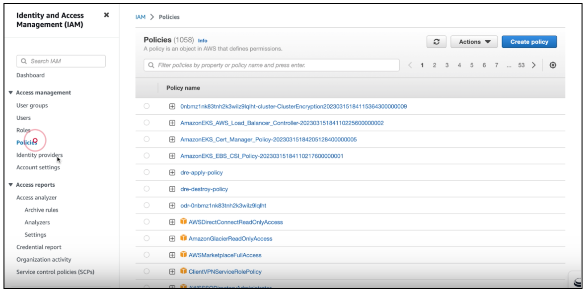
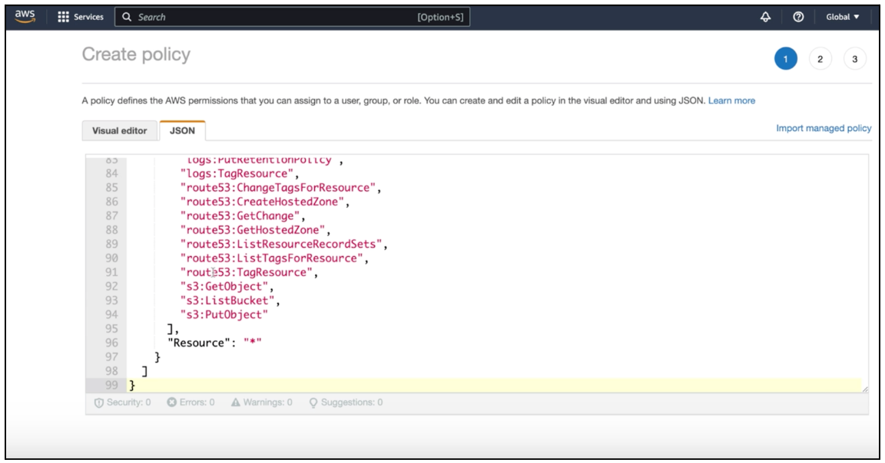
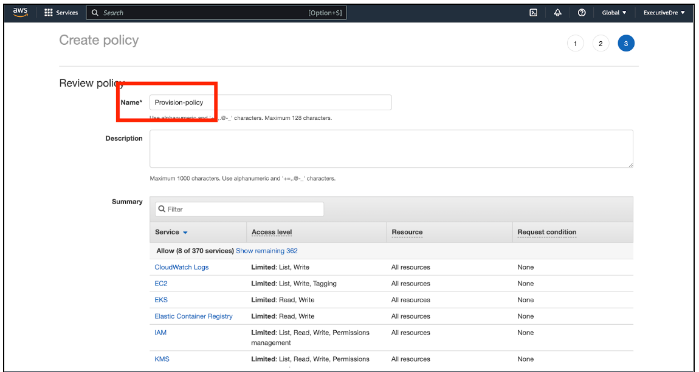
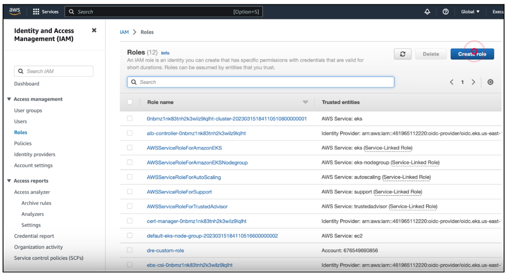
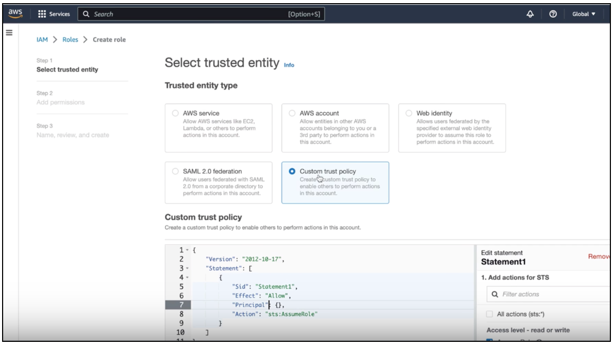
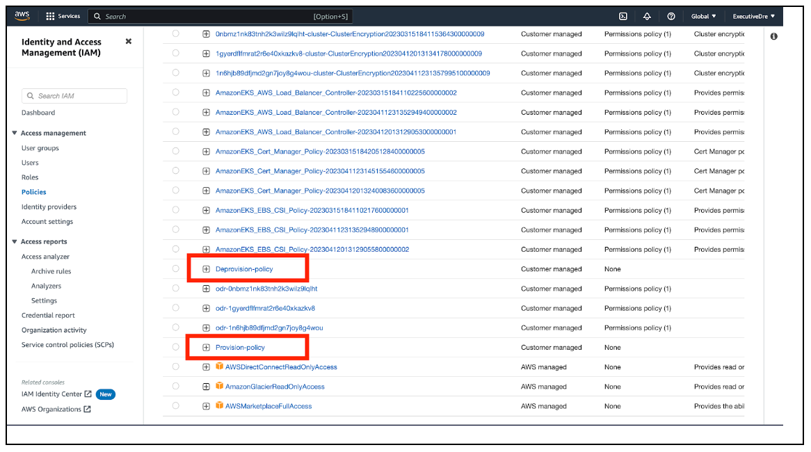
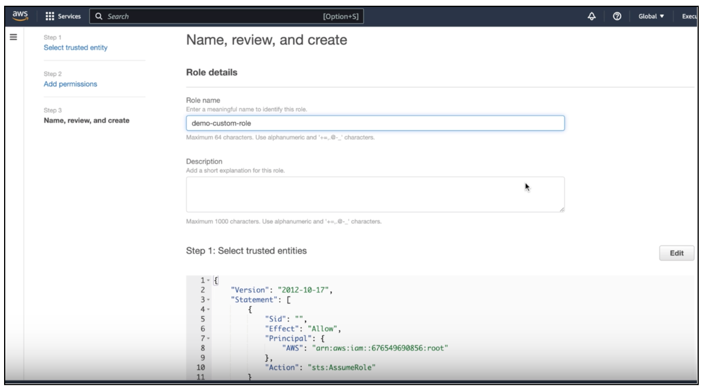
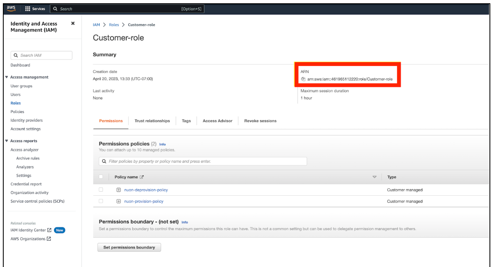

# Create IAM Role for Install

To add an Install in your customer's AWS account, you will need an ARN ([Amazon Resource Name](https://docs.aws.amazon.com/general/latest/gr/aws-arns-and-namespaces.html)) for an IAM[ (Identity and Access Management](https://aws.amazon.com/iam/)) role. Each customer must create a new role in their AWS account, add two policies to it, and give you the ARN for the role.

Here are the steps to create the IAM role with the required policies.

1.  Log into your AWS account.
2.  Navigate to Identity and Access Management.
3.  In the left sidebar, under Access management, click **Policies**.



4.  In the top-right corner of the page, click **Create policy**.
5.  In the page that appears, click the **JSON** tab.



6.  Copy the text of this[ <u>provision policy</u>](https://gist.github.com/nnnnat/1770c245fb4988e37f5768526c3dbd99#file-nuon-provision-policy-json), and paste it into the text box. This policy gives Nuon one-time access to add the sandbox and install agent to the customer's AWS account.
7.  At the bottom right of the screen, click **Next: Tags.**
8.  On the next page, click **Next: Review**.
9.  On the next page, enter a name for the policy.



10.  At the bottom right of the page, click **Create policy**.
11.  Create Destroy Policy - Repeat steps 3-9 above, but use the[ <u>deprovision policy</u>](https://gist.github.com/nnnnat/1770c245fb4988e37f5768526c3dbd99#file-nuon-deprovision-policy-json) instead. This policy allows us to destroy the install/sandbox, if need be.
12.  In the left sidebar, under Access management, click **Roles**.



13.  In the top-right corner of the page, click **Create Role**.
14.  On the next page, click **Custom trust policy**.



15.  Copy and paste the following text into the box, to replace the existing text.

```
{

"Version": "2012-10-17",

"Statement": \[

{

"Sid": "",

"Effect": "Allow",

"Principal": {

"AWS": "arn:aws:iam::676549690856:root"

},

"Action": "sts:AssumeRole"

},

{

"Sid": "",

"Effect": "Allow",

"Principal": {

"AWS": "arn:aws:iam::766121324316:root"

},

"Action": "sts:AssumeRole"

}

]

}
```

16.  At the bottom-right of the page, click **Next**.
17.  On the page that appears, select the provision and deprovision policies you created above (in steps 3-10).



18.  At the bottom right of the page, click** Next**.
19.  Enter a name for the role in the Role name text box.



20.  At the bottom right of the page, click** Create role**.

That's it. You've created the IAM role. If you view the details page for the role, you will see its ARN. Copy the value and send it to your vendor.


