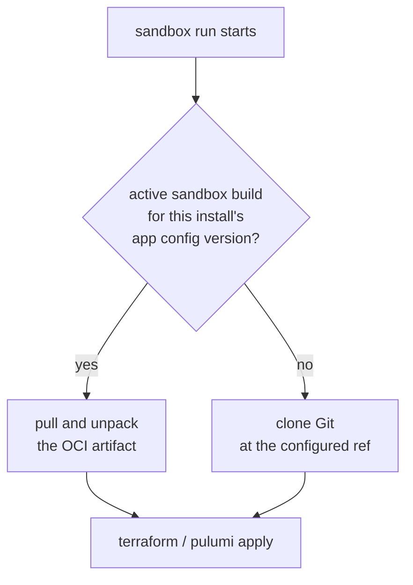
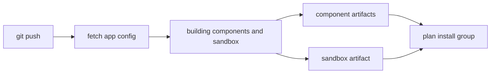

A customer's install provisioned cleanly in March. It's November, and you need to reprovision it.

By default, that reprovision clones your sandbox repo *right then* and applies whatever is at the
configured branch today. Eight months of module changes, a bumped provider constraint, a repo that
someone renamed — all of it lands on infrastructure that has been running fine, and none of it is
what the install was built with.

Sandbox builds close that gap. Nuon packages your sandbox into an **immutable OCI artifact** — the
same mechanism already behind [component builds](/guides/app-install-life-cycle#sync-and-build) —
and installs provision from the artifact instead of reaching for Git.

<Note>
  Sandbox builds are behind the `sandbox-oci-artifacts` org feature flag and are off by default.
  [Reach out to Nuon](https://nuon.co/demo-request) to enable it for your org.
</Note>

<CardGroup cols={2}>
  <Card title="Reprovision what you provisioned" icon="lock">
    An artifact is immutable and pinned to an app config version. A reprovision a year later applies
    the exact code that install was created with.
  </Card>
  <Card title="No Git at apply time" icon="plug-circle-xmark">
    The install runner pulls the sandbox from the same registry it already pulls component artifacts
    from. Nothing in your customer's account reaches GitHub or holds a Git credential.
  </Card>
  <Card title="No Terraform Registry either" icon="download">
    With the provider mirror on, providers ship inside the artifact, so a provision doesn't depend on
    `registry.terraform.io` being reachable.
  </Card>
  <Card title="Break it on your own time" icon="triangle-exclamation">
    A bad sandbox fails at build time, in your branch run, instead of part-way through a customer's
    provision.
  </Card>
</CardGroup>

## Turn it on

<Steps>
  <Step title="Ask Nuon to enable it">
    Sandbox builds are behind the `sandbox-oci-artifacts` org feature. Ask us to switch it on — there
    is nothing to install and no change to your `sandbox.toml`.
  </Step>
  <Step title="Build the sandbox once">
    If your app uses [app branches](/concepts/app-branches), the next push builds it automatically.
    Otherwise hit **Build sandbox** on the app's **Sandbox** tab.
  </Step>
  <Step title="Provision or reprovision">
    Any sandbox run for an install on that app config version now uses the artifact. The run's logs
    say which source it used.
  </Step>
</Steps>

<Note>
There is no configuration for any of this. Nothing in your app config changes, and nothing below is
something you have to set up.
</Note>

## How the source is resolved

Every sandbox run — provision, reprovision, deprovision — resolves where to get the code from before
it runs anything:



**The lookup is per install, not per app.** It keys off the app config version *that install is
pinned to*, so two installs on different versions of your app provision from two different sandbox
artifacts — each one the sandbox that shipped with its version.

**A missing artifact is never a failure.** No build for that version, or an artifact that can't be
resolved, falls back to cloning Git exactly as before. That's what makes turning the flag on safe:
installs that predate your first sandbox build keep working untouched, and adoption happens
install-by-install as each one moves onto a version that has a build behind it.

This applies to Terraform and Pulumi sandboxes alike — the runner unpacks the artifact and works in
that directory instead of a clone, and everything downstream is unchanged.

## Where builds come from

A sandbox build is a record tied to one app config version and one sandbox config, executed by a
[build runner](/architecture/platform#build-runner) in the Nuon control plane. It moves through
`queued` → `planning` → `building` → `active`, or `error`, and streams logs the whole way. The
artifact is pushed to your app's OCI repository — the same one your component builds are pushed to —
tagged with the build's ID.

### On every app branch run

If your app uses [app branches](/concepts/app-branches), the `building components and sandbox` step
builds the sandbox alongside your components. It appears as its own row in that step, next to each
component, and links through to its logs.



With the flag off, that step still runs — it just builds components only.

**Which ref gets built:** if your sandbox lives in the same repo as the app config being built, the
build is pinned to that run's commit SHA, so the sandbox and the components come from one commit. If
the sandbox lives elsewhere, it uses the ref from your sandbox config.

### On demand

The app's **Sandbox** tab lists every build with its status, and **Build sandbox** runs one against
your current config. Each build links to a detail page with its timeline and logs.

```bash
curl -X POST "https://api.nuon.co/v1/apps/$APP_ID/sandbox/builds" \
  -H "Authorization: Bearer $NUON_API_TOKEN" \
  -H "X-Nuon-Org-ID: $NUON_ORG_ID"
```

Useful for validating a sandbox change before you push it, and for apps that don't use app branches.

<Note>
Building doesn't require the feature flag — the tab and the endpoint work either way. What the flag
controls is whether installs **use** the result. Turning it on for an org that has been building all
along changes nothing until the next sandbox run.
</Note>

## Vendoring Terraform providers

Sandbox builds are what make provider vendoring possible for a sandbox at all — there's no build step
to vendor into otherwise. With the `terraform-provider-mirror` feature also enabled, the build runs
`terraform providers mirror` and ships the resulting filesystem mirror inside the artifact. The
install runner finds it on unpack and initializes against it, so provisioning needs no Terraform
Registry access.

Pin `terraform_version` in your `sandbox.toml` so the build mirrors providers for the version that
will actually run:

```toml sandbox.toml
terraform_version = "1.11.3"

[public_repo]
directory = "."
repo      = "nuonco/aws-eks-sandbox"
branch    = "main"
```

<Tip>
Together, these two features take a provision from "needs GitHub *and* `registry.terraform.io`" to
"pulls one more artifact from the registry it already pulls component artifacts from" — a much
smaller ask of a customer with a restricted egress policy.
</Tip>

## Troubleshooting

<AccordionGroup>
  <Accordion title="An install still cloned Git">
    There's no `active` build for the app config version *that install* is pinned to. An install on
    an older version has no artifact behind it until it moves to a version that does — check the
    app's **Sandbox** tab for which versions have builds, and the sandbox run's logs for which source
    it chose.
  </Accordion>
  <Accordion title="No sandbox build appeared on a branch run">
    Three reasons it's skipped: the flag is off, the app has no sandbox config, or the run had no
    config changes and wasn't forced — a run with nothing to build doesn't build anything, sandbox
    included. Re-trigger the run with force, or build once from the **Sandbox** tab.
  </Accordion>
  <Accordion title="The sandbox build failed">
    Open it from the **Sandbox** tab or from the branch run's build step and read its logs. These are
    the same failures you'd otherwise hit mid-provision — an unresolvable module, a provider
    constraint that can't be satisfied, invalid Terraform — which is the point of catching them here.
  </Accordion>
  <Accordion title="Provisioning still reaches out to the Terraform Registry">
    Vendoring is a second feature. Ask us to enable `terraform-provider-mirror` as well, and set
    `terraform_version` in your `sandbox.toml` so the mirror matches the version that runs.
  </Accordion>
</AccordionGroup>

## See also

- [Sandboxes](/concepts/sandboxes) — what a sandbox is and what it provisions
- [Configuring Sandboxes](/guides/configuring-sandboxes) — the `sandbox.toml` reference
- [App Branches](/concepts/app-branches) — the workflow that builds sandboxes on every push
- [App and Install Life Cycle](/guides/app-install-life-cycle) — how builds and deploys fit together
