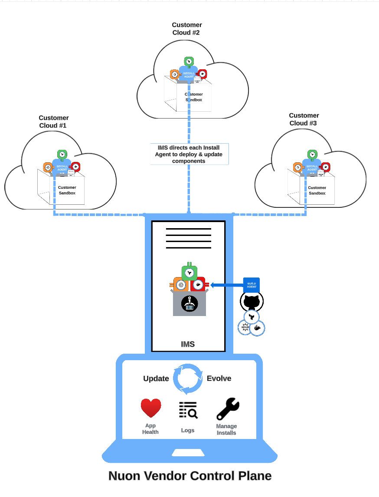

# Component Lifeycyle

Now that you’re familiar with the different parts of the Nuon platform, let’s summarize how they work together through the component lifecycle.

## Create an Organization

When you sign up for Nuon by creating an organization, Nuon provisions these resources in the vendor account.

-   Infrastructure Management Server (IMS)
-   Build agent
-   ECR registry

## Add a Component

When you add a component, by specifying its source and deployment details, the following actions occur.

-   The IMS in the vendor account copies the component and creates a job for the build agent.
-   The build agent transforms the component into deployable artifacts and stores them in the vendor’s ECR registry.
-   The install agent in each existing install syncs the artifacts with the ECR registry in the customer cloud. 

## Create an Install

When you create an install:
-    Nuon provisions a sandbox in the customer’s account, which includes an install agent and a local ECR registry. 
-    The install agent syncs all artifacts in the vendor’s ECR registry with the ECR registry in the customer cloud, so it has the latest version of all artifacts
-    The install agent transforms the artifacts into components, and provisions the corresponding software or infrastructure elements in the sandbox. 

## Deploy a Component

When you deploy a component:
-    The install agent syncs the artifacts for that component from the vendor’s ECR registry to the ECR registry in the customer account. 
-    The install agent provisions the elements of the application related to that component. 

## Update a Component

When you update a component and deploy it, the install agent updates the infrastructure for that component in the customer’s cloud.

