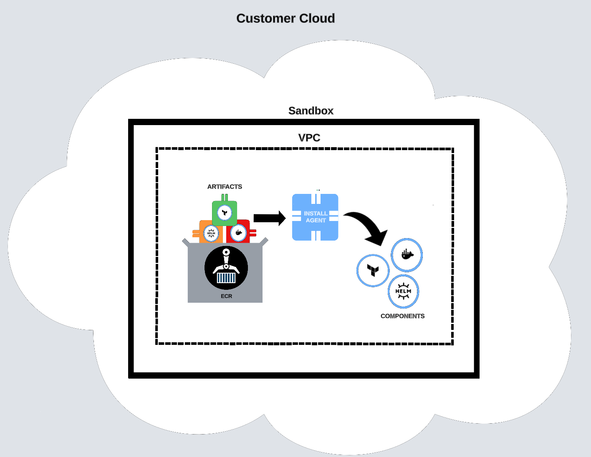

# Customer Cloud

This section describes the infrastructure elements Nuon creates in each customer cloud account.

## Sandbox

When you create a new install, Nuon provisions a sandbox in the customer’s cloud account. The sandbox consists of essential infrastructure elements required to run your application in the customer's cloud, including:

-   Virtual Private Cloud (VPC) with public/private subnets
-   ECR registry
-   Install agent

A sandbox ensures your application is isolated from other infrastructure in your customer's cloud. A sandbox also provides a consistent environment so if your application works in one customer’s account, it will work in all others.

The initial provisioning of the sandbox is the only time that Nuon ever directly accesses a customer’s cloud account. All other provisioning happens from the install agent running in the customer’s account.

## Install Agent

The install agent is responsible for provisioning, updating, and de-provisioning all infrastructure related to a component. The agent does not directly provision resources. Instead, it runs jobs scheduled by the vendor’s IMS.

To ensure scalability and resilience, each job is executed as its own container process. This approach allows for parallel execution of multiple jobs and prevents resource competition among components. For example, deploying a Terraform component won't affect the resources required for other components.

## ECR Registry

When you deploy a component, the build agent in the IMS creates one or more artifacts in the vendor’s ECR registry. The install agent then syncs these artifacts from the vendor's ECR registry to the ECR registry in the customer account. This has two advantages:

-   **Security** — syncing the images into the install’s ECR registry eliminates the need for long-lived access to the vendor’s ECR registry. Also, it restricts the install to only allow running images in the same account.
-   **Reliability** — Nuon is designed so a vendor can have thousands of installs. Creating all installs from a single vendor ECR registry ensures consistency across all customer accounts.

