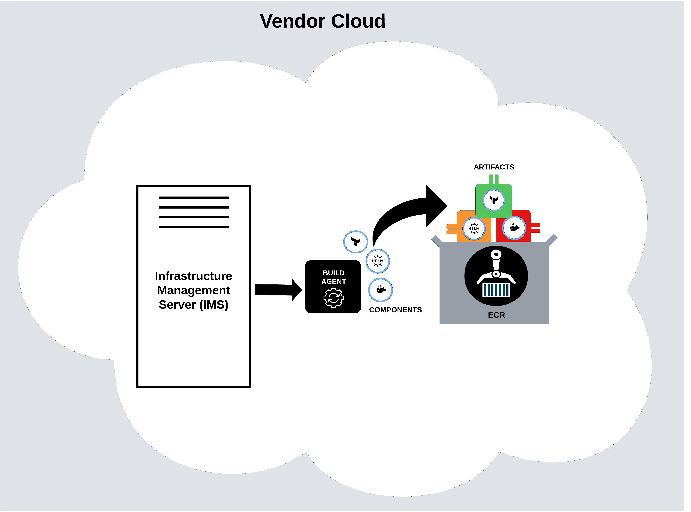

# Vendor Cloud

When you sign up for Nuon, we create a dedicated vendor account for you. We then provision the following infrastructure to manage your components and installs.

-   **Infrastructure Management Server** **(IMS)** - this server powers the agents used for building and deploying components. It also stores historical telemetry and job data for each install.
-   **Build agent** - this agent is responsible for creating deployable artifacts from components. The build agent communicates with the IMS, which tells the agent what to build. Upon a successful build, the build agent pushes one or more artifacts into the ECR registry.
-   **ECR registry** - this registry stores and manages all components you configure, making them ready to deploy in a customer’s AWS account.

## Server-Agent Model

Nuon uses a server-agent model for managing customer cloud installs. The IMS for each vendor controls a set of agents that perform builds, deploys, and other parts of the component lifecycle. In addition to the build agent in the vendor’s account, a separate install agent is created for each customer account.

The install agent manages the lifecycle of components in that customer's account. The install agent communicates with the vendor's IMS and runs jobs to provision, update, and manage components in an install.

The server-agent model ensures isolation and enables a smaller security perimeter for each install and component’s lifecycle. This eliminates the need for cross-account IAM permissions after the initial setup.

## Artifacts

The first step of any deployment is creating an OCI artifact and syncing it to the correct installs before deployment. The build agent transforms components into OCI-compatible artifacts stored in an isolated ECR registry. These artifacts have no dependency on an external image, which is important for security and reliability. Relying on an externally hosted container image is dangerous as the image could be deleted (causing downtime) or, even worse, updated to contain malicious software.

Each install agent is connected to a vendor's IMS. The IMS directs each install agent to synchronize the correct image into its environment. A one-time use token is created for the vendor's ECR registry, directing the agent to pull the image and store it locally. The install agent also converts the local artifacts into components and provisions the corresponding software or infrastructure elements in the customer cloud account.. 

The agent running in the install is the only actor permitted to write to the install’s ECR registry. Once an artifact is written into the install’s ECR account, it is only accessible by the agent and the nodes in the cluster.

