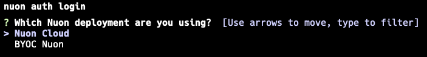
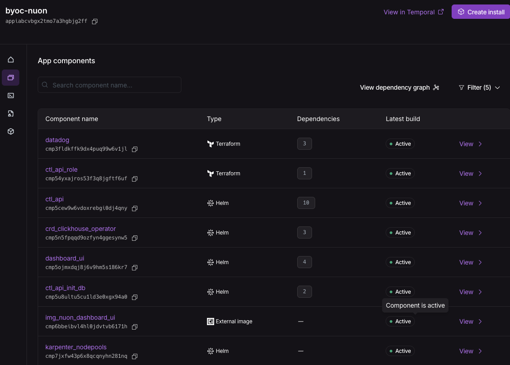

## CLI

See the [CLI documentation](./cli) for how to install and upgrade the Nuon CLI to interact with the Nuon control plane.

The Nuon CLI can interact with Nuon Cloud or a Nuon BYOC instance. `nuon auth login` will prompt the user to select Nuon Cloud or to enter the Url of their BYOC Nuon instance.

## Control Plane

### Nuon Cloud

Nuon Cloud is a multi-tenant SaaS offering of the Nuon control plane. It is used for trials and smaller production deployments. Nuon Cloud also installs Nuon BYOC, the Nuon control plane for customers requiring self-hosted.

Therefore, there is no control plane install required.

### Nuon BYOC

Nuon BYOC is where Nuon installs the Nuon control plane into your cloud account.

Nuon BYOC is for customers who want development and production instances of Nuon where they can stay current on the latest Nuon feature while want maintaining a stable instance that is periodically upgraded by Nuon.

Nuon BYOC demonstrates the benefits of Bring Your Own Cloud (BYOC) because Nuon installs and maintains the Nuon control plane while the customer has their Nuon metadata and infrastructure resources running in their AWS cloud account.

In this way, Nuon is dogfooding Nuon to install and maintain its customer base using the Nuon control plane.

There is a [public GitHub repository](https://github.com/nuonco/byoc) of the Nuon BYOC app which is a good way to learn how to structure a complex Nuon app. The app includes Nuon's dashboard, api, EKS and Karpenter, Temporal, ClickHouse, and PostgreSQL.

### Self-hosted

Nuon BYOC is our default and preferred method to install the Nuon control plane for a customer.

[Contact Sales](https://nuon.co/contact-sales) if you would like to discuss using our Helm charts.

