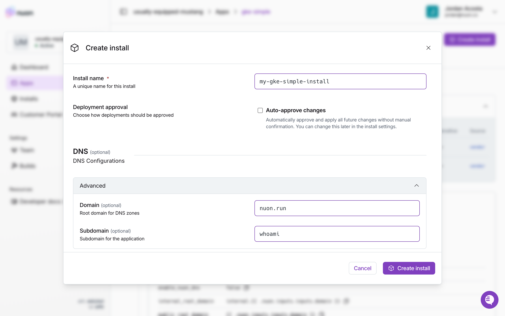
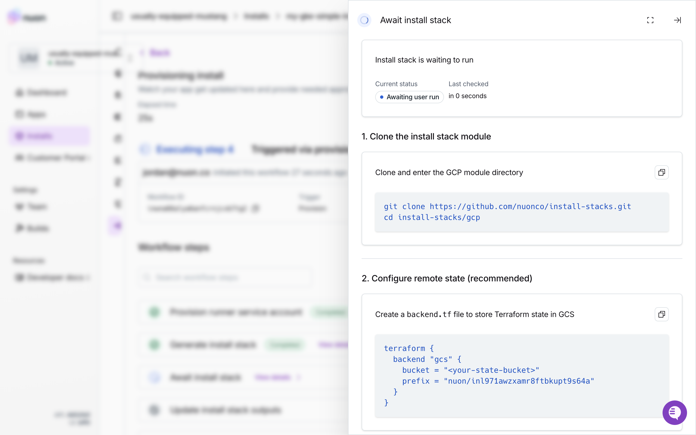

This guide will review how to deploy an app for deployment to Google Cloud, using the [gke-simple example app](https://github.com/nuonco/example-app-configs/tree/main/gke-simple) as an example.

## Configuration

To deploy an app to Google Cloud, configure it to use a GCP sandbox and runner.

The gke-simple app uses the open-source [gcp-gke-sandbox](https://github.com/nuonco/gcp-gke-sandbox). It requires some basic config values. Add inputs to your own app configs so users can provide these when installing it.

```toml sandbox.toml
#:schema https://api.nuon.co/v1/general/config-schema?source=sandbox

terraform_version = "1.5.0"

[public_repo]
repo      = "nuonco/gpc-gke-sandbox"
directory = "."
branch    = "main"

[vars]
nuon_id              = "{{ .nuon.install.id }}"
project_id           = "{{ .nuon.install_stack.outputs.project_id }}"
region               = "{{ .nuon.install_stack.outputs.region }}"
public_root_domain   = "{{ .nuon.install.id }}.{{.nuon.inputs.inputs.domain}}"
internal_root_domain = "internal.{{ .nuon.install.id }}.{{.nuon.inputs.inputs.domain}}"
```

Set the runner type to "gcp".

```toml runner.toml
#:schema https://api.nuon.co/v1/general/config-schema?source=runner

runner_type = "gcp"
helm_driver = "configmap"
```

## Installation

### Set up Google Cloud project

Before installing an app in Google Cloud, you need to set up a project to install it in. You can do this using the Google Cloud web console, or the `gcloud` CLI tool.

<Note>
  We recommend [installing the gcloud CLI
  tool](https://docs.cloud.google.com/sdk/docs/install-sdk), throughout this
  guide. In addition to using it set up your project, it can authenticate the
  Google Cloud Terraform provider. This will provide the quickest and simplest
  installation experience.
</Note>

Create the project.

<Tabs>
  <Tab title="CLI">
  ```sh
    gcloud projects create <my-gke-simple-install> --name="<My GKE Simple Install>"
  ```
  </Tab>
  <Tab title="Web">[screenshot of google web console]()</Tab>
</Tabs>

In the new project, enable the services required by the app.

<Note>
  The services reuquired will vary based on the app architecture. When creating
  your own apps for Google Cloud, take note of which services they will need so
  your users will know what to enable.
</Note>

<Tabs>
  <Tab title="CLI">
  ```sh
    gcloud services enable \
      compute.googleapis.com \
      container.googleapis.com \
      artifactregistry.googleapis.com \
      dns.googleapis.com \
      cloudresourcemanager.googleapis.com \
      --project=<my-gke-simple-install>
  ```
  </Tab>
  <Tab title="Web">[screenshot of google web console]()</Tab>
</Tabs>

## Install app

Navigate to the apps page of the Nuon Dashboard, and select the Google Cloud app from the apps list. Click the "Create install" button in the top right of the page. Provide a name, fill out the required inputs, and check "Approve all". Click "Create install" at the bototm of the modal.



You will be sent to the new install's provision workflow, and asked to provision the install stack. When the "Await install stack" step activates, click on "View details" to open the detail panel, and follow the directions there to provision the install stack.



This will provision a Nuon runner into the account, which will take over the provision workflow and complete the remaining steps. Once the provision is complete, navigate to the overview page to the overview page. There you will find information about the install, and a link to the whoami service running in Google Cloud.
