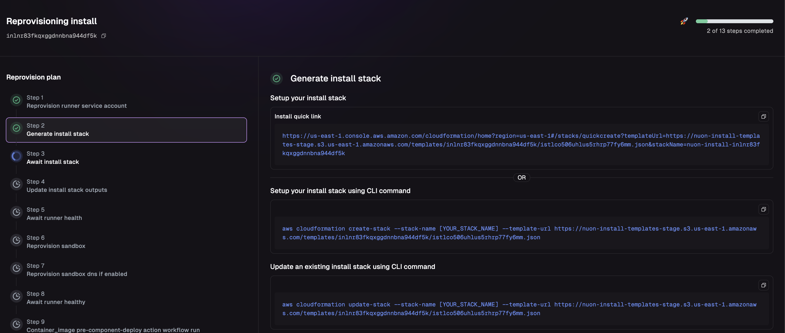
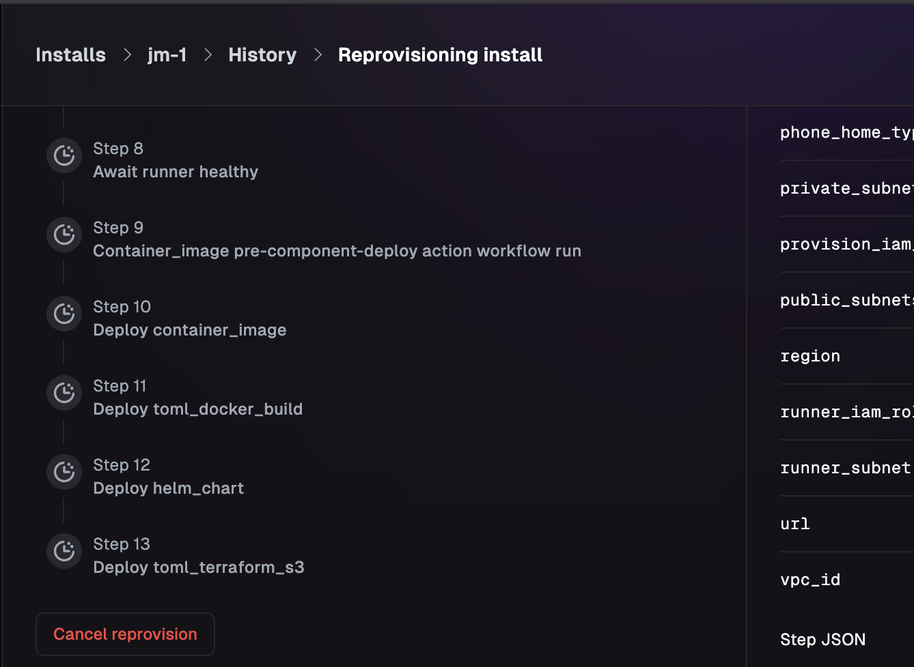
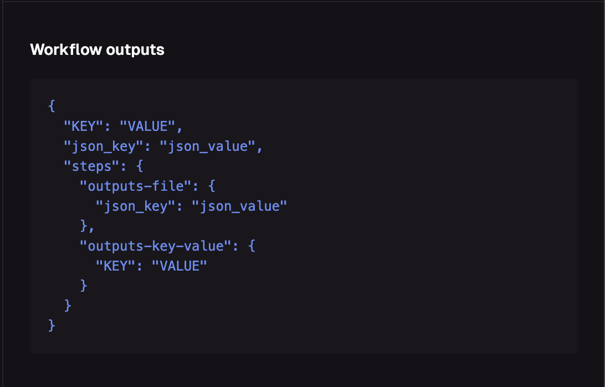
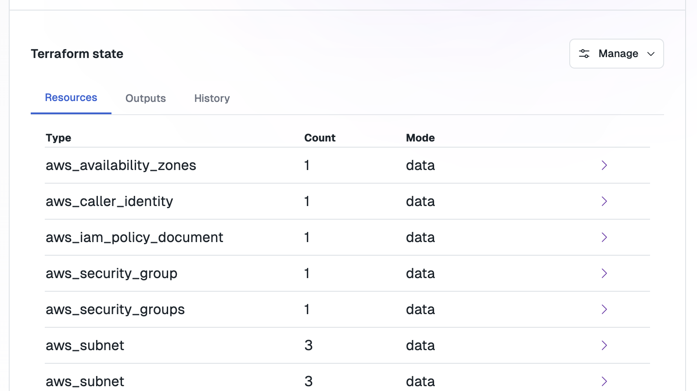
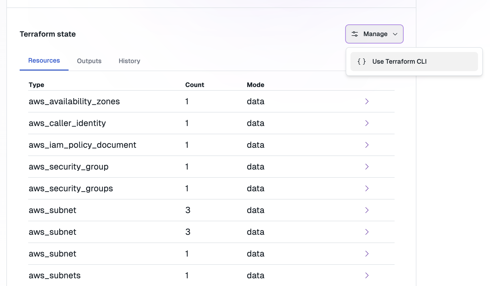

_May 5th, 2025_

v0.19.539

<blockquote>
This update introduces significant improvements to install workflows, including detailed step information, workflow cancellation, enhanced action outputs, and Terraform workspaces management.
</blockquote>

<TOCInline toc={toc} maxHeadingLevel={3} />

## Workflows UI

The UI view of each step now includes details on the step itself. For instance, you can see details when generating a step.

<Note>Workflows are now supported by actions and deploys</Note>

## Workflow Cancellation

You can now cancel a workflow by clicking the "Cancel" button at the bottom of any running workflow.

<Note>This cancellation will make a best effort to cancel the current running step, including cancelling any running jobs on the runner.</Note>

## Improvements to Action Outputs

Previously, action outputs combined the outputs from all steps into a single dictionary. Now, you can access all outputs 
by step as well.

<Note>Renaming an action step can potentially break references to actions. We plan to add an ID field for output references soon.</Note>

## Kube Config + Credentials

We now automatically inject a valid kube config into the environment for each action. You can reference the `KUBECONFIG` 
env var to find a configuration file for the install sandbox the runner has access to.

<Note>Currently, all actions use the maintenance role defined in your app.</Note>

## Terraform Workspaces

All sandboxes and terraform components use the Nuon API as their state backend. You can now see resources that are managed via the UI:

For manual state imports or bringing existing apps into Nuon, you can now generate a `backend` configuration for working with the state of an install sandbox or component directly.

<Note>If you get a deploy error saying you have two backends configured, please remove your customer backend configuration as the runner environment will automatically configure it</Note>

<Note>This is controlled with a feature flag and we will be working with users to enable this one-by-one.</Note>
## Bug Fixes and Internals

* Fixed an issue where the runner could run out of space.
* Fixed an issue where reprovisioning an install could fail if the stack was unable to be templated during initial setup.
* Fixed a bug where all components would rebuild if the previous sync failed.

## Coming Soon

We are working on approvals, a way to preview and accept or deny changes to an install before they are executed.
