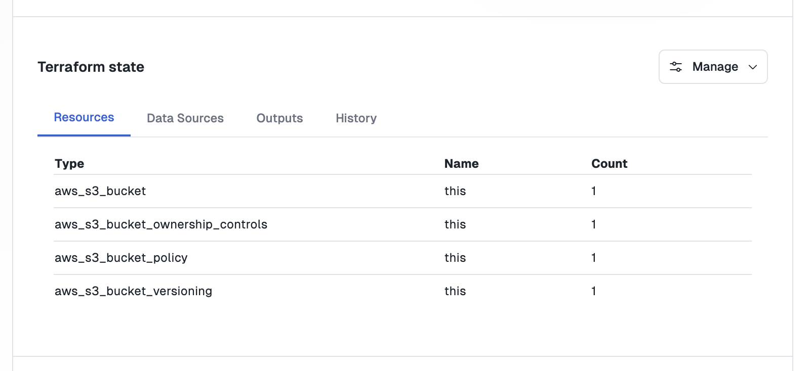
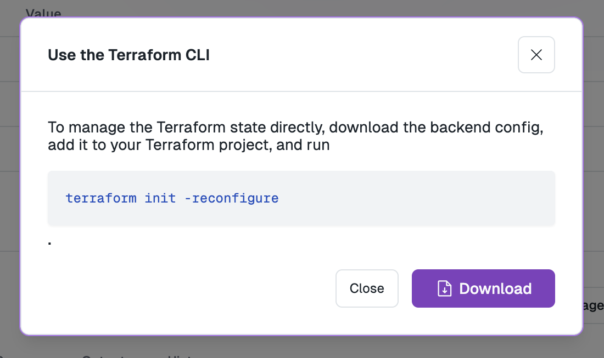

_May 6th, 2025_

<div className="badge badge--primary">v0.19.540</div>

<blockquote>
This update adds support for input types, internal inputs, auto-configured dependencies, and improvements to Terraform component workflows with KUBECONFIG integration and workspace management.
</blockquote>

<TOCInline toc={toc} maxHeadingLevel={3} />

## Input Types

You can now define an input type, which denotes which type of input is accepted. This is used to control rendering across different install inputs and will allow us to build more semantic meaning into inputs.

You can define a `type` field on an input in your config. The following types are supported:

* `string`
* `bool`
* `number`
* `json`
* `list`

Input types are currently only settable as metadata, but will be rolled out to all different surfaces of install 
management soon.

<Note>This change is backwards compatible and all current inputs will default to `string` as their `type`.</Note>

## Internal Inputs

Internal inputs are inputs that are only settable via the Nuon dashboard. This allows you to define inputs that a customer cannot control directly or set internal values.

You can use `internal: true` to mark an input as internal.

<Note>This change is backwards compatible and all current inputs will default to `internal: false`.</Note>

## Dependencies

Dependencies are now auto-configured based on the variables that you define. For example, the following config would mark `container_image` as a dependency.

```toml
[values]
"image.repo" = "{{.nuon.components.container_image.outputs.repo_url}}"
"image.tag" = "{{.nuon.components.container_image.outputs.tag}}"
```

If you would like to manually declare a dependency, you can define it in a component config using:

```toml
# define a dependency directly, if you do not use any outputs from it.
dependencies = ["docker_build", "container_image"]
```

## Terraform Component `KUBECONFIG`

Each terraform component run will now have a `KUBECONFIG` env-var with the path to the kubeconfig for the run.

You can use the `kubectl` provider without any additional configuration, as the file and env var are exposed using defaults:

```hcl
provider "kubectl" {}

resource "kubectl_manifest" "example" {
  yaml_body = <<YAML
apiVersion: v1
kind: ConfigMap
metadata:
  name: example
  namespace: default
data:
  key: "value"
YAML
}
```

## Terraform Workspace Improvements

You can now see resources managed by a Terraform component in the UI.



To make working with terraform state easier, you can now download a nuon backend config file for any workspace with the push of a button.



## Bug Fixes and Improvements

* Fixed an issue where only 64MB was reserved for the runner.
* Input Group and Input ordering is now respected.
* Fixed an internal issue where dependencies were not configured with an app-version, but only used the latest.
* Missing or circular dependencies will now error when syncing a config.
