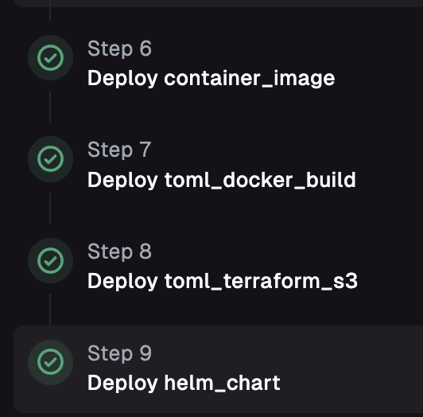
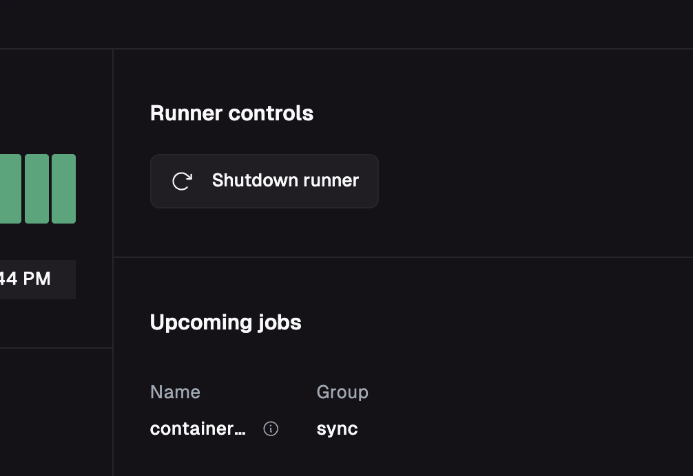
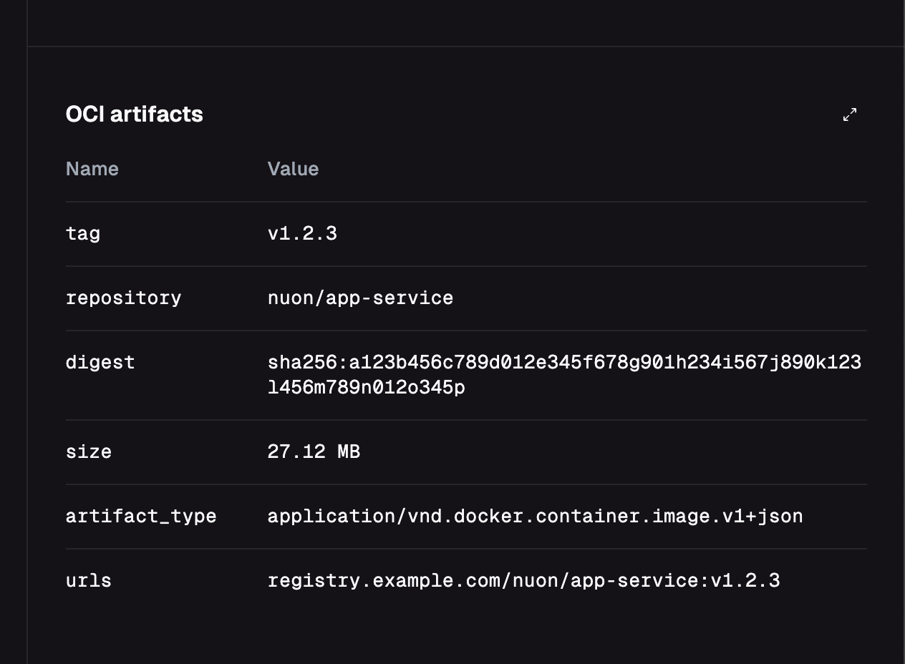

_May 8th, 2025_

v0.19.542

<blockquote>
This update focuses on improvements to install management, including component dependency ordering, UI enhancements, and comprehensive options for deprovisioning installs, components, sandboxes, and stacks.
</blockquote>

<TOCInline toc={toc} maxHeadingLevel={3} />

## Component Dependencies Sub-Ordering

When multiple components have either the same dependencies or no dependencies, they will automatically be ordered by component type.

They will use this ordering:

1. `container_image`
2. `docker_build`
3. `terraform_module`
4. `helm_deploy`

If two components have the same dependencies _and_ the same type, they will be ordered by name. For instance, in the following deploy, only the helm deploy has any defined dependencies.

## Auto Hide Nav

The side-nav bar will now automatically hide when not being used.

## Restart Runner

While you should not need this for normal usage, you can now restart your runner from the runners page.

## OCI Artifact Information

Whenever a component is deployed into an install, an OCI artifact is synced into the install first. You can now see any 
container image, helm chart artifact or terraform artifact that was synced during a deploy on the image tab.

## Deprovision an Install

Deleting an install requires tearing down its deployed components, destroying the sandbox, and destroying the CloudFormation Stack via AWS.

You can now delete an install from the install overview page in the UI:

If you have components that are not successfully deploying and you want to attempt to tear down everything in the install, you can use the `continue` option:

## Forgot an Install

Once you have deprovisioned an install, you must forget it to remove it from Nuon's system. You can do this from the 
install overview page:

## Additional Delete Options

In the happy path, an install should be able to be deleted with just a single run of `Deprovision Install`. However, 
when things go wrong or you are iterating, you can delete individual parts of an install directly.

### Delete an Install Component

Sometimes an install will fail to destroy because a single component has leaked state. You can manually tear down a component on the install component page.

<Note>If you have a failed install deprovision due to a component, you can directly tear down the component and then re-run Deprovision Install to try again</Note>

### Teardown Install Components

You can delete all install components using the Teardown All Components option from the components overview.

### Deprovision a Sandbox

In rare cases, it can be helpful to forgo tearing down install components and deprovision only the sandbox. You can deprovision a sandbox directly from the sandbox tab on an install.

<Note>It is recommended to try the `Deprovision Install` button first</Note>

### Deprovision Install Stack

The install stack can only be deleted from an install AWS account directly. If you click the deprovision stack button 
from the install overview, you can find directions to deprovision it.

