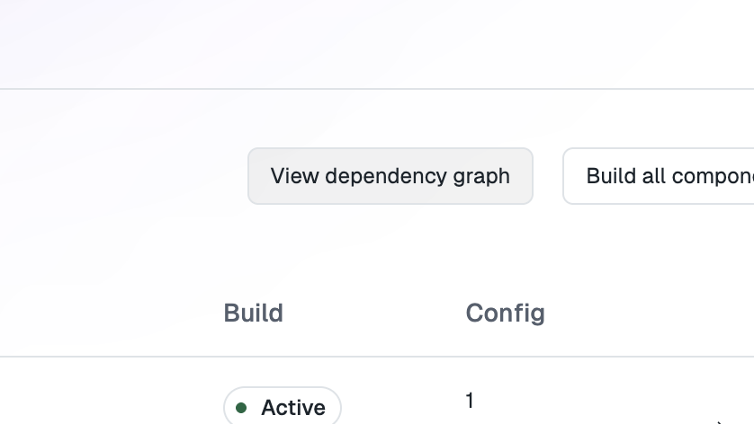
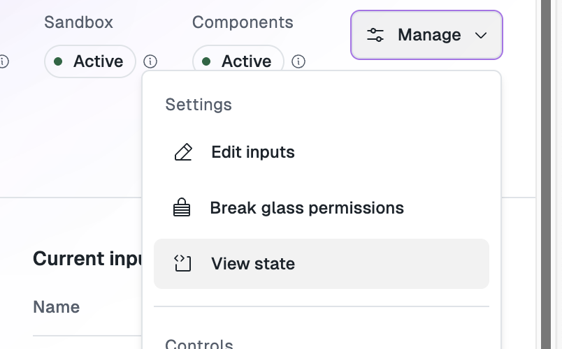
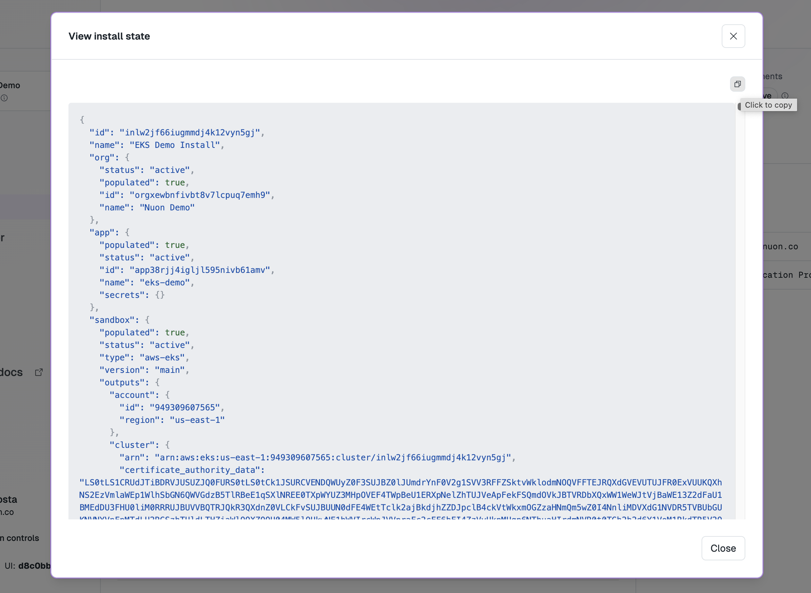
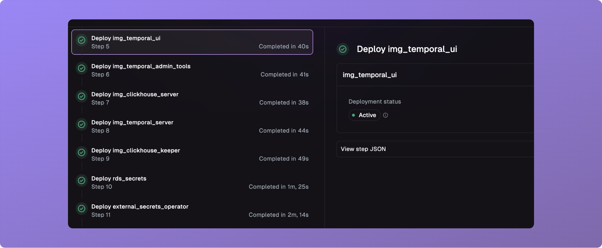
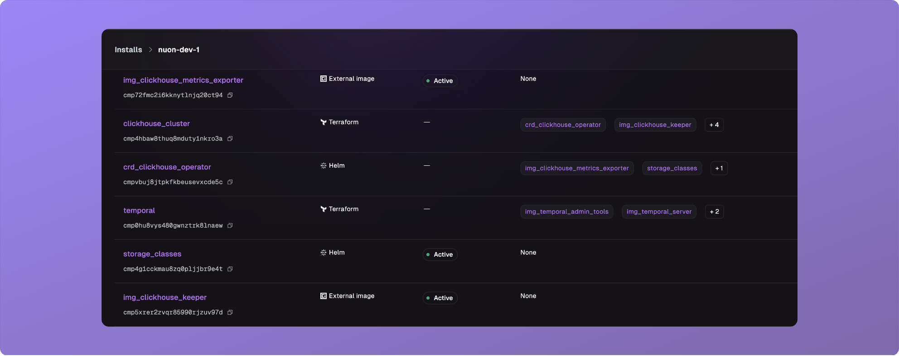
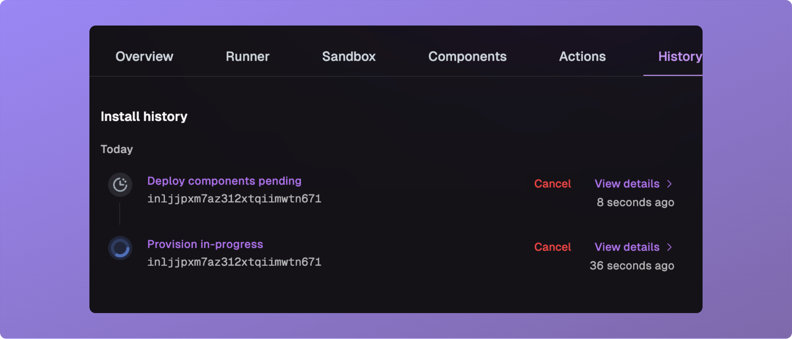

_May 16th, 2025_

<div className="badge badge--primary">v0.19.550</div>

## `nuon dev` CLI Command

<Warning>
	This feature is currently in alpha. Please reach out to use if you are
	interested in using it.
</Warning>

We have added a new CLI command, `nuon dev`, that you can use to create a new
app version and deploy it to a dev install.

```bash
~nuon (main)$ nuon dev ~/nuon/byoc/byoc-nuon -y

Checking that you are ready to create a new app version...

 INFO  checking git branch...
 SUCCESS  you are on branch ja/005-changlog-updates
 INFO  verifying app exists...
 SUCCESS  app ID is appt2zli0c6rx6utsd922i9kbl
 INFO  parsing app config...
 SUCCESS  parsed app config successfully
 INFO  validating config...
 SUCCESS  app config is valid
 INFO  checking component branches...
 SUCCESS  component branches are ok
 INFO  checking that local changes have been pushed...
 SUCCESS  all required changes have been pushed
 INFO  syncing config to api...
```

To use it:

1. Open a nuon app directory.
1. Create a dev branch.
1. Run `nuon installs select` to select the install you want to develop with.
1. Make some changes and push them to your remote.
1. Run `nuon dev` and follow the prompts.

A new app version will be created and deployed to your dev install. This new
version will **only** be deployed to your dev install. Other installs will not
be affected.

Additionally, you can pass the flag `--yes` to auto-approve all prompts. Make
sure you have the correct branch and install set up before you do this.

<Note>
	If you update only the source code of a component, and not it's config, a new
	build will not be created. You must create a build for that component
	yourself. This shortcoming will be resolved in a future update of this
	feature.
</Note>

Using the existing `nuon apps sync` command will update _all_ installs to the
config being synced, where as `nuon dev` will only update the _current_ install.

## View Component Dependency Graph

You can now view a graph of component dependencies for an app. On the the
"Components" tab of any app, click the "View dependency graph" button.



## View Install State

You can now view the complete state of an install in JSON format. On any
install, click the "View state" item in the "Manage" drop-down menu.





## Improved Step Viewer

We have made improvements to the step viewer that make it easier to work with
and debug steps.



## Improved Components Page Performance

The install components page has been overhauled to load faster, and support
rendering more components.



## Cancel Workflows From History Page

You can now cancel workflows from the history page.



## Fixes

- Fixed a bug where cancelling a reprovision would leave a runner unable to
  recover.
- Fixed a bug where inputs did not properly use their defaults.
- Fixed a bug where manual env-var overrides on an action run were not
  respected.
- Fixed a bug where `current-inputs` would show all historical inputs.
- Fixed a bug where you could not update an input with an install name (needed
  an install id), via the CLI.
- Fixed a bug where cancelling future workflows did not give the expected
  behavior.
- Fixed a bug where cancelling an in-progress workflow left a deploy, sandbox
  run or other in an in-progress status.
