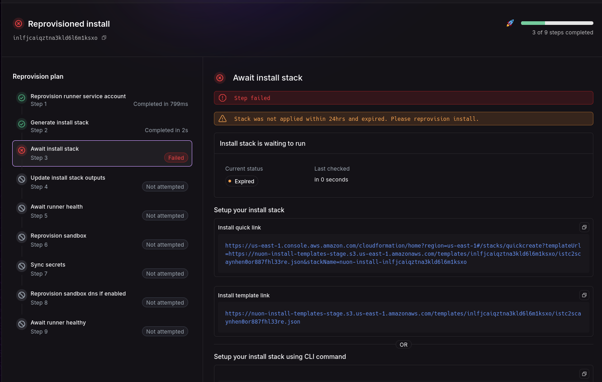
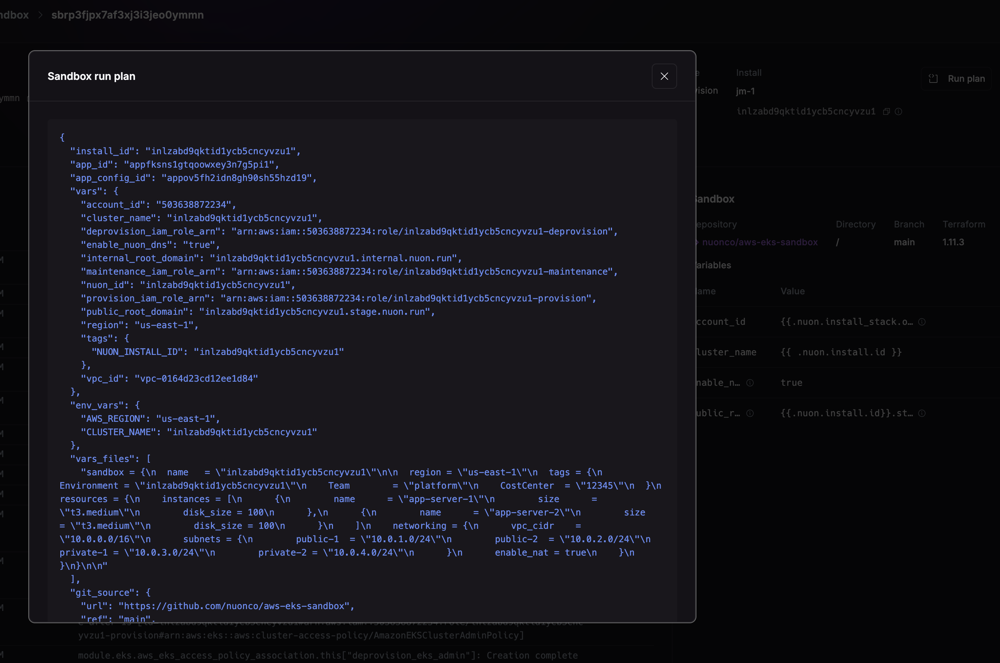

_May 19th, 2025_

<div className="badge badge--primary">v0.19.55?</div>

## Improved Secrets

The secrets have had their naming convention updated to better support multiple deployments into the same account and
faciliate access to these names which are guaranteed to be unique. The new naming convention is:

```txt
{{.nuon.install.id}}/{{.secret.name}}
```

Additionally, the secret ARN is now included in the `secrets` objects in `{{.nuon.secrets}}`.

## Handle Expired Stacks

CloudFormation stacks have an expiration of 24 hours when setting up a customer install. If a stack is not run in 24 
hours, it will show a better error message.



## Retry Failed Workflow

You can now retry a workflow from where it failed by clicking the "Retry Workflow From This Step". This will create a 
new workflow that starts at the step that was failed.

## View Deploy Plan

You can now view a deploy plan, from the UI:



<Note>This is useful for debugging the rendered variables that went into a deploy, or other run.</Note>

## Internal Migrations

We have been rolling out the following internal, platform improvements:

### Nested Event Loops

Each Nuon app and install is backed by a long lived Temporal workflow called [an eventloop](). Event loops are used for 
orchestration, control-flow and limit concurrency.

Previously, each install had a single event loop meaning only a single deploy or job could be executed at once. We have 
updated the install to have an event loop for each component, action, and the sandbox. This is a future migration that 
will allow us to build parallel deploys based on the component graph, and more.

### Component Builds

As part of now building Nuon with Nuon, we have deprecated an internal service, and changed the way we build components.

## Fixes

* Deprovisioning an install now works when outputs are missing. Previously, a failed deprovision could leave an install in an undeprovisionable state.
