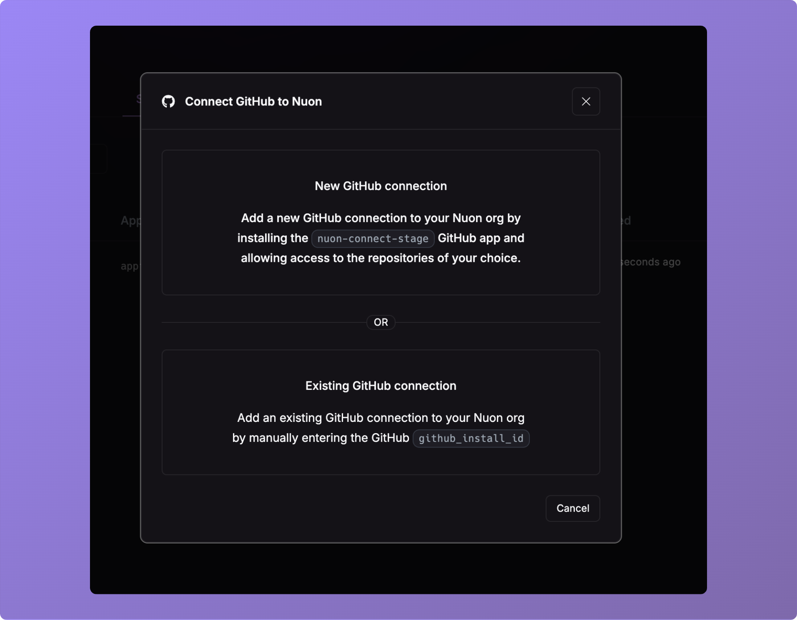
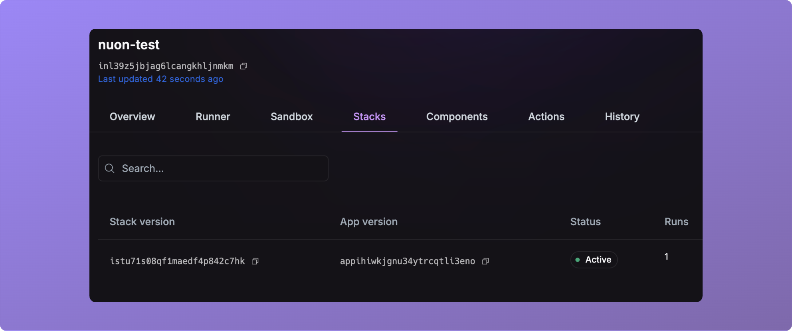

_May 27th, 2025_

v0.19.576

## Install Stacks

You can now view and interact with versions of an install's stack.

## Import a VCS Connection

You can now import a VCS connection into your org. This is useful for sharing the same Github installation of between 
different Nuon orgs.

## Refactored component build checksum

We have updated the logic for determining when component builds are triggered.
The checksum calculation now relies on the contents of the component configuration
file rather than the previous method. 

<Note>
Please note that this change is not backwards
compatible and will require a rebuild of all components during your first file sync
following this update.
</Note>

## Bug Fixes

* Fixed an issue where cancelling a workflow could leave a component undeployable.
* Fixed an issue where deprovisioning an install failed to find the latest deploy.
* Fixed an issue where a failed provision on the first run would prevent future stack runs from getting to a healthy runner.
