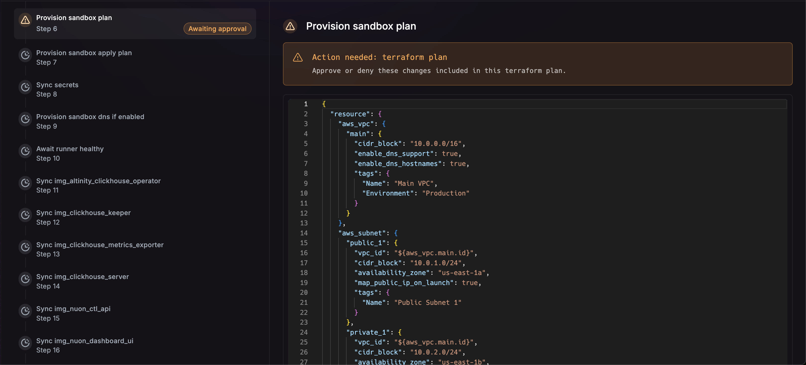
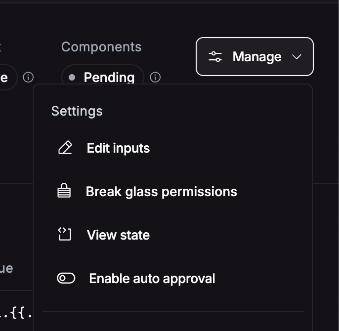
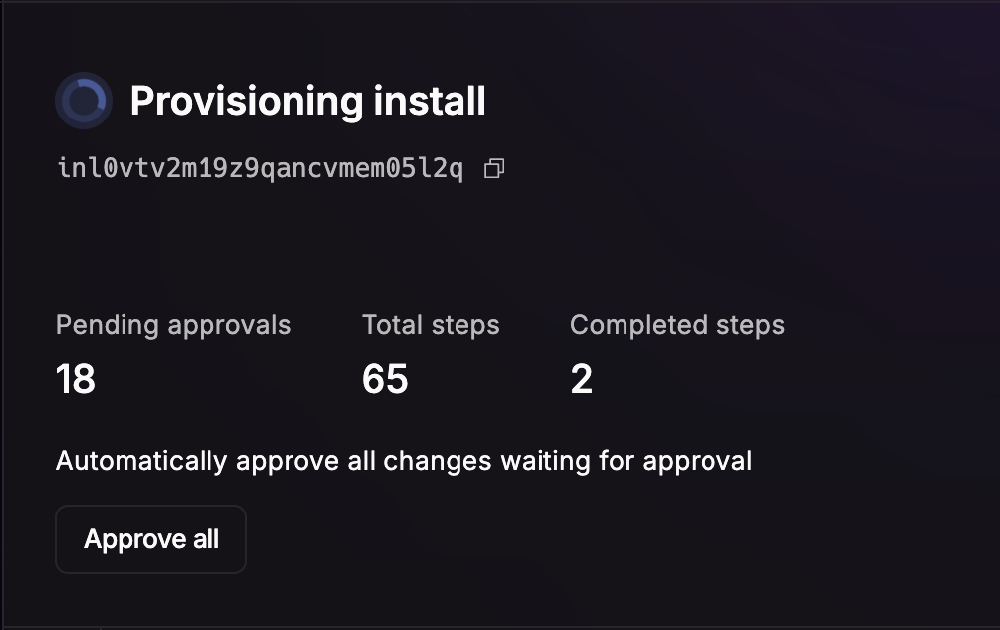
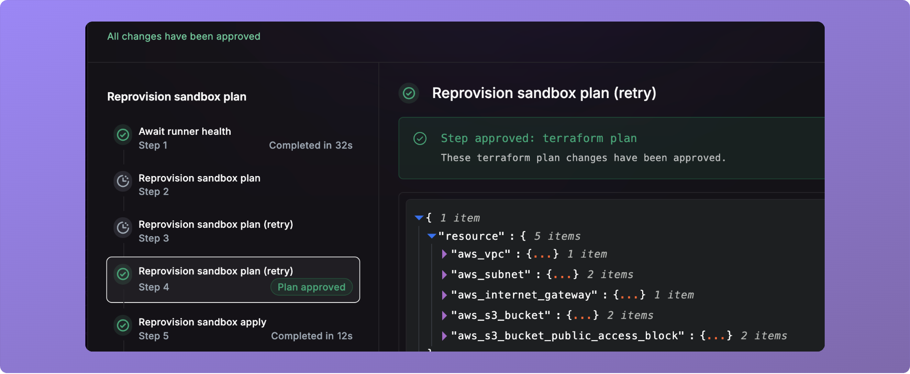

_June 16th, 2025_

v0.19.582

## Approvals

You can now see a Helm or Terraform plan when updating an install. Each workflow will automatically prompt you to 
approve the plan, and only proceed upon approval.

## Auto Approve Install

You can auto approve all changes on an install.

## Auto Approve Workflow

Sometimes, you just want to approve the first step in a workflow. You can approve all following steps on a workflow, 
which means each step will automatically proceed.

## Re Plan

When an approval has been waiting for an extended period of time, you can re-run the plan phase by pressing the 
**Retry Plan** button.

This will re-run the plan step, and prompt the approval before continuing.

## Bug Fixes and other

* `nuon apps sync-dir` has been deprecated in favor of `nuon apps sync`.
* Fixed an issue related to authentication for BYOC installs of Nuon.
* Fixed a bug where actions could not be deleted.
* Fixed a bug where some cron actions did not run.
* Fixed a bug where an empty permissions boundary errored out.
