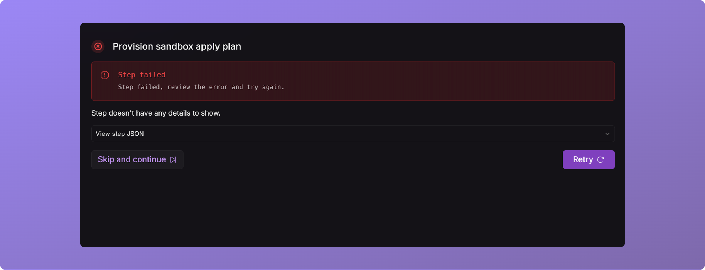
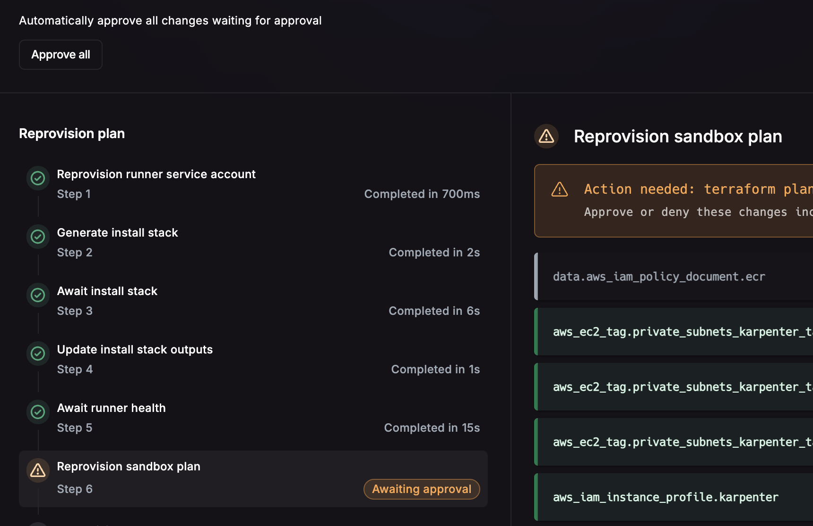
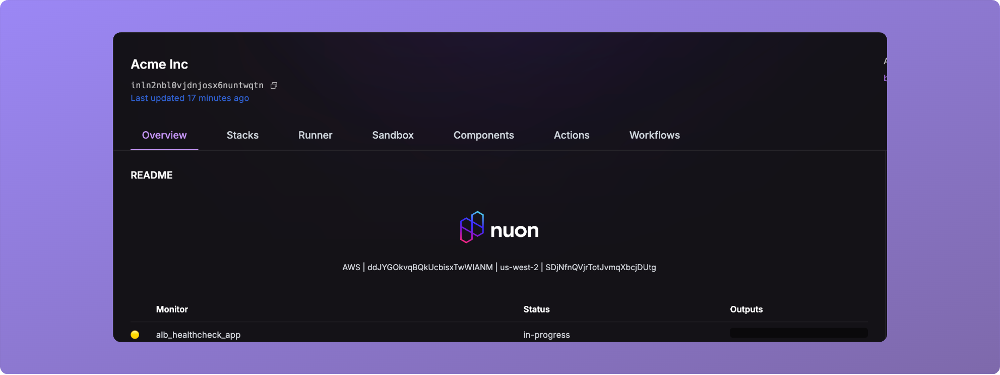
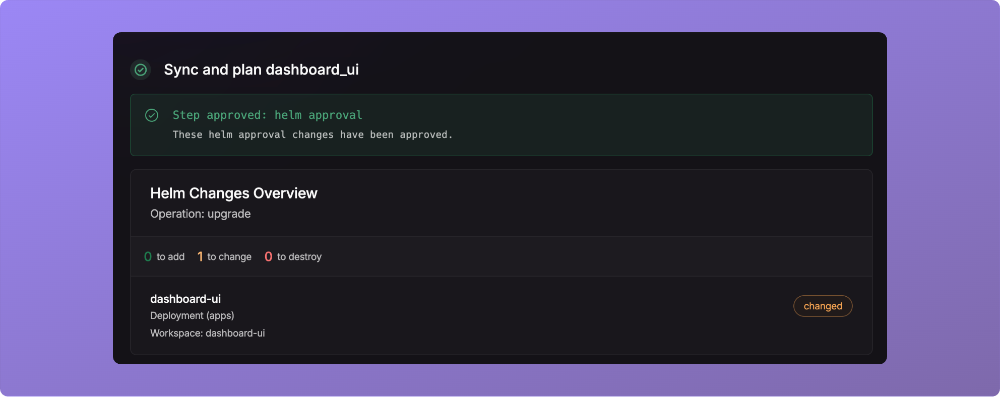
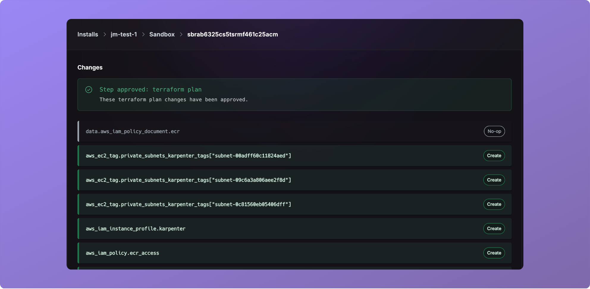

_June 27th, 2025_

v0.19.595

## Inline Workflow Retries

Failures can now be retried inline, and a new step will be generated.

## Auto Approve Workflow

You can now approve all steps in a workflow.

## Renamed History to Workflows

In preparation of the new Audit Log tool, we are renaming history to workflows.

## Remove Team Member

You can now remove team members from your org.

## Improved Approval Diffs

The diffs displayed for Helm and Terraform approval steps have been improved to preview more of the underlying changes.

## Approvals on Deploy and Sandbox Run Pages

We now keep approvals for all deploys and sandbox runs on the detail pages.

## Fixes

* Default secrets are now respected. Adding a `default` field on a secret will be respected.
* Fixed an issue where `connected_github` repos for sandboxes were not respected.
* Selective component build on install input update.
* Improved ctl-api healthchecks.
* Inputs reference parsing.
* Fixed a bug where authentication cookie could become too large and show a 431 response.
* Fixed a bug where components that were not deployed, would still be torndown during deprovision.
