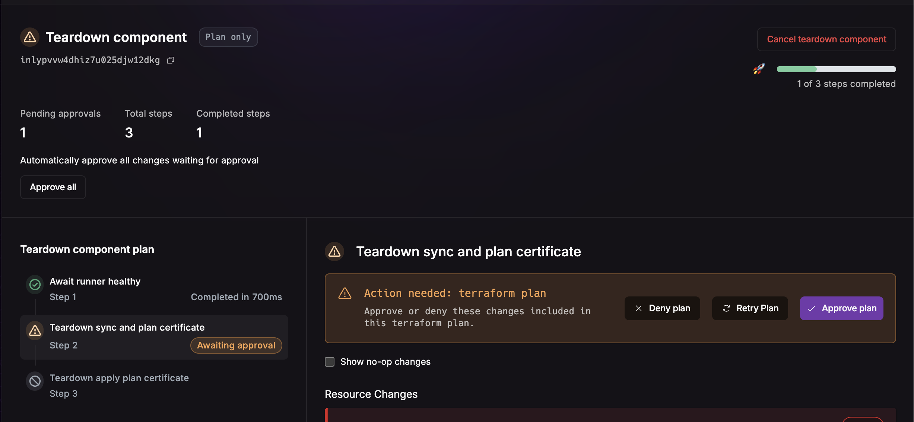

_July 8th, 2025_

v0.19.598

## Improved Helm Resource Diff

Improved the diff for helm teardowns.

## Plan Only Mode

You can now run most workflows in plan only mode. This means that changes will only be planned, and execution skipped. 
This is useful for checking for drift, for instance.

## Sync Secrets

You can sync secrets manually, using the UI.

## Nuon CLI list command pagination

The CLI now accepts limit & offset options for listing out items from commands.
`nuon components list --offset=15 --limit=5`

## Bug Fixes

* Fixed an issue where the Terraform state for a component would show an old state version.
* Fixed an issue where deprovisioning was not properly tearing down from a plan.
* Fixed an issue where some workflows would not get executed, due to an internal error.
