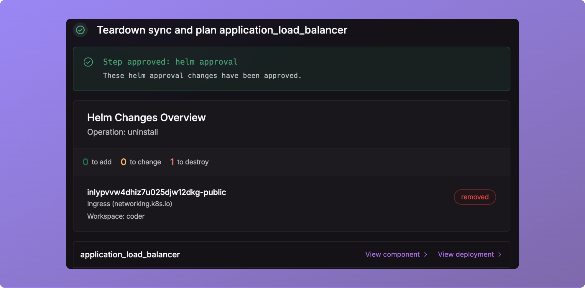
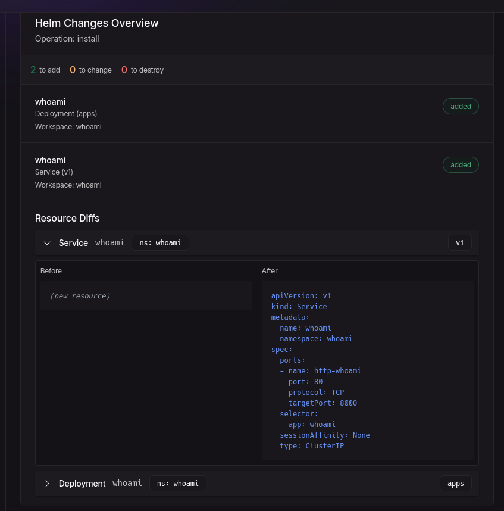
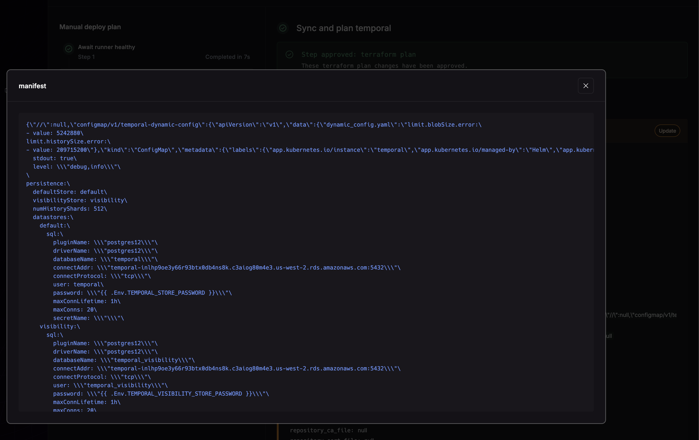

_August 1st, 2025_

v0.19.611

## New component type: Kubernetes Manifests

Adds support for kubernetes manifests component type.

## Support Helm Resource Diffs

Previously, we did not support showing Helm resource-level diffs.

## Support for Large Terraform Diffs

Some Terraform diffs, such as nested kubernetes manifests could not render correctly in the UI.

## Bug Fixes

* Fixed issue supporting large plans.
* Fixed performance issues in application.
* Fixed issue where you could not deprovision an application.
* Added a new internal Temporal codec server for better performance.
* Fixed an issue creating new org runners.
* Fixed an issue where LSP server did not work correctly.
* Fixed a bug where skipping some steps could render a workflow to make no progress.
* Fixed a bug where apps would not delete with the CLI. Note: Components must still be deleted first.
* Fixed a bug where the App's Components tab would error after nuon apps create --no-template and before nuon apps sync.
