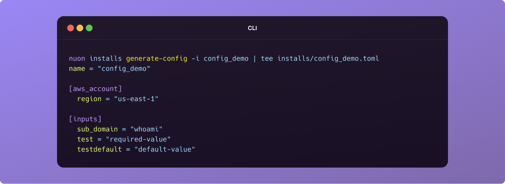
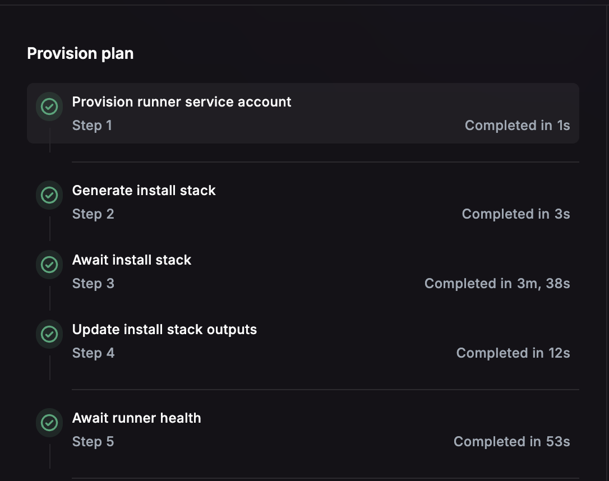

_August 7th, 2025_

<div className="badge badge--primary">v0.19.614</div>

## Install Config Files

You can now manage installs via source control for apps managed by
`nuon apps sync`. Create one config file per-install in a folder named
`installs/` under your app's config. Now syncing the app will also create/update
the corresponding installs. For more details take a look at
[Install Config file reference](/configuration-files#install-config).

```toml
name = "config_demo"
approval_option = "approve-all"

[aws_account]
  region = "us-east-1"

[inputs]
  sub_domain = "whoami"
  test = "required-value"
  testdefault = "default-value"
```

## Generate an Install Config File

To make it even easier to manage existing installs using CI, we have added a new
command `nuon installs generate-config` to export an existing install to stdout.
Create a TOML config file for the install in the `installs` folder of your app's
config and paste the stout. If required, make updates e.g., you app's release
number, and `nuon apps sync` to update the install. In the dashboard, see the
newly-created workflow to track the install's upgrade process.

```bash
cd <your-app-config>
mkdir -p installs
touch installs/<install-name>.toml
nuon installs generate-config -i <install-name> | tee installs/<install-name>.toml
```



## Workflow Step Groups

Workflow steps are now grouped, and some retries will retry an entire group when
required. For instance, when retrying a Terraform apply step, the plan can not
be reused, so a new group is created and the plan is retried (and re-approved)
first.



## Runner Instance Lifetime

As part of the install stack, we now set the MaxInstanceLifetime for Runner
instances to 7 days by default and recreate it via the autoscaling group. This
serves as a safety net in case the runner instance becomes unresponsive for some
reason due to accumlated state, such as disk space.

## Bug Fixes

- Fixes an issue where you could not cancel an install reprovision.
- Fixes an issue where running a `plan-only` action did not update it's status
  correctly.
- Fixes an issue where an install showed a "deprovisioned" status on first
  setup.
- Fixed memory leak that would cause page crashes during workflows.
- Removed extra fields on the log read endpoints.
