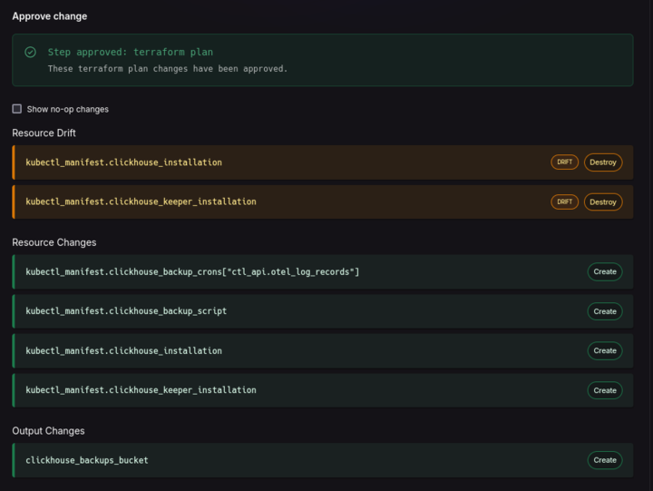
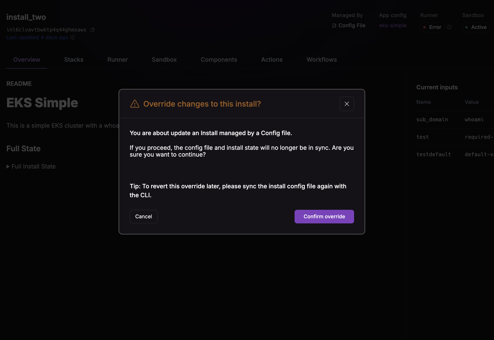
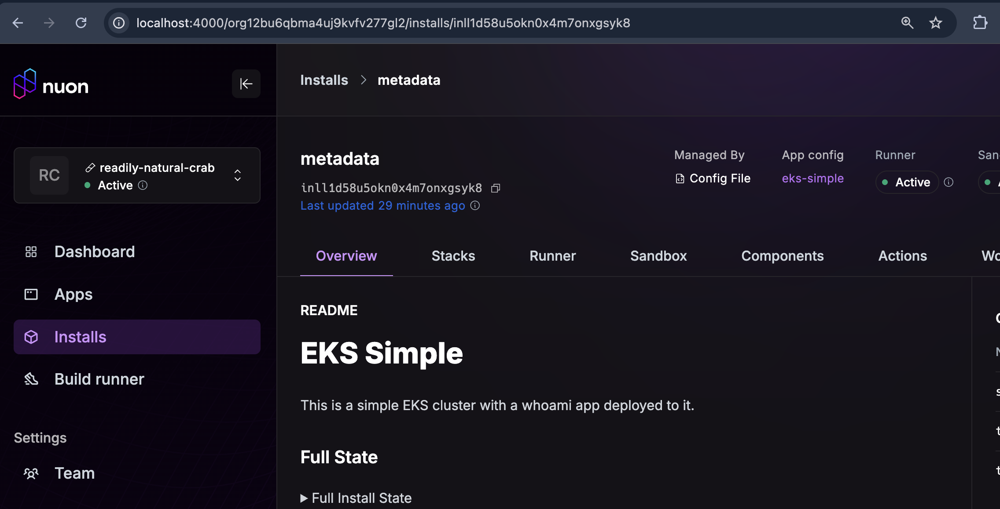
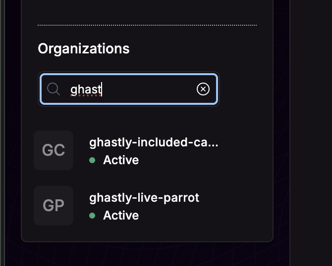

August 28th, 2025

v0.19.621

## Resource Drift for Terraform Component Plans

We now show resource drift for Terraform Component Plans.

## Install Config Updates

For installs managed by a config file, a confirmation in the UI will be shown before making any input changes.

The UI now shows whether an install is managed by a config file or not.

## Noop Approvals

Approvals for deploys with no changes will automatically be approved.

<Note>
  To prevent inadvertently mutating infrastructure due to drift, when noop changes are auto-approved the apply step is skipped.
</Note>

## Org Search Box

For users with many orgs, you can now search for them in the UI:

## Stability Improvements

We have been rolling out stability improvements for workers that are running in BYOC installs, including:

* Workers use less memory.
* States will automatically be marked as stale when generating.
* Improvements to worker caching.

## Bug Fixes

- Removed deprecated sandboxes from [nuonco GitHub org](https://github.com/nuonco).
- Improved documentation for [Kubernetes Manifests](https://docs.nuon.co/guides/kubernetes-manifest-components).
- Fixed a bug where some orgs would not properly provision due to a timeout.
