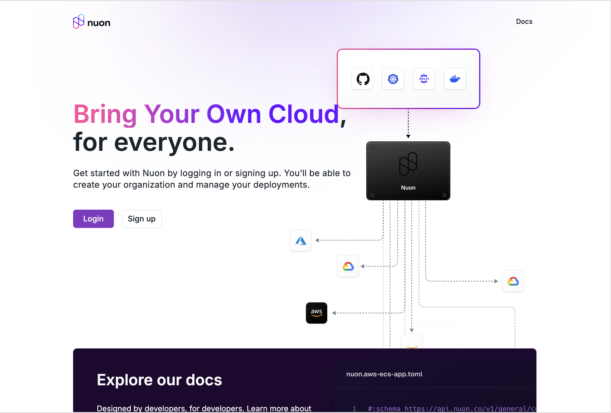
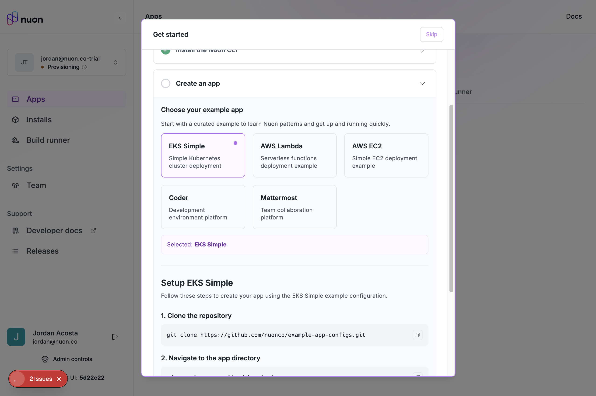
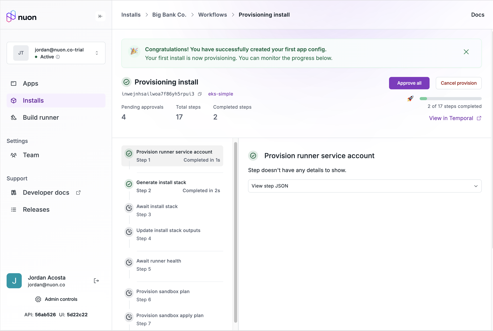
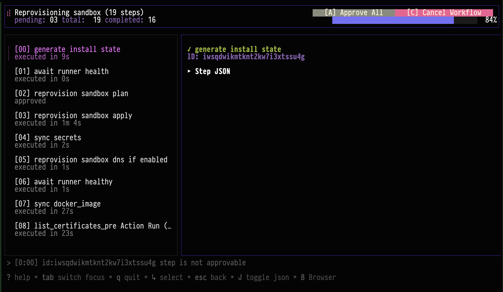

_Sep 30, 2025_

<div className="badge badge--primary">v0.19.631</div>

## Self-Service Cloud Registration

Anyone can now sign up for Nuon Cloud, without needing an invite.

To get started, go to [https://app.nuon.co](https://app.nuon.co) and click "Sign Up".



After you sign in, a trial org will be created for you, and you will be sent to our onboarding flow. You can then select
one of our example apps to get started with.



Once you have an app, you can create an install.



At any point during this process, you can click the "Skip" button to exit the onboarding flow and do your own thing.

## CLI UX Improvements

We have landed a workflow TUI in the `nuon` cli for viewing and approving workflows.



This feature requires the
`NUON_PREVIEW` to be set to `true` in the environment. You can try it like this:

```bash
nuon installs workflows-get -w inwxxxxxxxxxxxxxxxxxxxxxxx
```

This is part of a concerted effort to provide rich functionality directly in the TUI.

## Improved Helm Drift Detection

When you run a plan-only deploy, or are doing a noop deploy with no expected changes to a Helm chart, we will now detect 
any resource changes. Previously, the diff functionality only included changes to the chart values or rendered yaml, and 
did not account for drift in the cluster.

## Bug Fixes and Improvements

- Fixed a bug where uninstalling a Helm chart could fail because the diff could not be loaded.
- We have rolled out changes to our networking stack in the dashboard to decrease network usage, prevent unexpected 
  errors (or hnadle them more gracefully) and also make the application feel more performant.
- We fixed a bug where some endpoints in the UI and some plans would not use the current install's app-config, leading 
  to situations where components could not be deleted, or would be incorrectly rendered on the graph.
- Fixed a bug causing new actions to now work for a few seconds after syncing an app config.
- Fixed a bug where some workflows could fail if there were too many steps, too large of plans or were not approved in time.
