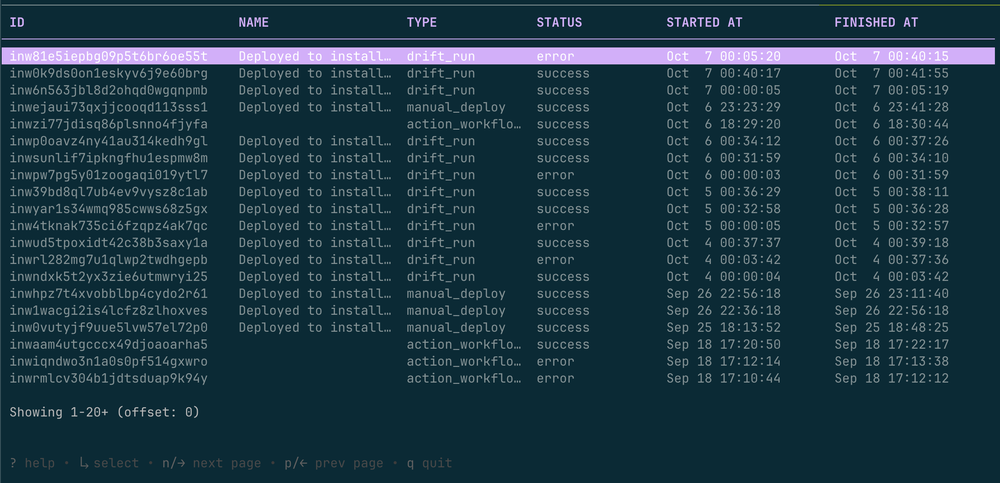

_Oct 7, 2025_

Define actions that can use break glass roles for executing privileged operations.

<div className="badge badge--primary">v0.19.658</div>

## Actions with break glass permissions

Actions can now utilize break glass roles and policies that have been enabled via an install CloudFormation stack. This 
allows for elevated permissions during critical operations while maintaining security boundaries.

### Break Glass Role Configuration

Break glass roles are enabled in CloudFormation and can be referenced in your action configurations. These roles provide temporary elevated access for emergency situations or critical deployments.

Sample break glass configuration:
```toml break_glass.toml
[[role]]
name                 = "bucket-operations-break-glass"
description          = "Grants access to the install bucket"
display_name         = "Bucket operations Break Glass"
permissions_boundary = ""

[[role.policies]]
name = "bucket operations"
contents = """
{
    "Version": "2012-10-17",
    "Statement": [
        {
            "Sid": "SpecificS3BucketAccess",
            "Effect": "Allow",
            "Action": [
                "s3:CreateBucket",
                "s3:DeleteBucket",
                "s3:ListBucket",
                "s3:GetBucketLocation",
                "s3:GetBucketVersioning"
            ],
            "Resource": "arn:aws:s3:::{{.nuon.install.id}}-*"
        },
        {
            "Sid": "ListAllBuckets",
            "Effect": "Allow",
            "Action": [
                "s3:ListAllMyBuckets"
            ],
            "Resource": "*"
        }
    ]
}
"""
```

To configure an action with break glass permissions, specify the break glass role name in your action definition:

```toml action.toml
name = "simple_demonstration"
timeout = "1m"
break_glass_role="bucket-operations-break-glass"

[[triggers]]
type = "manual"

[[steps]]
name = "manage install-specific bucket"
inline_contents = """
#!/usr/bin/env sh
set -x

BUCKET_NAME="{{.nuon.install.id}}-demo-bucket-$(openssl rand -hex 4)"
aws s3 mb s3://$BUCKET_NAME --region us-east-1
aws s3 ls | grep {{.nuon.install.id}}
aws s3api delete-bucket --bucket $BUCKET_NAME --region us-east-1
"""
```

### CloudFormation Stack Integration

The break glass role and associated policies are created through a CloudFormation stack that you deploy to your AWS account. This stack creates:

- A break glass IAM role with elevated permissions
- Policies that define the scope of emergency access
- Trust relationships that allow Nuon runners to assume the role

Once enabled, the roles can be referenced in your actions, providing secure access to elevated permissions when needed.

### Security Considerations

Break glass roles enable a customer to temporarily grant elevated permissions and should be used with caution. They are 
primarily designed for mitigating customer issues, running migrations and other opt-in operations that require a 
customer to grant temporary elevated permissions.

## Nuon Workflows TUI


You can now run entire workflows via our experimental TUI. To interact with workflows, you can use the following command:

```bash
NUON_PREVIEW=true nuon installs workflows
```

You will then see all recent workflows, and can select a workflow to enter the TUI view:



## Bug Fixes and Improvements

- Fixed an issue where some Nuon Workflows would not generate if too many actions or components were defined.
- Fixed an issue where some Nuon Workflows could fail silently.
